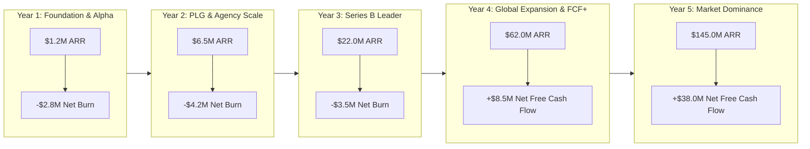

# COMPANY BIBLE — MASTER INDEX
## The Complete Company Operating System & Execution Blueprint
**Document 5** | **Classification:** Definitive Institutional Operating Manual & Executive OS

---

## Document Map

| Part | File | Sections | Key Institutional Deliverables |
|:---|:---|:---|:---|
| **Part 1** | [Vision, Strategy & Culture](file:///home/mohana-fedora/Data/MNVProjects/AIBuilder/docs/COMPANY_BIBLE/Company_Bible_Part1_Vision_Strategy_Culture.md) | Parts 1–3 | Core Mission & Purpose, 5 Core Beliefs (`Code is Truth`, `Tokens are Law`), Immutable Principles, Priority Decision Hierarchy Diagram (`User Trust -> Product Quality -> Dev Velocity -> Revenue`), 10/20-Year Vision Horizons (`$1.5B ARR by 2036`), Category Creation Quadrant Chart (`DIOS`), Competitor Counter-Positioning Matrix, Land-and-Expand Strategy, Institutional Culture Pillars |
| **Part 2** | [Org Design, Hiring & Ladders](file:///home/mohana-fedora/Data/MNVProjects/AIBuilder/docs/COMPANY_BIBLE/Company_Bible_Part2_OrgDesign_Hiring_CareerLadders.md) | Parts 4–5 | Functional Topology Mermaid Chart (`EPD Pods + GTM + Ops`), 8 Scaling Horizons (`1 -> 5 -> 25 -> 50 -> 100 -> 250 -> 500 -> 1000+ staff`), First 10 Crucial Hires in Exact Order, Institutional Hiring Scorecard Template (`40% Technical, 25% Design, 20% Craft, 15% Slope`), 4-Stage Interview Process, 90th Percentile Compensation Philosophy, Dual-Track Career Ladder Diagram & Matrix (`L1–L6 / M1–M5`) |
| **Part 3** | [GTM, Sales, CS & Marketing](file:///home/mohana-fedora/Data/MNVProjects/AIBuilder/docs/COMPANY_BIBLE/Company_Bible_Part3_GTM_Sales_CustomerSuccess_Marketing.md) | Parts 6–9 | Technical Truth Positioning, Launch Blitz Playbooks (`Product Hunt #1`, `Hacker News Top 3`, `Twitter/X`, `LinkedIn`, `DevRel`), Hybrid PLG-to-Enterprise Funnel Diagram, MEDDPICC Sales Rubric, AE/SA Compensation, Customer Health Scorecard (`0–100 points`), Churn Prevention Engine, 135%+ NRR Expansion Vectors, Programmatic SEO Engine (`1M+ monthly organic visitors`) |
| **Part 4** | [Business Model & Financials](file:///home/mohana-fedora/Data/MNVProjects/AIBuilder/docs/COMPANY_BIBLE/Company_Bible_Part4_BusinessModel_Financials_Metrics.md) | Parts 10–12 | Evaluation of 12 Revenue Streams with Gross Margins & Strategic Verdicts (`Core SaaS 88%`, `Usage Compute 72%`, `Marketplace 95%`, `Hosting 82%`, `White-Label 95%`), 5-Year Pro-Forma Income Statement (`$1.2M ARR / -$2.8M burn in Year 1` -> `$145M ARR / +$38M FCF in Year 5`), Unit Economics (`LTV:CAC > 7:1`, `Payback < 11m`), North Star Metric (`SPSE`), Executive Scorecard |
| **Part 5** | [Legal, Ops, Ecosystem & Risk](file:///home/mohana-fedora/Data/MNVProjects/AIBuilder/docs/COMPANY_BIBLE/Company_Bible_Part5_Legal_Ops_Ecosystem_Risk.md) | Parts 13–16 | Regulatory Roadmap (`GDPR Day 1`, `SOC2 Month 9`, `ISO Month 18`, `HIPAA Year 3`), Institutional AI Policy (`Zero default training on code`, `Uncapped IP indemnification`), Institutional Operating Rhythm Diagram (`Annual -> Quarterly -> Monthly -> Weekly`), RFC Review Standards, Community Ecosystem (`Agency Partners`, `Creator Marketplace`), 11-Domain Risk Management Matrix |
| **Part 6** | [5-Year Roadmap & Playbook](file:///home/mohana-fedora/Data/MNVProjects/AIBuilder/docs/COMPANY_BIBLE/Company_Bible_Part6_FiveYearRoadmap_FounderPlaybook.md) | Parts 17–18 | 5-Year Institutional Execution Roadmap Gantt Chart & Annual Objectives (`Year 1 MVP/PMF` -> `Year 5 Dominance & IPO Readiness`), Founder Operating Cadence (`Daily Time-Allocation`, `Weekly Pulse`, `Monthly EBR`), Essential 6-Book Reading List (`High Output Management`, `Innovator's Dilemma`, `Zero to One`), The 6 Fatal Founder Mistakes to Avoid at All Costs |
| **Part 7** | [Existential Verdict & Index](file:///home/mohana-fedora/Data/MNVProjects/AIBuilder/docs/COMPANY_BIBLE/Company_Bible_Part7_ExistentialVerdict_MasterIndex.md) | Final Chapter | Definitive Answers to the 7 Existential Questions (`Why exist in 2046?`, `Why won't Figma/Webflow/Vercel destroy us?`, `What makes DIOS category-defining?`, `What principles never change?`, `What mistakes kill the company?`), The 10 Commandments of DIOS, Company Legacy Statement, Master Navigation Index |

---

## Quick Reference Executive Highlights

### 1. The Institutional Core Identity & Purpose
- **Mission:** To democratize the creation of world-class digital experiences by bridging the gap between human imagination and production-grade software.
- **Vision (10-Year):** Power 15% of the top 10 million websites globally, generating `$1.5B+ ARR` as the indispensable operating system for frontend design and engineering.
- **North Star Metric:** **Successful Production Site Exports (SPSE)** — Number of sites published to custom domains or pushed to GitHub weekly.

### 2. Five-Year Pro-Forma Financial Trajectory

### 3. The 10 Commandments of DIOS Leadership
1. **AST is Law; Code is Truth.** Never compromise on structural cleanliness or trap user data.
2. **Hire only 10x talent** who raise the average bar and take extreme ownership.
3. **Speed is a compound interest engine**—keep the canvas at 60fps forever.
4. **Talk to real users every single week**; never outsource empathy to support silos.
5. **Protect runway like oxygen**—maintain >24 months cash across all market cycles.
6. **AI is a teammate, not magic.** Make every AI action explainable and undoable.
7. **Design tokens are the constitutional bedrock** of visual governance.
8. **Write everything down**—asynchronous clarity defeats tribal knowledge every time.
9. **Never build for short-term vanity metrics** at the expense of 10-year enterprise trust.
10. **We are here to build a generation-defining monopoly**, not a quick acquisition flip.

---

## Verification of Complete Institutional Venture Series (All 5 Bibles)

All 5 foundational master documents governing the **Digital Experience Operating System (DIOS)** are complete, formatted, and saved across `25 dedicated files` inside `/home/mohana-fedora/Data/MNVProjects/AIBuilder/docs/`:

| Document # | Document Title | Primary Purpose & Strategic Scope | Total Storage Size |
|:---|:---|:---|:---:|
| **Document 1** | [Product Bible V1](file:///home/mohana-fedora/Data/MNVProjects/AIBuilder/docs/Product_Bible_AI_Website_Platform.md) | Strategic market thesis, competitive differentiation, initial 16-pillar feature inventory, and financial modeling | `~59 KB` |
| **Document 2** | [Founder Research Bible](file:///home/mohana-fedora/Data/MNVProjects/AIBuilder/docs/FOUNDER_RESEARCH_BIBLE/Founder_Research_Bible_Part1_Industry_Competitors.md) *(4 Parts)* | Evidence-based industry & competitor deep-dives (13 platforms), Top 200 scored user frustrations, Jobs-To-Be-Done psychology, 11 reverse-engineered design systems, RICE pricing research, 100 white spaces, moat analysis | `~81 KB` |
| **Document 3** | [Product Bible V2](file:///home/mohana-fedora/Data/MNVProjects/AIBuilder/docs/PRODUCT_BIBLE_V2/Product_Bible_V2_Part1_Philosophy_Ecosystem_Users.md) *(6 Parts)* | Definitive product specification: 7 product principles, "Obsidian" design system, W3C token JSON schema, 22 click-level screen specifications, 11 component specs, 11 AI interaction modalities, and RICE-scored MVP roadmap | `~98 KB` |
| **Document 4** | [AI + Engineering Bible](file:///home/mohana-fedora/Data/MNVProjects/AIBuilder/docs/ENGINEERING_BIBLE/Engineering_Bible_Part1_Philosophy_Architecture.md) *(7 Parts)* | Definitive technical architecture: Rust/WASM AST engine, 12-agent AI orchestration pipeline, 20+ database tables with RLS, tRPC/REST/SSE API design, RAG vector memory, OpenTelemetry observability, automated testing harness, EKS cloud topology, and 24-month engineering roadmap | `~100 KB` |
| **Document 5** | [Company Bible](file:///home/mohana-fedora/Data/MNVProjects/AIBuilder/docs/COMPANY_BIBLE/Company_Bible_Part1_Vision_Strategy_Culture.md) *(7 Parts)* | Executive operating system: Vision, institutional culture, org design (1 -> 1,000+ staff), hiring scorecards, L1–L6 career ladders, MEDDPICC sales, PLG funnel, 5-year pro-forma financials ($145M ARR / +$38M FCF), SOC2/GDPR roadmap, 11-domain risk matrix, and 10 Founder Commandments | `~82 KB` |

**Total Combined Blueprint Size:** `~420 KB` of exhaustive, institutional-grade documentation ready to scale the company from Day 1 to global market leadership.
