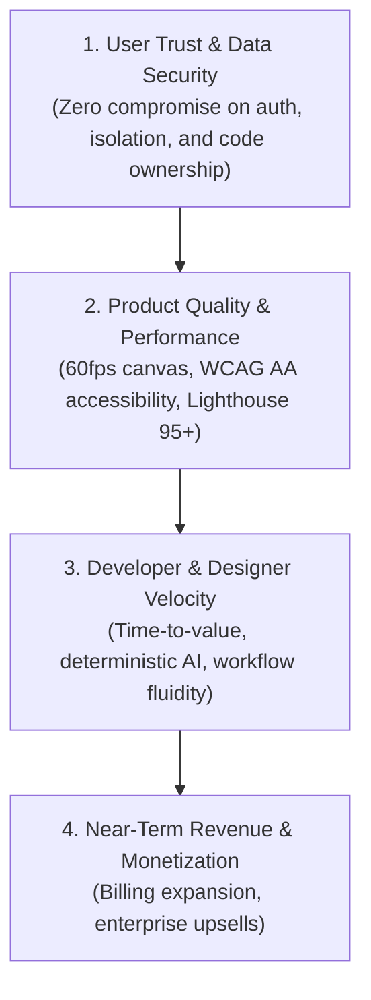
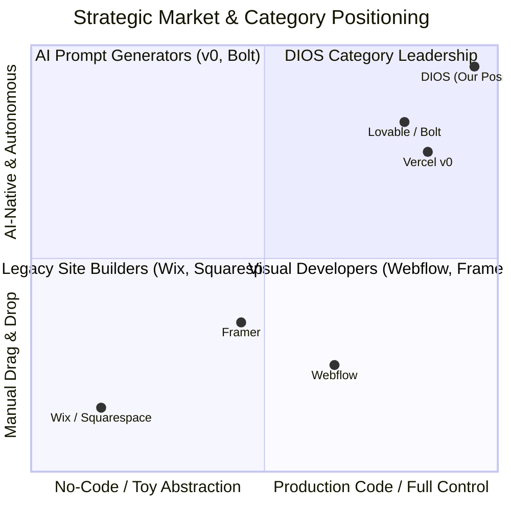

# COMPANY BIBLE — PART 1
## Vision, Strategic Positioning & Institutional Culture
**Document:** 5.1 of 5.7 | **Series:** Company Operating System & Execution Blueprint

---

# PART 1 — COMPANY VISION & SOUL

## 1.1 Core Identity & Purpose

| Dimension | Statement & Institutional Rationale |
|:---|:---|
| **Company Name** | **Antigravity / DIOS** (Digital Experience Operating System) |
| **Mission** | **To democratize the creation of world-class digital experiences by bridging the gap between human imagination and production-grade software.** |
| **Vision** | **To become the default operating system for the internet's frontend—where every website, web application, and digital product is conceived, designed, built, and operated.** |
| **Purpose** | Software is the primary interface through which humanity interacts, trades, learns, and builds. Yet, creating high-tier software remains locked behind thousands of hours of specialized engineering and design labor. Our purpose is to eradicate technical friction without sacrificing technical excellence, turning every founder, designer, and developer into an extraordinary creator. |

## 1.2 Core Beliefs & Axioms

1. **Code is the Universal Truth of the Internet:** Visual canvases that do not map 1:1 to production code are toys. If a design tool cannot export clean, semantic, human-maintainable code, it creates technical debt. We believe in *AST-native design*.
2. **Design Tokens are Constitutional Law:** Inconsistent design destroys brand equity and user trust. We believe that global governance via design tokens is the only way to scale visual excellence across millions of pages without visual degradation.
3. **AI Must be an Amplifying Teammate, Not a Black Box:** Users do not want magic that breaks mysteriously; they want intelligent automation that explains itself, respects existing constraints, and can be undone with precision.
4. **Speed is a Compound Interest Engine:** Latency in tools breeds cognitive fatigue. A canvas that renders at 60fps and builds in <3 seconds creates a flow state that yields 10x higher quality output.
5. **Zero Vendor Lock-in is the Ultimate Moat:** Customers should stay with us because our workflow is 10x better, not because their data is trapped in a proprietary database. Full bidirectional Git synchronization and standards-compliant code export earn permanent trust.

## 1.3 Immutable Operating Principles

### Company Principles
- **Long-Term Excellence Over Short-Term Extraction:** We optimize for the 10-year enterprise valuation and customer trust trajectory, never for quarter-end vanity metrics or aggressive monetization traps.
- **Craftsmanship as a Competitive Advantage:** Every screen, error message, API payload, and internal document must reflect obsessive attention to detail. If it doesn't wow us, it never ships.
- **Default to Transparency & Written Clarity:** Clear writing reflects clear thinking. We operate via comprehensive asynchronous documentation rather than tribal knowledge or endless synchronization meetings.

### Founder & Leadership Principles
- **Extreme Ownership at All Horizons:** Leaders do not blame external market shifts, competitor announcements, or cross-functional dependencies. If a metric misses or a user struggles, leadership owns the structural fix.
- **Relentless Standards, High Empathy:** We hold high standards for work quality while maintaining deep empathy for the people doing the work. High performance thrive in environments of psychological safety combined with intellectual rigor.
- **First-Principles Problem Solving:** We never do things because "that is how SaaS companies do it." We dissect every problem—from pricing structures to AST compilation—down to fundamental physics and economics before engineering the solution.

## 1.4 The Institutional Decision Framework

When faced with trade-offs across engineering, product, or business strategy, leadership and individual contributors MUST apply the **DIOS Priority Decision Hierarchy**:

**Why this hierarchy matters:** If an enterprise customer requests a high-paying feature that compromises the AST architecture or canvas performance for all users, **we reject the feature**. Revenue built on compromised product integrity always collapses under technical and reputational debt.

## 1.5 Temporal Vision Horizons

### The 10-Year Vision (2036)
By 2036, DIOS will power **15% of the top 10 million websites globally**. The concept of "hand-coding CSS layouts" or "rebuilding Figma mockups in React" will be viewed as an archaic historical artifact, similar to writing assembly code for business applications. We will be the indispensable infrastructure for global digital agencies, YC startups, and Fortune 500 digital marketing teams, generating **$1.5B+ in Annual Recurring Revenue (ARR)**.

### The 20-Year Vision (2046)
By 2046, DIOS will have evolved into the **Autonomous Digital Experience Cloud**. Companies will define their strategic objectives, brand identity, and product schemas; DIOS will autonomously generate, test, personalize, and optimize millions of adaptive digital interfaces globally in real time across web, spatial computing, and neural interfaces. We will be one of the top 10 most valuable software companies in human history.

---

# PART 2 — STRATEGIC POSITIONING & MARKET DOMINANCE

## 2.1 Category Creation: The Digital Experience Operating System (DIOS)

We do not compete in the "Website Builder" category (Wix, Squarespace), nor do we limit ourselves to the "Visual Developer Platform" category (Webflow, Framer). We are creating and owning a new software category: **The Digital Experience Operating System**.

## 2.2 Competitive Differentiation & Moat Trajectory

| Competitor / Class | Their Fatal Structural Weakness | Our Strategic Counter-Positioning & Defensible Moat |
|:---|:---|:---|
| **Webflow / Framer** (Incumbent Visual Builders) | Proprietary runtime engines, zero true Git synchronization, manual breakpoint management, retrofitted bolt-on AI tools. | **AST-Native Architecture & Git Truth:** We export clean Next.js/React code to GitHub. Our AI natively understands token hierarchies and multi-page AST schemas. |
| **Vercel v0 / Lovable / Bolt** (AI Code Prompt Generators) | Regex/string-based output, no visual canvas control, destructive prompt edits ("prompt roulette"), no multi-page design token governance. | **Bidirectional Visual Canvas:** We allow visual fine-tuning (`Cmd+K` + drag handles) with deterministic AST diffing. We never overwrite working code. |
| **Figma** (Design Monopoly) | Static vector drawing tool with zero understanding of actual browser DOM, state, responsiveness, or production CSS logic. | **Code Is Law Canvas:** Our canvas renders actual browser DOM via WebContainers. No "handoff" required—design *is* production code. |

## 2.3 Comprehensive Strategic Vectors

### Business & Expansion Strategy
We execute a **Trojan Horse Land-and-Expand Strategy**:
1. **Land via Freelancers & Startups (PLG):** Free tier with instant onboarding (<3 mins) captures individual developers and designers building landing pages and early products.
2. **Expand via Digital Agencies:** Agencies adopt Pro/Agency tiers ($299–$1,499/mo) to build sites 10x faster for clients, utilizing our white-label client portal and collaborative review workflows.
3. **Dominate via Enterprise Standardization:** As agency-built sites scale inside corporations, enterprise IT teams adopt DIOS Enterprise ($5,000+/mo) for global brand governance, SSO/RBAC, and SOC2 compliance.

### Ecosystem & Global Platform Strategy
- **The Design Token Exchange:** We establish the world's open repository of verified brand kits, component libraries, and AST layout schemas.
- **Developer Marketplace:** A 20% take-rate marketplace where agency partners and engineers monetize custom React components, AI agents, and industry-specific templates.
- **Global Edge Sovereignty:** Multi-region edge deployment (Cloudflare + AWS EKS) ensuring strict data residency compliance across US, EU (GDPR), and APAC markets from Day 1.

---

# PART 3 — INSTITUTIONAL CULTURE & OPERATING CADENCE

## 3.1 Cultural DNA & Functional Philosophies

| Cultural Pillar | Operational Definition & Behavioral Expectations |
|:---|:---|
| **Hiring Culture** | **We only hire talent capable of raising the average team bar.** A wrong hire is 10x more destructive than a delayed hire. We test for extraordinary craft, intellectual honesty, and high slope (rate of learning). |
| **Engineering Culture** | **Pragmatic perfectionism.** We write self-documenting TypeScript and Rust, enforce strict compile-time safety, and eliminate flaky tests instantly. Engineers talk directly to users weekly. |
| **Product Culture** | **Obsession with the "Golden Path."** Product managers are not backlog ticket pushers; they are domain experts who sketch wireframes, inspect AST payloads, and ruthlessly eliminate UI friction. |
| **Customer Culture** | **Customer obsession over competitor focus.** We do not build features because a competitor announced them. We build solutions to eradicate deeply felt customer frustrations. Every team member does customer support rotations. |
| **Documentation Culture** | **Asynchronous and immutable clarity.** Every proposal, architecture change, or product feature starts as a structured markdown document (`RFC` or `PRD`). If it is not documented, it does not exist. |
| **Innovation Culture** | **First-attempts should be bold; production releases must be bulletproof.** We allocate 20% of engineering bandwidth to exploratory AI models, WASM optimizations, and spatial UI research (`DIOS Labs`). |

## 3.2 Operating Norms & Communication Architecture

### Code & Quality Standards
- **Zero Broken Windows:** A bug in production, an inconsistent button margin, or an unhandled loading state is treated as a P1 issue. We do not accumulate visual or technical debt.
- **Mandatory Peer Reviews:** All code and design token changes require at least one senior peer review. Automated CI/CD (`dios-eval` + Argos CI) must pass 100% before merge.

### Communication & Remote Work Protocol
- **Asynchronous First:** We operate across global time zones. Slack/Discord is for urgent notifications and casual banter; **Notion/Linear is for real work and decision making**.
- **No Meeting Wednesdays & Thursdays:** 48 hours of uninterrupted deep-work focus time every single week for all engineering, design, and product individual contributors.
- **Meeting Economy:** Any meeting over 3 people requires a written agenda distributed 24 hours prior. If the agenda is missing, attendees are required to reject the invite. Meetings end with documented action items (`Who`, `What`, `When`).

### Feedback & Performance Cadence
- **Radical Candor:** We challenge directly while caring personally. Withholding constructive feedback regarding sub-par code or design is viewed as a failure of teamwork.
- **Monthly 1-on-1 Development Syncs:** Dedicated time focused exclusively on employee career trajectory, psychological safety, and removing organizational roadblocks.

---

*— End of Part 1 (Company Bible) —*
