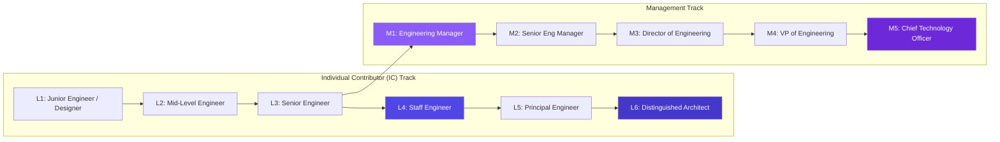

# COMPANY BIBLE — PART 2
## Organization Design, Hiring Strategy & Career Ladders
**Document:** 5.2 of 5.7 | **Series:** Company Operating System & Execution Blueprint

---

# PART 4 — ORGANIZATION DESIGN & SCALE EVOLUTION

## 4.1 Organizational Structure & Functional Topology

To maintain extreme velocity without corporate bureaucracy as we scale to 1,000+ employees, DIOS operates via **Cross-Functional Pods (EPD - Engineering, Product, Design)** supported by specialized horizontal infrastructure platforms.

```mermaid
graph TD
    CEO[Chief Executive Officer / Founder]
    
    subgraph Exec ["Executive Leadership Team (E-Team)"]
        CTO[Chief Technology Officer]
        CPO[Chief Product Officer]
        CRO[Chief Revenue Officer]
        CMO[Chief Marketing Officer]
        CFO[Chief Financial Officer]
        GC[General Counsel / Head of Legal]
        VP_People[VP of People & Culture]
    end

    CEO --> Exec

    subgraph Tech_Org ["Technology & AI Organization (CTO / CPO)"]
        Eng_Core[VP Engineering - Core Platform]
        Eng_AI[Head of AI Systems & Research]
        Eng_Infra[Head of Cloud, Edge & Security]
        Prod_Lead[Head of Product Management]
        Design_Lead[VP Design & Brand Systems]
    end

    CTO --> Eng_Core
    CTO --> Eng_AI
    CTO --> Eng_Infra
    CPO --> Prod_Lead
    CPO --> Design_Lead

    subgraph GTM_Org ["Go-To-Market Organization (CRO / CMO)"]
        Sales_Ent[VP Enterprise Sales]
        CS_Lead[VP Customer Success & Support]
        Mktg_Growth[Head of Growth & Performance Mktg]
        Mktg_DevRel[Head of DevRel & Community]
    end

    CRO --> Sales_Ent
    CRO --> CS_Lead
    CMO --> Mktg_Growth
    CMO --> Mktg_DevRel

    subgraph Ops_Org ["Operations & Corporate Organization (CFO / Legal / People)"]
        Fin_Ops[Head of Finance & RevOps]
        Legal_Ops[Enterprise Legal & IP Counsel]
        People_Ops[Talent Acquisition & HR Ops]
    end

    CFO --> Fin_Ops
    GC --> Legal_Ops
    VP_People --> People_Ops
```



## 4.2 Organizational Evolution Milestones (1 to 1,000+ Employees)

| Headcount | Stage / Funding | Organizational Topology & Leadership Structure | Primary Focus & Operational Bottlenecks |
|:---:|:---|:---|:---|
| **1–3** | Founding / Pre-Seed ($1M) | **Co-Founders Only:** CEO (Product/GTM) + CTO (Architecture/WASM Engine) + Founding Engineer (React Canvas). | **Zero to One Engine Proof:** Proving the WASM AST bidirectional sync works. No managers; 100% individual contributors. |
| **5–10** | Seed Stage ($5M) | **Single Pod Team:** Co-Founders + 4 Senior Engineers + 1 Product Designer + 1 Founding Growth/DevRel Lead. | **MVP & Closed Alpha:** Launching v0.5 to 100 users. Daily standups. Founders personally handle all customer support and hiring. |
| **25** | Series A ($15M) | **Two EPD Pods + Core GTM:** Pod A (Canvas Engine), Pod B (AI Multi-Agent Pipeline). First hires in GTM: Head of Growth, 2 DevRel Engineers, 1 Operations Lead. | **Product-Market Fit & Public Beta:** Scaling to $1M ARR. Establishing formal code review standards, basic CI/CD gates, and initial career scorecards. |
| **50** | Series A+ ($25M) | **Three Pods + Dedicated Infra:** Add Pod C (Design Tokens & Templates). Form dedicated SRE/Infra team (3 eng). Hire Head of People and first Enterprise Account Executive (AE). | **PLG Scale & Early Enterprise:** Scaling to $5M ARR. Need clear engineering management paths (Staff Engineers vs. Engineering Managers). |
| **100** | Series B ($50M) | **Functional Departments:** VP Engineering, VP Product, VP Design, VP Sales in place. 6 EPD Pods. Dedicated AI Research Lab (5 researchers). Dedicated Security/Compliance team. | **Category Leadership:** Scaling to $15M ARR. SOC2 Type II compliance. Managing cross-pod communication without slowing down shipping velocity. |
| **250** | Series C ($120M) | **Divisional Structure:** Core Platform Division, AI Platform Division, Agency/Enterprise Division. Full GTM sales motion (SDRs, AEs, Solutions Architects, Customer Success Managers). | **Global Expansion:** Scaling to $45M ARR. Opening EMEA (London/Berlin) and APAC (Tokyo/Sydney) regional offices. Implementing strict formal OKR cadences. |
| **500** | Series D ($250M) | **Multi-Product Business Units:** Separate BU leaders for DIOS Canvas, DIOS Marketplace, and DIOS Enterprise. Comprehensive in-house Legal, RevOps, and People teams. | **Market Dominance:** Scaling to $120M ARR. M&A strategy begins (acquiring specialized design tools or AI model boutiques). |
| **1,000+** | Pre-IPO / Public ($500M+) | **Global Software Enterprise:** 1,000+ employees across 15 global offices. Independent Board of Directors, Public Company Governance, dedicated internal Dev Academy. | **Generation-Defining Infrastructure:** Scaling beyond $300M+ ARR. Operating with extreme financial discipline, high free cash flow margins, and continuous product innovation. |

---

# PART 5 — INSTITUTIONAL HIRING STRATEGY & SCORECARDS

## 5.1 First 10 Crucial Hires & Hiring Order

To ensure technical perfection and market velocity, our first 10 non-founder hires must be extraordinary "10x individual contributors" who require zero management:

1. **Founding Rust/WASM Compiler Engineer (Employee #1):** Architect of the `SWC`-based AST parser and Web Worker runtime. Must have deep compiler and memory-optimization expertise.
2. **Founding React Canvas & WebContainer Engineer (Employee #2):** Expert in high-performance DOM rendering, virtualized trees, and StackBlitz/Sandpack browser runtimes.
3. **Founding AI Systems & Prompt Engineer (Employee #3):** Deep expertise in LLM context engineering, structured JSON outputs, vector embeddings (`pgvector`), and multi-agent pipelines.
4. **Founding Product Designer & Design Systems Architect (Employee #4):** Creator of our "Obsidian" design language and `tokens.json` schema. Must code fluent CSS and React components.
5. **Founding Fullstack & Distributed Systems Engineer (Employee #5):** Architect of our NestJS tRPC backend, PostgreSQL RLS multi-tenancy, and NATS JetStream background job queues.
6. **Founding Developer Relations & Community Lead (Employee #6):** Exceptional writer and speaker who builds our early Discord/GitHub community, writes technical tutorials, and drives Hacker News/Twitter awareness.
7. **Senior Cloud, Edge & Security Engineer (Employee #7):** Architect of our hybrid Cloudflare Workers + AWS EKS Karpenter infrastructure, zero-trust auth, and automated deployment engines.
8. **Senior AI Research Scientist (Employee #8):** Specialist in fine-tuning smaller open models (DeepSeek, Llama 3) for AST code repair, latency reduction, and autonomous UI self-healing.
9. **Founding Enterprise Account Executive / Solutions Lead (Employee #9):** Hybrid technical sales leader who closes our first 10 paying agency and enterprise beta accounts ($10K–$50K ACV).
10. **Head of People & Operations (Employee #10):** Exceptional operational talent who institutionalizes our hiring scorecards, compensation philosophy, and remote working culture before rapid scale.

## 5.2 Institutional Hiring Scorecard Template

Every candidate must be evaluated against a standardized, objective rubric before an offer is extended:

```
===================================================================================
POSITION: Senior Rust/WASM Engine Architect
CANDIDATE: [Name] | INTERVIEWER: [Name] | DATE: [Date]
===================================================================================

1. CORE TECHNICAL COMPETENCY (Weight: 40%)
   [ ] Strong No  [ ] Weak No  [ ] Weak Yes  [ ] Strong Yes  [ ] Extraordinary (Top 1%)
   Evidence: Demonstrated deep understanding of WASM memory allocation, SWC AST parsing,
             and zero-copy serialization between Rust Web Workers and JS main thread.

2. SYSTEM DESIGN & ARCHITECTURAL JUDGMENT (Weight: 25%)
   [ ] Strong No  [ ] Weak No  [ ] Weak Yes  [ ] Strong Yes  [ ] Extraordinary (Top 1%)
   Evidence: Designed an AST mutation queue capable of handling 60fps canvas drags while
             maintaining exact Git diff determinism without race conditions.

3. CRAFT OBSESSION & QUALITY STANDARDS (Weight: 20%)
   [ ] Strong No  [ ] Weak No  [ ] Weak Yes  [ ] Strong Yes  [ ] Extraordinary (Top 1%)
   Evidence: Unsolicited critique of our current alpha canvas responsiveness; provided
             concrete Rust optimization patterns to drop parse latency from 12ms to 4ms.

4. CULTURAL SLOPE & EXTREME OWNERSHIP (Weight: 15%)
   [ ] Strong No  [ ] Weak No  [ ] Weak Yes  [ ] Strong Yes  [ ] Extraordinary (Top 1%)
   Evidence: Previously debugged a critical production memory leak over a holiday weekend
             and subsequently rewrote the CI/CD memory profiling gate so it never recurred.

OVERALL RECOMMENDATION: [ ] HIRE (Must have at least two Strong Yes and zero No)
===================================================================================
```

## 5.3 The 4-Stage Interview Process

1. **Recruiter / Founder Culture Screening (45 mins):** Deep dive into career trajectory, intrinsic motivation, and alignment with our 5 Core Beliefs.
2. **Technical & Practical Craft Exercise (90 mins):** We NEVER ask LeetCode brain teasers. Candidates solve a real domain problem (e.g., writing a Rust AST visitor to mutate CSS token nodes, or building a high-performance virtualized canvas overlay).
3. **Architecture & System Design Panel (60 mins):** Deep architectural discussion with 2 senior engineers evaluating scalability, security, edge caching, and failure handling under stress.
4. **Executive & Bar-Raiser Final Interview (45 mins):** Conducted by a Founder or VP to ensure the candidate raises the institutional average and embodies extreme ownership.

## 5.4 Compensation, Equity & Career Ladders

### Compensation & Equity Philosophy
- **Top 90th Percentile Market Cash:** We pay at the top of the market (SF/NYC benchmarks) regardless of employee geographical location. We do not discount salaries for remote workers in lower-cost regions.
- **High-Ownership Equity Grants:** Every employee receives a significant, transparent option grant (`10-year exercise window` for employees with >2 years tenure). We want every team member to achieve life-changing wealth at IPO.

### Dual-Track Career Ladder (IC vs. Management)
We strictly decouple title and compensation from management responsibility. An extraordinary Individual Contributor (IC) can earn more than a VP without ever managing a single report.



| Level | IC Title | Management Title | Behavioral & Impact Expectations | Base Salary Range (USD) | Equity Grant Value |
|:---:|:---|:---|:---|:---:|:---:|
| **L3 / M1** | Senior Engineer | Engineering Manager | Owns end-to-end module execution independently; mentors juniors. / Manages 5–8 engineers; ensures sprint velocity and psychological safety. | $180K – $220K | $150K – $300K |
| **L4 / M2** | Staff Engineer | Senior Eng Manager | Architect of cross-pod systems; solves critical technical bottlenecks. / Manages 2–3 EMs (15–25 engineers); drives quarterly pod roadmaps. | $230K – $280K | $350K – $600K |
| **L5 / M3** | Principal Engineer | Director of Eng | Sets platform-wide architectural direction; speaks at global conferences. / Manages 40–70 engineers; aligns technical strategy with company financial OKRs. | $290K – $350K | $700K – $1.2M |
| **L6 / M4** | Distinguished Architect | VP of Engineering | Industry luminary; defines multi-year technical vision (e.g., spatial AST engine). / Manages entire 150+ engineering org; responsible for 99.99% SLA and executive board reporting. | $360K – $450K+ | $1.5M – $3.0M+ |

---

*— End of Part 2 (Company Bible) —*
