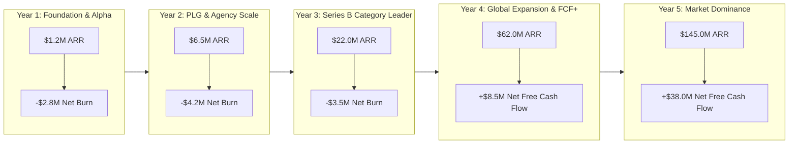
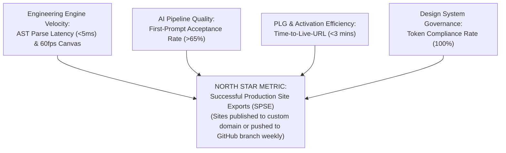

# COMPANY BIBLE — PART 4
## Business Model Evaluation, Financial Forecasts & Executive Metrics
**Document:** 5.4 of 5.7 | **Series:** Company Operating System & Execution Blueprint

---

# PART 10 — COMPREHENSIVE BUSINESS MODEL EVALUATION

## 10.1 Evaluation of All 12 Revenue Streams

We rigorously evaluate every potential monetization vector across Gross Margin, Scalability, Engineering Complexity, and Strategic Strategic Alignment:

| # | Revenue Stream & Description | Target Pricing Model | Gross Margin | Scalability & Growth Potential | Strategic Evaluation & Implementation Verdict |
|:---:|:---|:---|:---:|:---:|:---|
| **1** | **Core SaaS Subscriptions** Monthly/Annual seat licensing for individual creators, agencies, and enterprises. | Free / Pro ($29/mo) / Agency ($299/mo) / Enterprise ($5K+/mo) | **88%** | **Extraordinary** (Recurring, high retention) | **CORE BUSINESS (Day 1):** The primary engine of predictability and valuation. Highly predictable SaaS multi-tenant revenue. |
| **2** | **Usage-Based AI Compute** Metered credits for multi-agent generation, code refactoring, and auto-remediation. | $10 per 1,000 credits overage; tiered compute expansion packs. | **65% – 72%** | **High** (Scales with user activity) | **CORE BUSINESS (Day 1):** Directly monetizes heavy AI power users while protecting infrastructure margins against LLM API volatility. |
| **3** | **Template & Plugin Marketplace** Digital store for custom components, brand kits, and third-party developer plugins. | **20% Take Rate** on all creator/agency sales. | **95%+** | **High** (Network effects compound) | **CORE BUSINESS (Year 2):** Creates massive ecosystem stickiness and secondary revenue without direct engineering content creation costs. |
| **4** | **Managed Edge Hosting & Custom Domains** Global Cloudflare Anycast edge deployment, SSL, and CDN traffic. | Free up to 100GB bandwidth; $20/TB overage + $10/mo custom domain SSL. | **82%** | **High** (Every site needs hosting) | **CORE BUSINESS (Day 1):** Captures full-stack value chain. Eliminates deployment friction and creates high exit switching costs. |
| **5** | **Agency White-Labeling** Full platform rebrand (`build.youragency.com`) for agency-to-client handoffs. | Included in Agency plan ($299/mo) or $199/mo standalone add-on. | **95%+** | **Medium-High** (High ARPU agency expansion) | **CORE BUSINESS (Year 1/2):** High willingness to pay among digital agencies who want to present DIOS as their own proprietary tool. |
| **6** | **Enterprise Professional Services** Guided onboarding, custom design token migration, and dedicated AI training. | $250/hour or $15,000 flat-fee implementation packages. | **35% – 45%** | **Low** (Human-service bottleneck) | **SELECTIVE ENTERPRISE ONLY:** Used exclusively as a sales enablement tool to close $100K+ ARR contracts. Never scaled as a standalone business unit. |
| **7** | **Headless API & SDK Platform** Programmatic access to AST compiler, generation engine, and token conversion APIs. | $0.05 per API call or $499/mo developer tier. | **85%** | **High** (Automated programmatic scale) | **PHASE 3 EXPANSION (Year 3):** Allows large e-commerce brands and headless CMS providers to embed our engine into their custom workflows. |
| **8** | **Developer Certification & Training** "Certified DIOS Architect" online courses, exams, and agency partner badges. | $299 per exam / $999 for agency partner certification. | **90%+** | **Medium** (Builds professional brand) | **ECOSYSTEM EXPANSION (Year 2/3):** Creates an army of certified developers who insist on adopting DIOS at their employers. |
| **9** | **Self-Hosted Enterprise / Dedicated Cloud** Running DIOS VPC inside customer's private AWS/GCP infrastructure. | $100,000+/year base license + per-seat annual maintenance. | **95%+** | **Medium** (High sales complexity) | **ENTERPRISE ONLY (Year 3/4):** Required for defense, banking, and healthcare clients requiring strict on-premise air-gapped data isolation. |
| **10** | **Autonomous A/B Testing & Personalization** Real-time edge layout mutation based on visitor conversion telemetry. | $99/mo add-on or 1% of incremental attributed revenue. | **85%** | **High** (High-ROI marketing tool) | **PHASE 2 EXPANSION (Year 2):** Leverages our AST engine to do what static site builders cannot—real-time edge layout self-healing. |
| **11** | **Brand Kit & Token Sync Add-On** Enterprise bi-directional sync between Figma, DIOS, and internal GitHub monorepos. | $49/seat/mo Enterprise Design Ops add-on. | **92%** | **High** (Enterprise design team staple) | **ENTERPRISE EXPANSION (Year 2):** Solves the #1 operational headache of design systems teams inside Fortune 500 companies. |
| **12** | **Data & Benchmark Insights (Aggregated)** Anonymized UI/UX conversion benchmarks sold to enterprise marketing firms. | $25,000/year annual research report & API access. | **98%+** | **Low-Medium** (Niche executive market) | **LONG-TERM OPTION (Year 4+):** Low priority until we have billions of data points across millions of live deployed pages. |

---

# PART 11 — 5-YEAR FINANCIAL MODEL & UNIT ECONOMICS

## 11.1 Five-Year Pro-Forma Income Statement & Growth Projections

The model assumes **Venture-Backed Execution** ($5M Seed -> $20M Series A -> $60M Series B -> $150M Series C), prioritizing aggressive category capture and engineering talent density while turning free-cash-flow positive by Year 4.

| Financial Line Item | Year 1 (Foundation) | Year 2 (Growth & PLG) | Year 3 (Series B Scale) | Year 4 (Global Expansion) | Year 5 (Market Dominance) |
|:---|:---:|:---:|:---:|:---:|:---:|
| **Total Registered Users** | 45,000 | 250,000 | 850,000 | 2,400,000 | 6,000,000 |
| **Paying Customers (Accounts)** | 1,800 | 9,500 | 31,000 | 82,000 | 195,000 |
| **Average Revenue Per Account (ARPA)** | $666 / yr | $684 / yr | $709 / yr | $756 / yr | $743 / yr |
| **Total Annual Recurring Revenue (ARR)** | **$1,200,000** | **$6,500,000** | **$22,000,000** | **$62,000,000** | **$145,000,000** |
| **Cost of Goods Sold (COGS - Cloud & LLM)** | ($216,000) | ($1,105,000) | ($3,520,000) | ($9,300,000) | ($18,850,000) |
| **Gross Profit ($)** | **$984,000** | **$5,395,000** | **$18,480,000** | **$52,700,000** | **$126,150,000** |
| **Gross Margin (%)** | **82.0%** | **83.0%** | **84.0%** | **85.0%** | **87.0%** |
| **Research & Development (R&D - Eng/Design)**| ($2,400,000) | ($5,800,000) | ($11,500,000) | ($22,000,000) | ($42,000,000) |
| **Sales & Marketing (S&M - GTM/DevRel)** | ($900,000) | ($2,600,000) | ($7,200,000) | ($16,500,000) | ($34,000,000) |
| **General & Administrative (G&A - Legal/Ops)** | ($484,000) | ($1,195,000) | ($3,280,000) | ($5,700,000) | ($12,150,000) |
| **Total Operating Expenses (OpEx)** | ($3,784,000) | ($9,595,000) | ($21,980,000) | ($44,200,000) | ($88,150,000) |
| **Net Operating Income / Burn ($)** | **($2,800,000)** | **($4,200,000)** | **($3,500,000)** | **+$8,500,000** | **+$38,000,000** |
| **Operating Margin (%)** | *-233%* | *-65%* | *-16%* | **+13.7%** | **+26.2%** |
| **Total Full-Time Employees (Headcount)** | **18** | **45** | **110** | **260** | **580** |
| **ARR Per Employee Productivity** | $66,666 | $144,444 | $200,000 | $238,461 | $250,000 |

## 11.2 Unit Economics, CAC, LTV & Payback Targets

To ensure institutional sustainability and venture fundability across all market cycles, our unit economics must strictly adhere to our **Core Unit Economic Guardrails**:

| Unit Metric | Pro/Individual Plan ($29/mo) | Agency Plan ($299/mo) | Enterprise Plan ($5,000+/mo) | Target Institutional Guardrail |
|:---|:---:|:---:|:---:|:---|
| **Monthly Churn Rate (%)** | 3.5% | 1.8% | 0.5% | Overall Blended Net Revenue Retention (NRR) > 135% |
| **Average Lifetime (Months)**| 28.5 Months | 55.5 Months | 200+ Months | High switching costs driven by Git sync and custom token kits. |
| **Customer Lifetime Value (LTV)** | **$677** | **$13,770** | **$860,000+** | Calculated at blended 85% gross margin. |
| **Customer Acquisition Cost (CAC)**| **$85** *(PLG Organic + Paid)* | **$1,450** *(SDR + Growth)* | **$45,000** *(Dedicated AE + SA)* | Optimized via high-virality `"Built with DIOS"` loops and SEO. |
| **LTV : CAC Ratio** | **7.9 : 1** | **9.5 : 1** | **19.1 : 1** | Institutional target: **> 5.0 : 1** across all tiers. |
| **Months to CAC Payback** | **3.6 Months** | **5.8 Months** | **10.6 Months** | Institutional target: **< 12 Months** across all segments. |

---

# PART 12 — EXECUTIVE METRICS, OKRS & THE NORTH STAR

## 12.1 The North Star Metric: Successful Production Site Exports (SPSE)

**Why SPSE is the ultimate North Star:** If users are merely generating prompts without publishing or exporting to Git, we are a toy. When a user exports clean Next.js code to GitHub or deploys to a custom domain, they have experienced **core technical value**. SPSE drives high NRR, viral sharing, and enterprise standardization.

## 12.2 Institutional KPI & Executive Scorecard (Quarterly Tracking)

| Operational Domain | Core KPI / Metric | Green Target (Excellence) | Yellow Warning (Action Required) | Red Alert (Immediate Board Review) |
|:---|:---|:---:|:---:|:---:|
| **Product & Growth** | Weekly Active Editors (WAE) | > 40% of registered accounts | 25% – 39% | < 25% |
| **AI Systems** | First-Prompt Acceptance Rate | > 65% accepted without manual undo | 50% – 64% | < 50% (Indicates model prompt drift) |
| **Engineering / SRE**| Platform 5xx Error Rate (SLO) | < 0.05% across all API requests | 0.05% – 0.20% | > 0.20% (Breach of 99.95% SLA) |
| **Customer Success** | Blended Net Revenue Retention (NRR) | > 135% annual cohort expansion | 115% – 134% | < 115% (Indicates high seat churn) |
| **Financial / RevOps**| Months to CAC Payback | < 9.0 Months blended | 9.1 – 14.0 Months | > 14.0 Months (Unsustainable burn) |

---

*— End of Part 4 (Company Bible) —*
