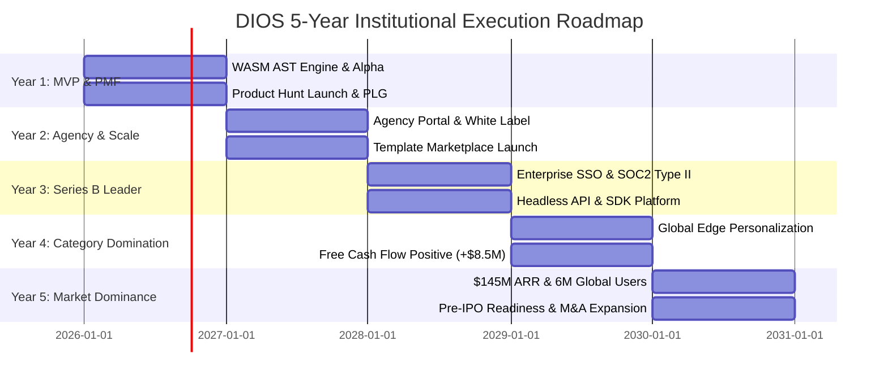

# COMPANY BIBLE — PART 6
## Five-Year Execution Roadmap & The Founder Playbook
**Document:** 5.6 of 5.7 | **Series:** Company Operating System & Execution Blueprint

---

# PART 17 — FIVE-YEAR INSTITUTIONAL EXECUTION ROADMAP

## 17.1 The 5-Year Scaling Horizon & Strategic Execution Matrix

We break our company's journey from founding to $145M+ ARR into **5 distinct annual horizons**, defining exact objectives, financial targets, organizational growth, and technical milestones for each year:

### Year 1: Foundation, MVP & Product-Market Fit (2026–2027)
- **Strategic Objective:** Prove AST-native bidirectional sync works flawlessly, attain high user love among early adopters, and establish initial PLG self-serve monetization.
- **Key Milestones:**
  1. Ship `v0.1 Alpha` (Rust/WASM engine + basic canvas) to internal team (Q1).
  2. Ship `v0.5 Closed Alpha` (4-agent AI pipeline + design tokens) to 100 beta testers (Q2).
  3. Execute #1 Product Hunt Launch for `v1.0 Public Beta` + GitHub 2-way sync (Q3).
  4. Reach $100K Monthly Recurring Revenue ($1.2M ARR) across Pro and Agency tiers (Q4).
- **KPIs & Targets:** `45,000` registered users, `1,800` paying accounts, `$1.2M ARR`, `130% NRR`, `60fps` canvas responsiveness.
- **Organization & Team:** Scale from 3 co-founders to **18 full-time employees** (12 EPD, 4 GTM/DevRel, 2 Ops). Raise $5M Seed round.

### Year 2: Agency Workflow Scale & Ecosystem Expansion (2027–2028)
- **Strategic Objective:** Capture the digital agency market via white-label portals, launch the DIOS Creator Marketplace, and secure Series A funding.
- **Key Milestones:**
  1. Ship `v2.0 Agency & Teams` featuring real-time collaborative presence (`Yjs`), element-pinned comments, and `build.youragency.com` white-labeling (Q1).
  2. Launch the DIOS Marketplace (`20% take rate`) with 100+ verified creator component kits (Q2).
  3. Attain SOC2 Type II compliance and close first 50 enterprise accounts at $25K+ ACV (Q3).
  4. Raise $20M Series A led by top-tier venture firm (Sequoia, YC, or a16z) (Q4).
- **KPIs & Targets:** `250,000` registered users, `9,500` paying accounts, `$6.5M ARR`, `138% NRR`, `< 9 months` CAC payback.
- **Organization & Team:** Scale to **45 full-time employees** (28 EPD, 12 GTM/Sales, 5 Corporate Ops). Form formal engineering pods.

### Year 3: Series B Scale & Enterprise Standardization (2028–2029)
- **Strategic Objective:** Become the indisputable category leader for AI website platforms, scale enterprise direct sales, and launch Headless API platform.
- **Key Milestones:**
  1. Ship `v3.0 Enterprise & Platform` featuring SAML SSO, SCIM provisioning, audit logging, and headless API/SDK access (`@dios/sdk`) (Q1).
  2. Launch programmatic SEO engine (`10,000+ indexed pages`) driving 500,000+ monthly organic visitors (Q2).
  3. Expand internationally with local data residency in EU (`AWS eu-west-1`) and APAC (`ap-northeast-1`) (Q3).
  4. Raise $60M Series B to fund aggressive global engineering and enterprise sales hiring (Q4).
- **KPIs & Targets:** `850,000` registered users, `31,000` paying accounts, `$22.0M ARR`, `142% NRR`, `84%` gross margin.
- **Organization & Team:** Scale to **110 full-time employees** (65 EPD, 32 GTM/Sales, 13 Corporate/Legal/People). Hire formal VPs across all functions.

### Year 4: Category Domination & Free Cash Flow Profitability (2029–2030)
- **Strategic Objective:** Capture global enterprise standardization, deploy autonomous real-time edge personalization, and achieve net free-cash-flow profitability.
- **Key Milestones:**
  1. Ship Autonomous A/B Testing & Personalization Engine executing real-time layout mutations inside Cloudflare Workers HTMLRewriter (Q1).
  2. Cross $50M ARR threshold with over 500 enterprise accounts paying > $50,000 annually (Q2).
  3. Host 1st Annual `DIOS Global Conference` in San Francisco with 3,000+ attendees (Q3).
  4. Turn **Net Free-Cash-Flow Positive (+$8.5M FCF)** while maintaining > 150% YoY top-line growth (Q4).
- **KPIs & Targets:** `2,400,000` registered users, `82,000` paying accounts, `$62.0M ARR`, `+$8.5M FCF`, `85%` gross margin.
- **Organization & Team:** Scale to **260 full-time employees** across US, EMEA, and APAC regional hubs.

### Year 5: Market Dominance, Pre-IPO Readiness & M&A (2030–2031)
- **Strategic Objective:** Solidify DIOS as a generation-defining multi-billion-dollar software enterprise, execute strategic acquisitions, and prepare for initial public offering (IPO).
- **Key Milestones:**
  1. Reach **$145M+ Annual Recurring Revenue ($12M+ MRR)** and **+$38.0M Net Free Cash Flow** (Q2).
  2. Execute strategic M&A acquisitions of specialized UI component libraries, AI model fine-tuning boutiques, and design ops agencies (Q3).
  3. Complete public company governance requirements, independent board appointments, and SOX financial compliance (Q4).
- **KPIs & Targets:** `6,000,000` registered users, `195,000` paying accounts, `$145.0M ARR`, `+$38.0M FCF`, `$250,000 ARR/employee`.
- **Organization & Team:** Scale to **580 full-time employees** across 4 global business units.

---

# PART 18 — THE INSTITUTIONAL FOUNDER PLAYBOOK

## 18.1 Founder Operating Cadence (Daily, Weekly, Monthly)

As founders scaling from Day 1 to Day 1,000, daily discipline determines institutional survival. Founders MUST adhere to this exact time-allocation cadence:

| Operating Timeframe | Institutional Cadence & Mandatory Leadership Actions |
|:---|:---|
| **Daily Cadence (The Founder's Day)** | **08:00 – 10:00 (Deep Focus):** No Slack, no email. Review AST compiler PRs, write strategic PRDs, or inspect live canvas telemetry. **10:00 – 12:00 (Customer & GTM):** Conduct 2 live customer discovery/support calls. Review active enterprise pipeline with AE lead. **13:00 – 15:00 (Recruiting & Team):** Conduct 2 candidates bar-raiser interviews. Unblock P0 engineering bottlenecks. **15:00 – 17:00 (Product Polish):** Test latest staging builds personally. Log detailed visual/functional feedback directly into Linear. |
| **Weekly Cadence (The Pulse)** | **Monday Morning:** 60-minute Executive Leadership Team (ELT) Sync to review the Weekly Scorecard, revenue actuals, and P0 blockers. **Wednesday & Thursday:** Guard the company-wide *No Meeting Days* ruthlessly. Lead by example by turning off Slack notifications. **Friday Afternoon:** 60-minute *Product Demo & Teardown* with engineering pods followed by asynchronous weekly executive update sent to all staff and board members. |
| **Monthly Cadence (The Course Correction)** | **First Tuesday:** Monthly Executive Business Review (EBR). Deep financial audit of actual burn vs. budget, cohort churn analysis, and CAC payback trajectory. **Third Friday:** Monthly All-Hands meeting. Transparently share revenue, burn, runway, and customer wins/losses with the entire 100+ person organization. |
| **Quarterly Cadence (The Horizon Shift)** | **Weeks 11–12 of Quarter:** Conduct asynchronous EPD pod OKR setting for the upcoming quarter. Review strategic RICE scores. **First Week of New Quarter:** Quarterly Board of Directors Meeting. Present formal financial statements, strategic risks, and executive hiring roadmap. |

## 18.2 The Founder Reading & Institutional Learning List

Every founder and executive team member must deeply study these foundational works to establish shared mental models:

1. **High Output Management** *(Andy Grove)* — For management leverage, task-relevant maturity, and operational rigor.
2. **The Innovator's Dilemma** *(Clayton Christensen)* — For understanding exactly how incumbents (Figma, Webflow) get disrupted by lower-end disruptive architectures (AST/AI).
3. **Working Backwards** *(Colin Bryar & Bill Carr)* — For institutionalizing Amazon's PR/FAQ writing culture and customer obsession.
4. **Zero to One** *(Peter Thiel)* — For building defensible monopolies, category creation, and non-consensus truth.
5. **Amp It Up** *(Frank Slootman)* — For raising institutional velocity, narrowing focus, and driving extreme execution standards.
6. **Good Strategy Bad Strategy** *(Richard Rumelt)* — For diagnosing structural challenges and designing cohesive, actionable strategic policies.

## 18.3 The 6 Fatal Founder Mistakes to Avoid at All Costs

1. **Premature Scaling Before True PMF:** Hiring 20 salespeople or spending $100K/month on paid ads before our AST canvas and AI pipeline have achieved > 65% first-prompt acceptance and > 130% NRR. **Result:** Catastrophic cash drain and rapid death.
2. **Diluting Technical Bar for Speed:** Hiring "average" engineers because a project is 3 weeks late. **Result:** An average engineer creates technical debt that slows down 4 senior engineers, permanently degrading code architecture.
3. **Competing on Feature Parity Instead of Architectural Differentiation:** Trying to build every obscure animation tool Framer has instead of doubling down on our unique AST bidirectional Git sync moat. **Result:** We become an inferior clone instead of a category leader.
4. **Ignoring Enterprise Security & Compliance Until the Contract is Lost:** Delaying SOC2 Type II or GDPR isolation until a $100K enterprise deal asks for it. **Result:** 9-month sales cycle delays and lost enterprise trust.
5. **Allowing Customer Support to Become an Outsourced Silo:** Stopping founders and core engineers from talking directly to frustrated users. **Result:** Product leadership loses touch with reality, and the canvas fills with paper-cuts.
6. **Mismanaging Cash & Relying on "Next Round" Optimism:** Operating with < 12 months of runway assuming VCs will always fund growth regardless of burn multiples. **Result:** Forced down-rounds, dilutive emergency financing, or bankruptcy.

---

*— End of Part 6 (Company Bible) —*
