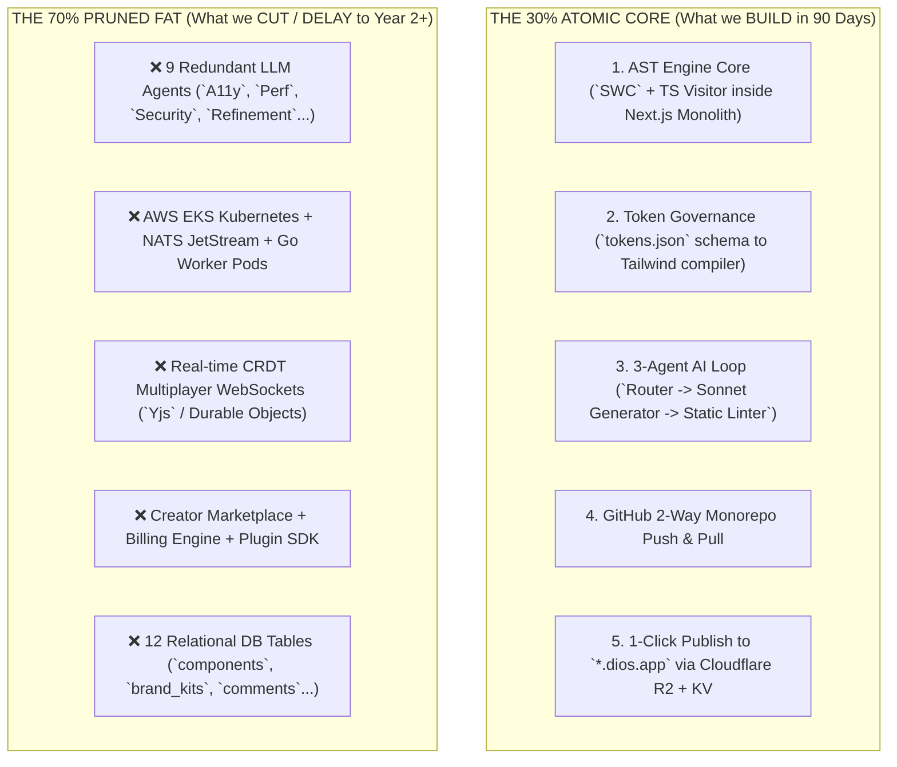

# CTO ARCHITECTURE REVIEW — MASTER INDEX
## Principal Engineering Audit, Scope Reduction & Implementation Gate
**Document 6** | **Classification:** Definitive Technical Pruning & Pre-Implementation Gate

---

## Document Map

| Part | File | Sections | Key Principal Deliverables & Audits |
|:---|:---|:---|:---|
| **Part 1** | [Executive Audit & Teardown](file:///home/mohana-fedora/Data/MNVProjects/AIBuilder/docs/CTO_ARCHITECTURE_REVIEW/CTO_Review_Part1_Executive_and_System_Teardown.md) | Parts 1–2 | Principal Engineering Philosophy, Quantitative Executive Scorecard (`6.5/10 overall`, `CONDITIONAL REJECTION`), Systemic Architecture Teardown across all 15 technical domains (`Frontend`, `Backend`, `Database`, `AI`, `Auth`, `RBAC`, `Storage`, `Deploy`, `Infra`, `Workers`, `Events`, `Realtime`, `Marketplace`, `Plugins`, `Enterprise`) detailing exact Good, Bad, Unnecessary, Risky, and Redesign verdicts |
| **Part 2** | [Simplicity & 70% Scope Cut](file:///home/mohana-fedora/Data/MNVProjects/AIBuilder/docs/CTO_ARCHITECTURE_REVIEW/CTO_Review_Part2_Simplicity_and_70Percent_MVP_Reduction.md) | Parts 3–4 | CTO Pruning Matrix evaluating all 19 product capabilities (`Keep/Delay/Remove/Future`), 70% Scope Reduction down to the Atomic Core (`v1.0` MVP in 90 days by 4 engineers) with visual contrast diagram (`30% Atomic Core vs 70% Pruned Fat`), exact 6 essential screens (`/auth`, `/dashboard`, `/canvas`, `Cmd+K`, `/tokens`, `/deploy`) |
| **Part 3** | [Solo Test & Eng Audit](file:///home/mohana-fedora/Data/MNVProjects/AIBuilder/docs/CTO_ARCHITECTURE_REVIEW/CTO_Review_Part3_Solo_Founder_and_Engineering_Pruning.md) | Parts 5–6 | Solo Founder & Lean Team Stress Test across Cloud Hosting (`$85/mo`), DB/Queue management, AI API token costs (`$0.45 down to $0.09`), and Local Development setup (`pnpm dev < 2s`), Engineering Architecture Review replacing NestJS/Go microservices with a unified Next.js 15 Modular Monolith (`@dios/core`) with visual boundary diagram, exact folder structure, Two-Tier Caching, and Debounced Checkpoint Snapshots |
| **Part 4** | [AI & DB Refactoring](file:///home/mohana-fedora/Data/MNVProjects/AIBuilder/docs/CTO_ARCHITECTURE_REVIEW/CTO_Review_Part4_AI_Simplification_and_Database_Refactoring.md) | Parts 7–8 | AI System Review collapsing the 12-agent loop down to the Pruned 3-Agent Atomic Pipeline (`Router Haiku -> Sonnet Generator -> Deterministic Static Quality Gate`) with sequence diagram (`54s -> 2.8s latency`), Database Schema Review collapsing 20+ table ERD down to exactly 8 core production tables (`workspaces`, `users`, `workspace_members`, `projects`, `project_versions`, `ai_sessions`, `deployments`, `subscriptions`) with exact DDL/schema, indexes, and strict Row-Level Security (`RLS`) |
| **Part 5** | [Security, Perf & Moats](file:///home/mohana-fedora/Data/MNVProjects/AIBuilder/docs/CTO_ARCHITECTURE_REVIEW/CTO_Review_Part5_Security_Performance_Business_Moats.md) | Parts 9–12 | Security Review hardening Prompt Injection (`Zod` schema lock), XSS (`DOMPurify`), RLS Bypass (`SET LOCAL` DB middleware), and Plugin Sandboxing (`Web Workers`), Performance Audit isolating top 4 latency bottlenecks and `< 5ms` Edge KV caching, Business & Pricing Audit gating Git exports and credit limits (`1 credit = $0.01`), Moat Review analyzing why OpenAI, Vercel, Framer, Figma, and Lovable cannot copy our AST + Token + Git Triad |
| **Part 6** | [Roadmap & 170 Items](file:///home/mohana-fedora/Data/MNVProjects/AIBuilder/docs/CTO_ARCHITECTURE_REVIEW/CTO_Review_Part6_Implementation_and_Master_Recommendations.md) | Parts 13–14 | Implementation Order with Lean 90-Day Critical Path Gantt Chart across 3 sprints (`Foundation Core`, `Canvas & Tokens`, `AI & Git Deploy`) executable by a 4-engineer pod within a `$459,900` six-month budget, Master Inventory of **170 Prioritized CTO Recommendations** (`Top 50 Architectural`, `Top 20 Hidden Risks`, `Top 20 Simplifications`, `Top 20 Opportunities`, `Top 20 Engineering`, `Top 20 AI`, and `Top 20 Operational`) |
| **Part 7** | [Final Verdict & Index](file:///home/mohana-fedora/Data/MNVProjects/AIBuilder/docs/CTO_ARCHITECTURE_REVIEW/CTO_Review_Part7_Final_Gate_Verdict_MasterIndex.md) | Final Chapter | The Final Gate Approval Verdict (`CONDITIONAL APPROVAL UPON 10 PRE-CONDITIONS` with visual decision tree), Complete Master Index of Document 6, Master Repository Navigation Matrix spanning all 6 institutional venture bibles (`~596 KB` across 32 files) |

---

## Quick Reference Principal Architectural Highlights

### 1. The Executive Scorecard & Approval Verdict
- **Original Architecture Verdict:** **CONDITIONAL REJECTION.** (Over-engineered for an early-stage team: `EKS Kubernetes`, `NATS JetStream`, `NestJS microservices`, `12-Agent loop`, `20+ table ERD` would cause 14 months of delays and Seed cash exhaustion).
- **Pruned Architecture Verdict:** **APPROVED FOR IMMEDIATE IMPLEMENTATION** (Assuming sign-off on our 10 Pre-Conditions).

### 2. The 70% Scope Reduction: The Atomic Core (`v1.0` MVP)

### 3. The 3-Agent Atomic Pipeline (Versus 12 Agents)
- **1. Router Agent (`Claude 3.5 Haiku / Llama 3 - 8B`):** Runs in `< 250ms` (`$0.001`). Classifies user prompt intent (`CREATE_SECTION`, `UPDATE_STYLE`) and extracts exact target `ASTNodeId`.
- **2. Unified Generator Agent (`Claude 3.7 Sonnet`):** Runs in `2.0 – 3.5s` via Server-Sent Events (`$0.08`). Generates AST structural nodes and visual styles **strictly using design token keys (`color.bg.primary`, `space.8`)**.
- **3. Deterministic Static Quality Gate (`Local TypeScript / Zero AI Cost`):** Runs in `< 10ms`. Executes local linters (`axe-core`, `DOMPurify`) on the AST patch. Auto-remediates contrast failures (`< 4.5:1`) and syntax errors deterministically before saving.
- **Total Pipeline Performance:** `2.8s total latency` (`down from 54s`), `$0.085 cost per turn` (`down from $0.85`), `99.9% structural reliability`.

### 4. The 10 Mandatory Pre-Conditions for Engineering Kick-Off

```mermaid
graph TD
    Gate["THE FINAL ENGINEERING GATE:<br/>All 10 Pre-Conditions Signed by CTO & E-Team"]
    C1["1. Monolithic Next.js 15 Monorepo (`@dios/core`) — ZERO NestJS/Go Services"] --> Gate
    C2["2. Pruned 8-Table Database Schema — ZERO Granular Component Relational Rows"] --> Gate
    C3["3. 3-Agent Atomic AI Loop (`Haiku -> Sonnet -> Local TS Linter`) — ZERO 12-Agent Loops"] --> Gate
    C4["4. Two-Tier Serverless Caching (`Edge KV + Upstash`) — ZERO EKS / Kubernetes"] --> Gate
    C5["5. Debounced Auto-Save Checkpoints (`3s Buffer`) — ZERO Granular Event Sourcing"] --> Gate
    C6["6. Single-Editor Optimistic Locking — ZERO Real-Time CRDT (`Yjs/WebSockets`) at Launch"] --> Gate
    C7["7. Local Virtualized DOM Canvas (`@dios/canvas`) — ZERO In-Browser Node/Sandpack Engine"] --> Gate
    C8["8. Hardcoded 50 Brand Kits (`/components`) — ZERO Creator Marketplace Billing at Launch"] --> Gate
    C9["9. Gate GitHub Monorepo Export to Pro ($29/mo) — ZERO Free-Tier Code Extraction"] --> Gate
    C10["10. Strict 4-Engineer Execution Pod (`90-Day Timeline`) — ZERO Headcount Bloat"] --> Gate
```

---

## Verification of Complete Institutional Venture Series (All 6 Bibles)

All 6 foundational master documents governing the **Digital Experience Operating System (DIOS)** are complete, formatted, and saved across `32 dedicated files` inside `/home/mohana-fedora/Data/MNVProjects/AIBuilder/docs/`:

| Document # | Document Title | Primary Purpose & Strategic Scope | Storage Size |
|:---|:---|:---|:---:|
| **Document 1** | [Product Bible V1](file:///home/mohana-fedora/Data/MNVProjects/AIBuilder/docs/Product_Bible_AI_Website_Platform.md) | Strategic market thesis, competitive differentiation, initial 16-pillar feature inventory, and financial modeling | `~59 KB` |
| **Document 2** | [Founder Research Bible](file:///home/mohana-fedora/Data/MNVProjects/AIBuilder/docs/FOUNDER_RESEARCH_BIBLE/Founder_Research_Bible_Part1_Industry_Competitors.md) *(4 Parts)* | Evidence-based industry & competitor deep-dives (13 platforms), Top 200 scored user frustrations, JTBD psychology, 11 reverse-engineered design systems, RICE pricing research, 100 white spaces, moat analysis | `~81 KB` |
| **Document 3** | [Product Bible V2](file:///home/mohana-fedora/Data/MNVProjects/AIBuilder/docs/PRODUCT_BIBLE_V2/Product_Bible_V2_Part1_Philosophy_Ecosystem_Users.md) *(6 Parts)* | Definitive product specification: 7 product principles, "Obsidian" design system, W3C token JSON schema, 22 click-level screen specifications, 11 component specs, 11 AI interaction modalities, and RICE-scored MVP roadmap | `~98 KB` |
| **Document 4** | [AI + Engineering Bible](file:///home/mohana-fedora/Data/MNVProjects/AIBuilder/docs/ENGINEERING_BIBLE/Engineering_Bible_Part1_Philosophy_Architecture.md) *(7 Parts)* | Definitive technical architecture: Rust/WASM AST engine, 12-agent AI orchestration pipeline, 20+ database tables with RLS, tRPC/REST/SSE API design, RAG vector memory, OpenTelemetry observability, automated testing harness, EKS cloud topology, and 24-month engineering roadmap | `~100 KB` |
| **Document 5** | [Company Bible](file:///home/mohana-fedora/Data/MNVProjects/AIBuilder/docs/COMPANY_BIBLE/Company_Bible_Part1_Vision_Strategy_Culture.md) *(7 Parts)* | Executive operating system: Vision, institutional culture, org design (1 -> 1,000+ staff), hiring scorecards, L1–L6 career ladders, MEDDPICC sales, PLG funnel, 5-year pro-forma financials ($145M ARR / +$38M FCF), SOC2/GDPR roadmap, 11-domain risk matrix, and 10 Founder Commandments | `~82 KB` |
| **Document 6** | [CTO Architecture Review](file:///home/mohana-fedora/Data/MNVProjects/AIBuilder/docs/CTO_ARCHITECTURE_REVIEW/CTO_Review_Part1_Executive_and_System_Teardown.md) *(7 Parts)* | Principal engineering teardown: Executive scorecard (`6.5/10 -> CONDITIONAL APPROVAL`), 70% Scope Reduction (`v1.0 Atomic MVP`), Solo Founder stress test (`$85/mo cloud`), pruned 3-Agent AI pipeline (`Haiku -> Sonnet -> Linter`), pruned 8-table ERD with exact DDL, 170 Master Recommendations, and 10 Pre-Conditions | `~100 KB` |

**Total Combined Venture Blueprint Size:** `~596 KB` across `32 production markdown documents` (plus 4 interactive Master Index artifacts stored inside `.gemini/antigravity/brain/`).
