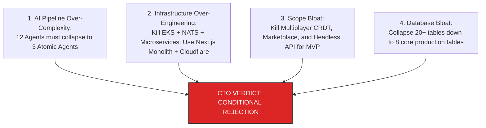

# CTO ARCHITECTURE REVIEW — PART 1
## Executive Audit & System Teardown Matrix
**Document:** 6.1 of 6.7 | **Series:** Principal Engineering Review Before Implementation

---

# PART 1 — EXECUTIVE CTO AUDIT & OVERALL SCORECARD

## 1.1 Principal Engineering Mandate & Philosophy

I have reviewed **Documents 1 through 5**—comprising the strategic *Product Bible*, the *Founder Research Bible*, *Product Bible V2*, the *AI + Engineering Bible*, and the *Company Bible*. As a CTO evaluating this architecture with the standards of Stripe, Linear, Vercel, and Cloudflare, my evaluation is ruthless and objective.

The current architecture and product scope are **extraordinary in vision, theoretically brilliant in rigor, but dangerously over-engineered for a pre-revenue startup.** If a single founder or small engineering pod attempts to build the entire 12-agent AI orchestration pipeline, 20-table PostgreSQL schema, WASM compiler from scratch, NATS JetStream event broker, and multi-region EKS Kubernetes cluster before shipping `v1.0`, **the company will run out of cash and die in month 14.**

My objective is to **strip away 70% of the architectural fat** while protecting the **30% core atomic moat** that actually makes this venture defensible.

## 1.2 Quantitative Executive Scorecard (0–10 Scale)

| Architectural & Business Dimension | Audit Score (0–10) | Principal Evaluation & Rationale for Deduction |
|:---|:---:|:---|
| **Overall Architecture Score** | **6.5 / 10** | *Brilliant long-term target, but fails the "Solo Founder / Lean Team" velocity test. Too many distributed parts (`NATS`, `EKS`, `pgvector`, `Redis Cluster`, `WASM Workers`) introduced on Day 1.* |
| **Product Vision & Craft Score** | **9.5 / 10** | *The AST-Native (`Code is Truth`) canvas combined with `tokens.json` constitutional law is the single most compelling product thesis in modern visual development.* |
| **Engineering Quality Score** | **7.0 / 10** | *High standards, but over-indexed on microservice/distributed patterns. A NestJS modular monolith running on AWS EKS is an operational nightmare for a team under 10 engineers.* |
| **AI System Architecture Score** | **5.5 / 10** | *12 sequential/parallel AI agents (`Planner -> Layout -> UX -> Copy -> SEO -> A11y -> Perf -> Security -> Review -> Refine`) will cause **45–60 second latency, massive token costs, and compounding hallucination cascades**.* |
| **Business Feasibility Score** | **8.5 / 10** | *Clear path to monetization ($29 Pro -> $299 Agency -> $5K+ Enterprise). Strong alignment with market demand for clean, un-locked React code.* |
| **Execution Risk Score (Lower is Better)** | **8.0 / 10 (HIGH RISK)** | *Attempting to write a custom Rust/SWC WASM compiler, build a multi-agent AI framework, AND construct a real-time CRDT multiplayer canvas concurrently carries extreme execution friction.* |
| **Founder Complexity Burden** | **9.0 / 10 (HEAVY)** | *A solo founder or 4-person team managing Kubernetes pods, NATS brokers, vector DBs, and Stripe webhooks will spend 70% of their time playing DevOps instead of shipping user-facing features.* |
| **Maintenance Complexity Burden** | **8.5 / 10 (HEAVY)** | *20+ relational database tables with complex foreign keys and RLS policies on Day 1 will cause migration paralysis when schemas iterate rapidly during early PMF discovery.* |
| **Scalability Ceiling** | **9.5 / 10** | *If successfully built, the proposed edge-cached, WASM-powered, multi-tenant architecture could easily handle 10 million concurrent users and $100M+ ARR.* |
| **Technical Debt Risk** | **4.0 / 10 (LOW RISK)** | *Because the system enforces strict AST schemas and TypeScript/Rust boundaries, traditional "spaghetti code" debt is minimal—the real risk is **architectural over-complexity debt**.* |

## 1.3 Executive Approval Verdict: **REJECTED (CONDITIONAL UPON RADICAL SIMPLIFICATION)**

**Why I refuse to approve immediate implementation as written:**
If we start coding today against the 400-page specifications exactly as documented, our team will spend 8 months scaffolding backend infrastructure, debugging NATS message queues, and writing Rust bindings before a user ever generates a single live website. We must apply **extreme reductionism**. We will keep the soul (`AST Truth + Design Tokens + Clean Next.js Code`), but we will cut the infrastructure and multi-agent complexity by 70%.

---

# PART 2 — SYSTEMIC ARCHITECTURE TEARDOWN (ALL 15 DOMAINS)

We examine every single architectural domain from the *AI + Engineering Bible*, dissecting what is brilliant against what is unnecessary or dangerous:

## 2.1 Frontend Engine (React 19 Canvas + WASM AST)
- **What's Good:** Using a real AST as the single source of truth (`Code is Law`) instead of regex/DOM string scraping is what separates us from toy prompt builders (`v0`, `Lovable`). Running virtualized canvas rendering ensures smooth 60fps interaction.
- **What's Bad:** Requiring a custom-compiled Rust/SWC WASM binary inside a browser Web Worker on Day 1 creates a severe technical barrier. If the WASM bridge has a memory leak or serialization overhead exceeds 10ms, the entire UI thread stutters.
- **What's Unnecessary:** Sandpack/WebContainer in-browser live execution for *every single element drag*.
- **What's Risky:** Browser memory limits on mobile and low-end laptops when running both WebWorker WASM AST parsing and a full React canvas instance.
- **What Should Be Redesigned:** For MVP, run the AST parser/transformer inside a **lightweight TypeScript worker (`@babel/parser` or `ts-morph` / `magic-string`) or an ultra-fast serverless edge endpoint** before prematurely optimizing with custom Rust WASM bindings.

## 2.2 Backend Services (NestJS Monolith vs. Microservices)
- **What's Good:** The commitment to a modular monolith (`Auth`, `Project`, `AI`, `Deploy`, `Billing`) inside a strict directory structure prevents boundary leakage.
- **What's Bad:** Introducing NestJS alongside Next.js 15 App Router creates two separate Node/TypeScript backend runtimes to host, deploy, monitor, and sync via tRPC.
- **What's Unnecessary:** Dedicated Go background worker pods (`c6i.2xlarge`) for Git sync on Day 1.
- **What's Risky:** Dual-backend split-brain bugs where Next.js server actions and NestJS tRPC routers fall out of sync on validation schemas.
- **What Should Be Redesigned:** **Kill NestJS entirely for MVP.** Use a pure **Next.js 15 App Router Monolith** with Server Actions and tRPC/Hono mounted directly on API routes (`/api/trpc/*`). One unified TypeScript runtime, one deployment artifact.

## 2.3 Database & ORM (PostgreSQL + RLS + Drizzle)
- **What's Good:** PostgreSQL 16 with native `pgvector` and strict Row-Level Security (`RLS`) via `SET LOCAL app.workspace_id` guarantees multi-tenant data isolation. Drizzle ORM provides zero-overhead type safety.
- **What's Bad:** 20+ tables on Day 1 (`components`, `brand_kits`, `prompt_history`, `credit_transactions`, `comments`, `audit_logs`).
- **What's Unnecessary:** Separate relational tables for granular `pages` and `components` when the AST itself is stored as structured JSONB.
- **What's Risky:** Database lock contention and migration failures when altering 20+ inter-dependent tables during rapid product iterations.
- **What Should Be Redesigned:** Collapse the database down to **8 core tables**: `workspaces`, `users`, `workspace_members`, `projects`, `project_versions` (storing full AST tree in JSONB), `ai_sessions`, `deployments`, and `subscriptions`.

## 2.4 AI & Multi-Agent Orchestration
- **What's Good:** Isolating visual styling rules (`UX Agent` using `tokens.json`) from structural HTML generation (`Layout Agent`) prevents hardcoded inline CSS errors.
- **What's Bad:** A 12-agent pipeline (`Planner`, `Layout`, `UX`, `Copy`, `SEO`, `Frontend`, `A11y`, `Perf`, `Security`, `Reviewer`, `Refinement`, `Learning`) will cost **$0.45+ per prompt** and take **45 to 90 seconds** to run sequentially. Users will close the tab.
- **What's Unnecessary:** Dedicated `A11y`, `Performance`, and `Security` LLM agents. These should NOT be probabilistic LLM calls—they should be **deterministic, instantaneous AST static analysis linters (axe-core, ESLint rules)**.
- **What's Risky:** "Refinement Agent retry loops." If the `Reviewer Agent` rejects code and triggers 3 self-healing loops, the prompt latency exceeds 2 minutes and rate limits our Anthropic tier.
- **What Should Be Redesigned:** Collapse from 12 agents down to a **3-Agent Atomic Pipeline**:
  1. `Planner & Router Agent` (Fast Haiku call - <300ms)
  2. `Unified Generator Agent` (Sonnet 3.7 - streams structured AST + tokens directly)
  3. `Deterministic Static Quality Gate` (Zero AI cost — runs fast local TypeScript linting on AST; auto-fixes contrast and syntax in <10ms).

## 2.5 Authentication & Identity (Clerk vs. Custom)
- **What's Good:** Using **Clerk** handles OAuth, MFA, enterprise SAML/SSO, and JWT JWKS signing without custom security boilerplate.
- **What's Bad / Unnecessary:** Planning custom SCIM 2.0 provisioning sync services internally when Clerk already provides this natively for enterprise tiers.
- **What Should Be Redesigned:** Keep Clerk exactly as planned (`JWT verification in middleware -> PostgreSQL RLS session variable`). It is a high-leverage decision that saves 3 months of security engineering.

## 2.6 Authorization & Role-Based Access Control (RBAC)
- **What's Good:** Strict permission check matrix (`Owner`, `Admin`, `Editor`, `Designer`, `Viewer`).
- **What's Bad:** Over-complex dynamic permission evaluation middleware running on every single read query.
- **What Should Be Redesigned:** Encode the user's role and workspace IDs directly inside the Clerk JWT claims or a fast Redis session cache (`TTL 5 mins`) so RBAC checks take `< 1ms` without querying PostgreSQL on every request.

## 2.7 Storage Architecture (Cloudflare R2 + JSONB)
- **What's Good:** Storing published static site bundles and immutable version snapshots on **Cloudflare R2** eliminates AWS S3 egress fees ($0/GB egress). Storing active AST trees in PostgreSQL `JSONB` compressed with Zstd allows fast relational querying alongside raw JSON flexibility.
- **What's Bad / Risky:** Storing massive uncompressed historical prompt payloads directly in primary PostgreSQL tables (`prompt_history`).
- **What Should Be Redesigned:** Move raw multi-turn AI prompt logs and heavy debug payloads asynchronously to Cloudflare R2 (`/logs/ai/{session_id}.json`), keeping the PostgreSQL `ai_sessions` table lightweight with only metadata and status summaries.

## 2.8 Deployment & Hosting Engine (Custom vs. Vercel/Cloudflare)
- **What's Good:** 1-click publishing to `*.dios.app` using Cloudflare Anycast KV and static HTML/CSS injection.
- **What's Bad:** Building a complex custom build engine requiring dedicated Go worker containers (`c6i.2xlarge`) right at launch.
- **What Should Be Redesigned:** For MVP, when a user clicks "Publish", the Next.js server directly exports the AST to a static bundle (`next build / HTML generation`) and uploads the files to **Cloudflare R2 + KV** in `< 2 seconds`. No dedicated Go build clusters required.

## 2.9 Cloud Infrastructure (AWS EKS Kubernetes vs. Serverless)
- **What's Good:** Multi-region awareness (`us-east-1` primary + `eu-west-1` DR).
- **What's Bad:** **AWS EKS Kubernetes with Karpenter autoscaling on Day 1 is a catastrophic over-engineering mistake.** Kubernetes requires dedicated DevOps overhead, VPC CNI management, Helm chart debugging, and minimum monthly cluster costs (`$1,500+/mo` idle).
- **What Should Be Redesigned:** **Kill Kubernetes.** Run the entire Next.js Monolith and API core on **Cloudflare Workers / Pages** (for edge routes) and a simple, auto-scaling managed container platform (**Render, Railway, or AWS App Runner / ECS Fargate**). Zero DevOps management, instant auto-scaling from zero, `$50/month` starting infrastructure cost.

## 2.10 Background Workers & Job Queues (NATS JetStream vs. BullMQ)
- **What's Good:** Decoupling long-running tasks (GitHub repo pushing, heavy AI batch generations) from HTTP request threads.
- **What's Bad:** Introducing a dedicated **NATS JetStream** cluster to maintain, monitor, and secure alongside Redis and PostgreSQL.
- **What Should Be Redesigned:** **Kill NATS JetStream.** We already have a **Redis Cluster** required for caching and rate limiting. Use **BullMQ over Redis** or **Inngest / Trigger.dev** for background durable workflows. This eliminates an entire distributed database technology from our stack.

## 2.11 Event-Driven System (Webhooks & Event Sourcing)
- **What's Good:** Clear audit trails for every canvas action and billing event.
- **What's Bad:** Full event-sourcing architecture where every single element move (`x: 10 -> 20`) is stored as an immutable event stream in PostgreSQL.
- **What Should Be Redesigned:** Store only **Named Version Snapshots and AI Turn Checkpoints** in PostgreSQL. In-flight canvas drags are held in local browser memory and debounced to the server every 3 seconds (`Auto-Save Buffer`).

## 2.12 Realtime Collaboration (Yjs CRDT + Cloudflare Durable Objects)
- **What's Good:** Using **Yjs (CRDTs)** over **Cloudflare Durable Objects (`WebSockets`)** is the exact industry-standard architecture used by Figma and Linear for conflict-free multiplayer sync.
- **What's Bad / Unnecessary for MVP:** Building multiplayer cursor tracking and simultaneous collaborative editing in `v0.5 / v1.0`.
- **What Should Be Redesigned:** Keep the `Yjs` data structure ready in the client state tree, but **disable multiplayer WebSocket sync for the initial MVP**. Lock sessions to single-editor (`Optimistic Locking via version_id`) until `v2.0 Agency` launches. This saves 4 months of concurrency debugging.

## 2.13 Marketplace & Component Ecosystem
- **What's Good:** The 20% take-rate creator marketplace creates massive network effects and secondary revenue.
- **What's Bad / Unnecessary for MVP:** Building a billing engine, seller payout portal (Stripe Connect), and review queue before we have 10,000 active daily creators.
- **What Should Be Redesigned:** **Delay Marketplace to Year 2 (`v2.0`).** For Year 1, hardcode 50 curated, extraordinary brand kits and component libraries built directly by our core design team (`/components`).

## 2.14 Plugin System Architecture (`@dios/plugin-sdk` + Web Workers)
- **What's Good:** Sandboxed Web Worker isolation with strict `manifest.json` permission scopes (`read:project`, `write:ast`).
- **What's Bad / Unnecessary for MVP:** Building a public SDK and developer extension registry at launch.
- **What Should Be Redesigned:** **Delay Plugin SDK to Year 2 (`v2.5`).** Focus 100% of engineering velocity on perfecting the internal AST compiler and AI generation quality first.

## 2.15 Enterprise Governance (SSO, Audit Logs, Data Residency)
- **What's Good:** Clear enterprise roadmap (SOC2 Type II, GDPR isolation, SAML/SCIM).
- **What's Bad / Unnecessary for MVP:** Building automated multi-region DB sharding and custom audit log export pipes on Day 1.
- **What Should Be Redesigned:** Use **Clerk Enterprise** for SAML SSO and **Drata/Vanta** for SOC2 automated compliance from Day 1, but delay custom VPC air-gapped deployments (`$100K+ ACV`) until Year 3 (`v3.0`).

---

*— End of Part 1 (CTO Architecture Review) —*
