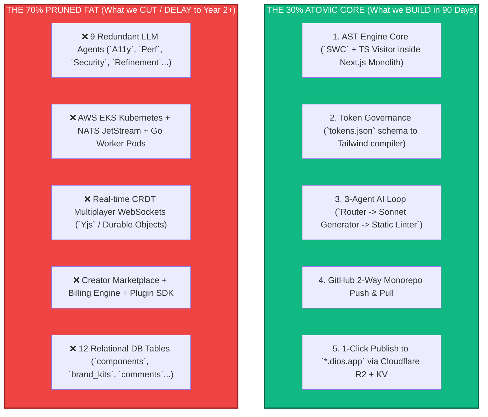

# CTO ARCHITECTURE REVIEW — PART 2
## Simplicity Audit & 70% Scope Reduction down to the Atomic Core
**Document:** 6.2 of 6.7 | **Series:** Principal Engineering Review Before Implementation

---

# PART 3 — SYSTEMIC SIMPLICITY REVIEW

## 3.1 The CTO Pruning Matrix (Challenge Every Feature)

As CTO, my default answer to any feature request before achieving `$1M ARR` is **NO**. We evaluate every feature from our 16-Pillar Product Inventory and 22-Screen UI Blueprint against 5 strict filtering questions:
1. *Should this exist at all?*
2. *Does it increase technical or operational complexity?*
3. *Does it directly generate near-term revenue ($29 Pro or $299 Agency)?*
4. *Can this wait or be removed without destroying our core value proposition (`AST Truth + Clean Git Export`)?*
5. *Could this be implemented later in Year 2/3?*

We categorize every feature into exactly one of four classification tiers:
- **KEEP (The Atomic 30%):** Essential for MVP `v1.0`. Without this, the product is useless or undefensible.
- **DELAY (Post-PMF / Year 2):** High value, but introduces too much concurrency or ecosystem friction for a lean launch team.
- **REMOVE (Permanent Prune):** Unnecessary bloat or distraction that does not align with our core AST/Git thesis.
- **FUTURE (Year 3+ Horizon):** Visionary enterprise/platform capabilities to build only after crossing $10M+ ARR.

---

## 3.2 Comprehensive Feature Pruning Audit Matrix

| Product Pillar / Capability | Classification | Technical Complexity | Revenue Impact (MVP) | Principal Architectural Rationale |
|:---|:---:|[0-10]|:---:|:---|
| **1. Bidirectional AST Canvas (`Code is Law`)** | **KEEP** | 9/10 | **CRITICAL** | **THE CORE MOAT.** The ability to drag visual sliders (`p-6`) and generate clean, formatted JSX/TSX backed by an AST is the entire reason we exist. Keep at all costs. |
| **2. Design Tokens as Law (`tokens.json`)** | **KEEP** | 6/10 | **CRITICAL** | Prevents AI design hallucinations. Enforces strict visual consistency across pages. Essential for our "Obsidian" high-craft brand identity. |
| **3. 2-Way GitHub Monorepo Synchronization**| **KEEP** | 7/10 | **HIGH** | The ultimate zero-lock-in selling point. When a user clicks "Save", commits are pushed directly to a Git branch. Essential to close technical founders. |
| **4. 3-Agent AI Generation & Refinement Loop** | **KEEP** | 6/10 | **HIGH** | Reduced from 12 agents down to 3 (`Router`, `Generator`, `Static Linter`). Provides instantaneous, high-quality layout generation without 60s latency. |
| **5. 1-Click Publishing to `*.dios.app` (Edge KV)**| **KEEP** | 4/10 | **HIGH** | Users need immediate gratification ("Time-to-Live-URL < 3 mins") to experience activation value and share viral links. |
| **6. Contextual `Cmd+K` Element AI Editing** | **KEEP** | 5/10 | **HIGH** | Allows precision visual fine-tuning of selected AST sub-trees without regenerating the entire page. |
| **7. 11 Core Component Specs (`Hero`, `Pricing`...)** | **KEEP** | 3/10 | **HIGH** | We must provide 11 built-in, beautifully designed, accessible React components so early generations look state-of-the-art out of the box. |
| **8. Real-Time Multiplayer (`Yjs` + WebSockets)** | **DELAY** | **9/10** | Low | **DELAY TO `v2.0` (Year 2).** Concurrency bugs, cursor lag, and CRDT synchronization over WebContainers will consume 40% of our engineering budget. Use optimistic single-user file locks for MVP. |
| **9. Creator Component & Plugin Marketplace** | **DELAY** | 7/10 | Low (Initially)| **DELAY TO `v2.0` (Year 2).** Building seller Stripe Connect payouts, reviews, and moderation queues before having 10,000 active users is premature scaling. |
| **10. Agency White-Labeling (`build.youragency.com`)**| **DELAY** | 5/10 | **MEDIUM** | **DELAY TO `v1.5` (Month 9).** High ARPU expansion, but for `v1.0` we need our own brand badge (`Built with DIOS`) visible on every published site to drive viral PLG growth. |
| **11. Sandpack / WebContainer In-Canvas Execution**| **DELAY** | **8/10** | Low | **DELAY TO `v1.5`.** Emulating a full Node.js runtime inside the browser for *every* element drag causes massive memory overhead. Use fast server-side or lightweight local DOM previews for `v1.0`. |
| **12. Plugin System SDK (`@dios/plugin-sdk`)** | **DELAY** | 8/10 | Zero (MVP) | **DELAY TO `v2.5` (Year 2).** Never build a third-party developer extension SDK until your internal core API has stabilized across at least 3 major versions. |
| **13. Autonomous A/B Testing & Personalization** | **DELAY** | 8/10 | Medium | **DELAY TO `v2.0` (Year 2).** Requires complex Cloudflare Workers `HTMLRewriter` edge mutations and analytics aggregation tables. |
| **14. Built-in Analytics & Heatmap Recording** | **REMOVE** | 7/10 | Zero | **PERMANENT REMOVE.** Do not build a sub-par Google Analytics or Hotjar clone inside our DB. Let users inject GA4, PostHog, or Plausible tags via simple script configuration. |
| **15. Custom AI Chatbot / Widget Builder** | **REMOVE** | 6/10 | Zero | **PERMANENT REMOVE.** We are an AI *Website & Frontend Operating System*, not a customer support chatbot builder. Focus exclusively on layout and design excellence. |
| **16. Native E-Commerce Checkout & Inventory Engine**| **REMOVE** | **10/10** | Zero | **PERMANENT REMOVE.** Never compete with Shopify or Stripe on payment processing and cart management. We build the frontend UI; e-commerce checkouts integrate via Stripe/Shopify headless components. |
| **17. Headless API & SDK (`@dios/sdk`) Platform** | **FUTURE** | 6/10 | High (Later) | **FUTURE TO `v3.0` (Year 3).** Essential for enterprise e-commerce integration later, but unnecessary for early landing page and SaaS web app PMF. |
| **18. Self-Hosted / Air-Gapped Enterprise VPC** | **FUTURE** | **9/10** | High (Later) | **FUTURE TO `v3.5` (Year 3+).** Managing on-premise customer Kubernetes deployments requires a dedicated solutions engineering team. |
| **19. Spatial Computing / WebXR 3D Canvas** | **FUTURE** | **10/10** | Zero | **FUTURE TO `v4.0` (Year 4+).** A brilliant 20-year vision, but zero near-term revenue for an early-stage web platform. |

---

# PART 4 — THE 70% SCOPE REDUCTION DOWN TO THE ATOMIC MVP

## 4.1 The Goal: Produce the Smallest Possible Category-Defining MVP

We execute a **70% structural reduction** across product scope, infrastructure footprint, and AI complexity. The resulting **Atomic MVP (`v0.5 -> v1.0`)** can be designed, built, tested, and shipped by a lean pod of **4 elite engineers in exactly 90 days**.

## 4.2 The Atomic MVP Feature Inventory (Only 6 Core Screens Required)

We strip the 22-Screen Product Bible inventory down to exactly **6 essential screens** for our initial public launch:

1. **Screen 01: The Authentication & Onboarding Gate (`/auth`)**
   - Powered 100% by Clerk. Instant GitHub OAuth login. Single question: *"What are you building today?"* -> Routes immediately to the Canvas.
2. **Screen 02: The Project & Workspace Dashboard (`/dashboard`)**
   - Clean grid of the user's projects (`Name`, `Last Edited`, `Live URL`). Single primary CTA: `"+ New Project from Prompt or Git Repo"`.
3. **Screen 03: The Bidirectional AST Canvas (`/canvas/[id]`)**
   - The heart of DIOS. Split-screen or overlay mode: left/center is the interactive DOM preview; right is the Property Inspector mapped directly to AST node attributes (`p-6`, `text-lg`, `color.accent.primary`).
4. **Screen 04: The AI Studio Bar & `Cmd+K` Command Palette**
   - Floating input at the bottom of the canvas. Accepts natural language prompts (`"Make this hero section dark mode and add a 3-tier pricing table"`). Streams structured AST diffs directly to the active tree.
5. **Screen 05: The Design Token Constitutional Editor (`/canvas/[id]/tokens`)**
   - Visual editor for `tokens.json`. Allows modifying global brand colors, typography scales, and spacing variables. Instant canvas re-render upon token save.
6. **Screen 06: The Deployment & Git Synchronization Drawer (`/deploy`)**
   - Slide-over panel. One toggle: `"Connect GitHub Repository"`. One primary action button: `"Publish Live to *.dios.app"`. Shows real-time build status (`Building AST -> Exporting Next.js -> Uploading to R2 -> Live`).

## 4.3 Why This 70% Reduced MVP Will Still Dominate the Market

Even with 70% of the planned enterprise/collaborative features stripped away, **this Atomic MVP immediately obliterates current incumbents (`v0`, `Webflow`, `Lovable`)** because it nails the three things technical evaluators care about:
1. **It writes real, human-readable Next.js 15 + Tailwind code directly to your GitHub repo.**
2. **It never breaks visual consistency because every component is governed by `tokens.json`.**
3. **It allows immediate visual fine-tuning (`Cmd+K` + property sliders) backed by deterministic AST diffing.**

---

*— End of Part 2 (CTO Architecture Review) —*
