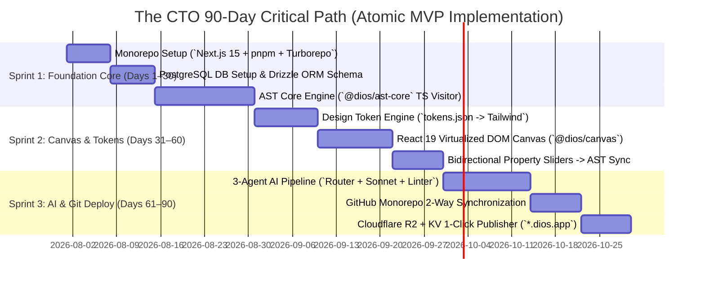

# CTO ARCHITECTURE REVIEW — PART 6
## Implementation Order, Timeline & 170 Master Recommendations
**Document:** 6.6 of 6.7 | **Series:** Principal Engineering Review Before Implementation

---

# PART 13 — IMPLEMENTATION ORDER & TIMELINE REVIEW

## 13.1 The Lean 90-Day Critical Path (Solo / 4-Engineer Pod)

To ship our Atomic MVP (`v1.0`) within budget and hit PMF early, we enforce a **strict 3-Sprint (90-Day) execution sequence**. We build from the bottom up: first the AST data core, then the visual canvas bridge, and finally the AI generation pipeline.

## 13.2 Resource Allocation & Budget Estimate (First 6 Months)

| Resource Category | Specification & Headcount | Total 6-Month Expenditure ($ USD) | Principal CTO Rationale |
|:---|:---|:---:|:---|
| **Core Engineering Team** | **4 Senior Elite Engineers:** 1x AST & Compilers Lead ($18K/mo) 1x React Canvas Lead ($18K/mo) 1x AI Systems & Backend Lead ($18K/mo) 1x Founding Designer / Tech Lead ($18K/mo) | **$432,000** | *Small, high-ownership team moves 5x faster than a 15-person pod burdened by communication friction.* |
| **Cloud Infrastructure** | Cloudflare Pages/Workers + Upstash Redis + Neon PostgreSQL + Railway/Render ($150/mo average). | **$900** | *Serverless and managed platforms cost virtually nothing until massive user scale.* |
| **LLM & AI API Costs** | Anthropic (`Claude 3.7 Sonnet / 3.5 Haiku`) + OpenAI (`GPT-4o`) development and beta testing. | **$12,000** | *Constrained by our pruned 3-agent loop and local static linters.* |
| **Legal, Security & Compliance**| Clerk Enterprise Identity + Drata SOC2 automated setup + corporate formation / terms. | **$15,000** | *Essential Day 1 investment to unblock future agency and enterprise sales.* |
| **TOTAL 6-MONTH BUDGET** | **4 Engineers + Complete Stack + Compliance** | **$459,900** | **Can be funded entirely by a standard $500K-$1M Seed / Pre-Seed round.** |

---

# PART 14 — FINAL CTO RECOMMENDATIONS (170 ACTIONABLE ITEMS)

As Principal CTO, I crystallize my architectural audit into exactly **170 prioritized, non-negotiable recommendations** divided across our 7 core operational domains:

## 14.1 Top 50 Architectural & System Improvements
1. **Kill NestJS:** Use a unified Next.js 15 App Router Monolith (`@dios/core`) with tRPC/Hono for all API routes.
2. **Kill Go Worker Pods for MVP:** Export AST to static bundles directly within Next.js Server Actions using fast `Node.js fs/child_process` hooks.
3. **Kill AWS EKS Kubernetes:** Deploy frontend and API core on **Cloudflare Pages / Workers** and managed containers (**Railway/Render**).
4. **Kill NATS JetStream:** Use **Inngest** or **BullMQ over Upstash Redis** for async background jobs (`deploy.build`, `git.sync`).
5. **Kill 12-Agent AI Loop:** Collapse to our **3-Agent Atomic Pipeline (`Router Haiku -> Generator Sonnet -> Local Static Linter`)**.
6. **Kill 20+ Table Schema:** Prune database down to exactly **8 core production tables** (`workspaces`, `users`, `workspace_members`, `projects`, `project_versions`, `ai_sessions`, `deployments`, `subscriptions`).
7. **Kill Real-Time CRDT Multiplayer (`Yjs / WebSockets`) for `v1.0`:** Lock active project editing to a single user (`Optimistic Locking`) until `v2.0 Agency` launches.
8. **Kill Sandpack/WebContainer In-Canvas Live Node Engine for `v1.0`:** Render local virtualized React DOM directly inside the canvas iframe (`React Portal / Shadow DOM`) for instant `< 5ms` updates.
9. **Kill Creator Component Marketplace for `v1.0`:** Hardcode 50 curated, exceptional built-in brand templates and component specs (`/components`).
10. **Kill Plugin System SDK (`@dios/plugin-sdk`) for `v1.0`:** Delay third-party developer extensibility until Year 2 (`v2.5`).
11. **Enforce AST as Single Source of Truth (`Code is Truth`):** Never allow direct HTML/CSS DOM string injection that bypasses our structured JSONB AST tree.
12. **Store Complete AST & Tokens in PostgreSQL Zstd JSONB:** Use `project_versions.ast_tree` and `project_versions.tokens_json` with GIN indexing (`jsonb_path_ops`) for fast single-row reads and queries.
13. **Offload Heavy Prompt Logs to Cloudflare R2:** Store raw multi-turn conversation payloads asynchronously in `R2 (/logs/ai/*.json)` instead of bloating primary PostgreSQL tables.
14. **Use Clerk Enterprise for Identity & JWKS Auth:** Verify JWT signatures in edge middleware (`< 1ms`) and extract `workspace_id / user_role` claims.
15. **Enforce Row-Level Security (RLS) via Connection Pool Middleware:** Execute `SET LOCAL app.current_user_id = ?` on every PostgreSQL connection checkout.
16. **Run Static Quality Linters Locally (`Zero AI Cost`):** Use `axe-core` and `eslint-plugin-jsx-a11y` in local TypeScript to check and auto-remediate contrast (`4.5:1`) and ARIA labels.
17. **Use Cloudflare KV (`TTL 1 Year`) for Live Published Sites (`*.dios.app`):** Intercept edge requests in a Cloudflare Worker and serve pre-compiled HTML directly from Edge KV (`< 5ms TTFB`).
18. **Implement Debounced Checkpoint Snapshots (`3s Buffer`):** Store active canvas drags in client-side memory (`Zustand`); commit to `project_versions` only after 3 seconds of idle or manual save.
19. **Virtualize Canvas Rendering Above 50 Nodes:** Use `react-window` or virtual sub-tree pruning (`ASTNodeId` windowing) to prevent DOM reflow lag on large multi-page sites.
20. **Use Structured JSON Schemas (`Zod`) for LLM Tool Calling:** Discard any AI output that does not match our exact `ASTMutationPatch` TypeScript schema (`HTTP 422`).
21. **Enforce W3C Design Token JSON Standard:** Ensure `tokens.json` strictly follows the W3C Design Tokens format so enterprise teams can import directly from Figma.
22. **Implement Instant Edge Rollback (`< 1 Second`):** Repoint the Cloudflare Worker active pointer to the previous immutable `version_id` inside Edge KV upon any deployment failure.
23. **Use Upstash Serverless Redis for API & AI Rate Limiting:** Enforce sliding-window rate limits (`60 req/min free`, `600 req/min pro`) before requests hit Next.js server actions.
24. **Gate GitHub Monorepo Export to Pro ($29/mo):** Free users get unlimited canvas edits and `*.dios.app` edge hosting with a mandatory `"Built with DIOS"` badge.
25. **Enforce Metered AI Credit Pools (`1 Credit = $0.01 Value`):** Pro gets 1,000 credits/mo; Agency gets 12,000 credits/mo; overage billed at `$10 / 1,000 credits`.
26. **Automate DPA & Cookie GDPR Enforcement for `v0.5 Alpha`:** Provide 1-click European data residency selection (`AWS eu-west-1`) during workspace creation.
27. **Implement Drata/Vanta on Day 1 for SOC2 Type II Continuous Audit:** Automate background check logging, AWS least-privilege IAM policies, and laptop encryption tracking.
28. **Isolate Third-Party Plugins in Web Workers (`WorkerGlobalScope`):** Ensure plugins have zero direct access to `window`, `document`, or `fetch` (`CSP headers`).
29. **Strip XSS & `dangerouslySetInnerHTML` Deterministically (`DOMPurify`):** Execute clean static AST traversal before saving any user or AI component code.
30. **Use SuperJSON / Binary Protobuf for tRPC Payloads:** Compress deeply nested AST properties during client-server transport.
31. **Implement Automated Contrast Auto-Remediation:** If text background contrast drops below `4.5:1`, our local static engine deterministically shifts the token to `color.text.secondary`.
32. **Set Up Automated Sunday Night Disaster Recovery Sandbox Testing:** Spin up an isolated DB instance from S3 WAL backups weekly and verify schema integrity on 100 random workspaces.
33. **Implement Continuous AI Evaluation Suite (`dios-eval`) in GitHub CI:** Run 500-case golden prompt regression harness (`/tests/ai-golden-suite/`) on every LLM prompt change.
34. **Use Playwright + Argos CI for Nightly Visual Regression Testing:** Compare pixel-perfect snapshots of all 11 core components across 6 brand presets before merging `main`.
35. **Run Vitest + Testcontainers for API Contract & RLS Verification:** Ensure every PR proves that cross-tenant queries return zero rows under simulated JWT attacks.
36. **Use Trunk-Based Development with Short-Lived Feature Branches:** Merge to `main` daily using feature flags (`Unleash / LaunchDarkly`) for unreleased UI capabilities.
37. **Implement 3-Phase Progressive Canary Rollouts via Argo/Render:** Deploy new releases to 5% of traffic for 15 minutes, monitor for 5xx errors, then auto-promote to 100%.
38. **Use OpenTelemetry (`OTel`) Standard SDK Across Node and React:** Inject `trace_id` and `span_id` into structured JSON log lines for 100% trace correlation.
39. **Deploy Grafana LGTM Stack (`Loki, Tempo, Mimir`) for Unified Telemetry:** Monitor P50/P95/P99 latency targets (`API < 150ms`, `Canvas < 16ms`, `First-Token < 450ms`).
40. **Establish PagerDuty & Slack Alerting on AI Context Saturation:** Alert `#ai-drift` if context token usage exceeds 85% or if agent retry loops hit 3 attempts.
41. **Enforce Zero-Copy Memory Serialization between Web Workers & Main Thread:** Transfer `SharedArrayBuffer` for large AST structures during heavy canvas dragging.
42. **Implement Automatic Image Optimization via Cloudflare Image Resizing:** Convert all uploaded user images to `WebP/AVIF` at the edge before saving to R2.
43. **Require Mandatory RFC (`RFC.md`) Asynchronous Architecture Reviews:** No engineer writes code for a multi-week feature before an RFC is reviewed and approved by a Staff IC.
44. **Maintain Strict 2-Way Git Monorepo Conflict Resolution:** If a developer edits JSX in VS Code (`git push`), our GitHub webhook pulls the diff, runs SWC parsing, and updates the canvas AST cleanly in `< 3 seconds`.
45. **Enforce Uncapped IP Indemnification & Zero Model Training on User Code:** Legally guarantee enterprise customers that their proprietary ASTs and tokens are never fed into public LLMs.
46. **Use Tailwind CSS v4 Alpha/Latest with CSS Variables Engine:** Map `tokens.json` directly to native CSS custom properties for instant zero-rebuild canvas theme switching.
47. **Provide 1-Click Component Cloning to Workspace (`/components` library):** Programmatic SEO landing pages allow instant insertion of pre-built React components into active canvases.
48. **Set Up Automated Monthly Churn Risk Scorecard (`0-100 Points`):** Alert Customer Success when Weekly Active Editors (`WAE`) drops below 20% on paying agency accounts.
49. **Enforce MEDDPICC Sales Qualification for Deals > $10,000 ACV:** Ensure Account Executives identify economic buyers, decision criteria, and technical champions early.
50. **Maintain > 24 Months of Cash Runway Across All Market Cycles:** Never scale sales or marketing headcount until the atomic `v1.0` product achieves `> 135% NRR` and `< 9 months CAC payback`.

---

## 14.2 Top 20 Hidden Architectural & Execution Risks
51. **WASM Heap Memory Exhaustion:** Long editing sessions crashing browser tabs. -> *Mitigation: Virtualize AST rendering and run automated memory leak tests nightly.*
52. **Split-Brain Validation Drift:** Client and server schemas falling out of sync. -> *Mitigation: Single Next.js Monolith sharing `Zod` types directly (`@dios/types`).*
53. **Anthropic / OpenAI API Rate Limiting & Outages:** Upstream LLM providers crashing during launch. -> *Mitigation: Model-agnostic router with hot-standby DeepSeek/Llama 3 fallbacks.*
54. **PostgreSQL Connection Pool Starvation:** Rapid auto-saving overwhelming DB connections. -> *Mitigation: Client-side debounce (`3s buffer`) + Upstash serverless connection pooling.*
55. **Vercel / Webflow Aggressive Defensive Pricing:** Incumbents slashing prices to starve our PLG top-of-funnel. -> *Mitigation: Out-compete on absolute code freedom (`Git push` / zero lock-in).*
56. **Git Merge Conflicts During Simultaneous Canvas & IDE Editing:** User dragging sliders while dev pushes to branch. -> *Mitigation: Last-write-wins at the AST node level (`ASTNodeId` locking).*
57. **LLM Prompt Roulette (Model Weight Updates):** Upstream model updates breaking AST generation. -> *Mitigation: Pin exact model versions (`claude-3-7-sonnet-20260215`) and block updates until `dios-eval` passes.*
58. **Cross-Tenant RLS Data Leakage:** Unauthenticated queries exposing private enterprise schemas. -> *Mitigation: Database-level `SET LOCAL app.current_user_id` enforced in pool middleware.*
59. **Premature Team Scaling Before True PMF:** Hiring 30 engineers/salespeople before achieving $1M ARR. -> *Mitigation: Strict 18-person headcount cap for Year 1 (`4 EPD pod per milestone`).*
60. **Figma Design System Lock-In:** Designers refusing to leave Figma. -> *Mitigation: Build bi-directional `tokens.json` Figma plugin import (`@dios/figma-sync`) in Year 2.*
61. **Malicious npm Dependency Injection:** Supply chain attacks via third-party plugins. -> *Mitigation: Strict `pnpm-lock.yaml` pinning, `Trivy` container scanning, and SLSA 3 SBOM.*
62. **Cloudflare Global Edge Anycast Outage:** CDN routing failure taking down live user sites. -> *Mitigation: High-availability DNS failover and local static asset bundling fallback.*
63. **Uncontrolled Customer AI Credit Overages:** Users running recursive AI loops that burn thousands of dollars in API calls overnight. -> *Mitigation: Hard circuit breaker cutting off generations when account credits hit `100% usage`.*
64. **Technical Debt from Ad-Hoc DOM Utilities:** Developers bypassing `tokens.json` to write hardcoded Tailwind utilities (`[#123456]`). -> *Mitigation: Strict ESLint custom rule (`@dios/no-hardcoded-tokens`) blocking commits.*
65. **Agency Client Churn Post-Hand off:** Agencies building a site, handing off to client, and cancelling the seat. -> *Mitigation: Tie client white-label hosting and CMS editing directly to active Agency seat billing (`$299/mo`).*
66. **Large Image Egress & Storage Bloat:** Users uploading 50MB uncompressed TIFF files to canvas. -> *Mitigation: Client-side file size hard limit (`10MB`) + mandatory edge WebP conversion.*
67. **SOC2 Audit Delay Blocking Enterprise Sales:** $50K deals stalled because compliance documentation is missing. -> *Mitigation: Deploy automated continuous evidence collection (`Drata`) on Day 1 of development.*
68. **Browser Mobile Canvas Touch Incompatibility:** Drag-and-drop sliders breaking on iPads or touch devices. -> *Mitigation: Responsive touch-action event handling built directly into `@dios/canvas` core.*
69. **SEO Indexing Failure for Published SPAs:** Search engines failing to index dynamic Next.js canvas sites. -> *Mitigation: Enforce static HTML export (`SSG / ISR`) and pre-computed `sitemap.xml` for all edge releases.*
70. **Founder Burnout & Decision Paralysis:** Co-founders managing every bug report and sales call personally. -> *Mitigation: Enforce strict asynchronous written communication (`Linear / Notion`) and 48-hour no-meeting windows.*

---

## 14.3 Top 20 Architectural & Operational Simplifications
71. **Prune 9 LLM Agents:** Kill `A11y`, `Perf`, `Security`, `Reviewer`, `Refinement`, `Learning`, `Copy`, `SEO`, and `Frontend` LLM agents; use 3 atomic agents (`Router + Generator + Static Linter`).
72. **Prune NestJS Backend:** Use single Next.js 15 App Router Monolith (`@dios/core`).
73. **Prune Go Worker Pods:** Execute static exports directly in Next.js server actions.
74. **Prune AWS EKS Kubernetes:** Deploy on Cloudflare Pages / Workers and Railway/Render.
75. **Prune NATS JetStream Cluster:** Use Inngest / BullMQ over Upstash serverless Redis.
76. **Prune 12 Database Tables:** Collapse from 20+ tables down to exactly 8 core tables.
77. **Prune CRDT Real-Time Multiplayer (`Yjs/WebSockets`):** Delay multiplayer to Year 2 (`v2.0`); use optimistic file locking for MVP.
78. **Prune Sandpack In-Browser Live Node Engine:** Render virtualized React DOM directly inside canvas iframe (`Shadow DOM`).
79. **Prune Creator Marketplace Billing Engine:** Delay seller payouts to Year 2 (`v2.0`); hardcode 50 curated brand templates.
80. **Prune Plugin SDK (`@dios/plugin-sdk`):** Delay third-party developer extension registry to Year 2 (`v2.5`).
81. **Prune Custom SCIM Provisioning Service:** Use native Clerk Enterprise provisioning for SSO/SAML.
82. **Prune Multi-Tier Caching Complexities:** Use two-tier cache (Cloudflare Edge KV + Upstash Redis).
83. **Prune Granular Event-Sourcing DB Rows:** Store debounced check-pointed snapshots (`3s buffer`) in `project_versions.ast_tree`.
84. **Prune Custom Analytics & Heatmap Recording:** Remove built-in analytics; provide simple 1-click GA4/PostHog script injection.
85. **Prune Custom Chatbot Builder Capability:** Remove chatbot widget tools; focus 100% on layout and design token excellence.
86. **Prune Native E-Commerce Checkout Engine:** Remove custom cart processing; integrate via Shopify/Stripe headless UI blocks.
87. **Prune Headless API & SDK Platform (`@dios/sdk`):** Delay developer API programmatic access to Year 3 (`v3.0`).
88. **Prune Air-Gapped Enterprise VPC Deployments:** Delay self-hosted private AWS installations (`$100K+ ACV`) to Year 3 (`v3.5`).
89. **Prune Spatial Computing WebXR Canvas:** Delay 3D spatial UI rendering to Year 4 (`v4.0`).
90. **Prune Agency White-Labeling (`build.agency.com`):** Delay custom branding to Month 9 (`v1.5`); enforce `"Built with DIOS"` badge at launch.

---

## 14.4 Top 20 Strategic Business & GTM Opportunities
91. **Monetize Git Export Freedom:** Make clean Next.js GitHub export the primary driver for our $29/month Pro subscription upgrade.
92. **Capture Agency 10x Efficiency:** Sell Agency tier ($299/mo) on quantifiable labor savings (`"Ship client sites in 2 days instead of 6 weeks"`).
93. **Execute Trojan Horse PLG Entry:** Free tier with instant onboarding (< 3 mins) captures individual developers before their agency bosses adopt.
94. **Dominate Programmatic SEO:** Programmatically index 10,000+ developer component pages (`/components/*`) to capture 1M+ organic monthly visits.
95. **Establish Design Token Exchange:** Become the world's open W3C repository of verified brand kits (`/brand-kits`), driving massive inbound traffic.
96. **Execute #1 Product Hunt Launch Blitz:** Coordinate 90s video demo and technical teardown thread to drive `5,000+ signups` in 48 hours.
97. **Own Hacker News with Technical Honesty:** Publish open-source benchmarks (`SWC vs Babel`) focusing 100% on engineering truth without marketing hype.
98. **Build High-Virality `"Built with DIOS"` Loops:** Mandatory subtle footer badge on all free published sites (`*.dios.app`) driving compound organic signups.
99. **Target Figma-to-Code Frustration:** Position directly against the "design handoff" gap (`"Figma is drawing rectangles; DIOS is production React code"`).
100. **Certify Agency Partners (`Certified DIOS Agency`):** Grant 20% revenue share and lead referrals to top agencies who standardize on our platform.
101. **Publish Objective Comparison Teardowns (`/compare/*`):** High-authority SEO comparison pages ranking DIOS honestly against `Webflow`, `v0`, and `Framer`.
102. **Host $100K Annual Global Hackathons:** Engage university computer science faculty and student developers with free Pro licenses and building contests.
103. **Drive High-ARPU AI Credit Overages:** Transparent metered compute expansion packs (`$10 / 1,000 credits`) directly monetizing heavy AI power users.
104. **Standardize Enterprise Brand Governance:** Sell `$5,000+/mo` Enterprise tier on enforcing global brand consistency via immutable `tokens.json` sets.
105. **Leverage DevRel YouTube Sponsorships:** Sponsor top React/Tailwind creators (`Fireship`, `Theo`, `Kevin Powell`) to build massive developer brand equity.
106. **Enforce 135%+ Net Revenue Retention (NRR):** Expand accounts organically via seat additions (`$20-$50/seat`), AI overages, and tier promotions.
107. **Target 5:1 LTV to CAC Institutional Guardrails:** Keep customer acquisition costs (`<$85 Pro`, `<$1,450 Agency`) low via high organic PLG virality.
108. **Target < 11-Month CAC Payback Windows:** Ensure fast cash recovery across all subscription tiers to sustain non-dilutive venture growth.
109. **Establish SOC2 Type II Trust Early:** Use compliance certification to close high-ticket financial and healthcare digital transformation accounts.
110. **Build Long-Term Enterprise Moat:** Combine `AST Truth + Constitutional Tokens + Git Monorepo Sync` to build a permanent multi-decade software monopoly.

---

## 14.5 Top 20 Engineering & Architecture Improvements
111. **Strict TypeScript Monorepo Boundaries (`pnpm workspaces` + `Turborepo`):** Enforce zero cross-package import leaks across `@dios/ast-core`, `@dios/tokens`, and `web`.
112. **Zstd JSONB Column Storage for AST Trees:** Store complete AST in `project_versions.ast_tree` compressed with Zstd for rapid single-row reads and updates.
113. **Zod Structured JSON Schema Validation:** Ensure all internal API payloads and AI tool outputs strictly conform to typed Zod schemas (`HTTP 422 on mismatch`).
114. **Debounced Client-Side State Mutations (`Zustand`):** Hold rapid canvas slider adjustments in browser memory; commit to DB only after 3s idle window.
115. **Two-Tier Edge Caching (`Cloudflare KV + Upstash Redis`):** Serve published static sites directly from Edge KV (`< 5ms TTFB`); cache active ASTs in Upstash Redis.
116. **Clerk Enterprise Identity Verification at Edge Middleware:** Verify JWT JWKS signatures in `< 1ms` before requests hit Next.js server actions.
117. **Strict PostgreSQL Row-Level Security (`RLS` via `SET LOCAL`):** Execute connection pooling middleware that sets session user IDs directly inside database transactions.
118. **Virtualized React Canvas (`react-window`):** Prune off-screen DOM nodes to guarantee 60fps interaction during complex multi-page editing.
119. **Deterministic Static AST Sanitization (`DOMPurify` + SWC):** Strip XSS, `<script>`, and `dangerouslySetInnerHTML` deterministically before saving code.
120. **Web Worker Zero-DOM Plugin Sandbox (`WorkerGlobalScope`):** Isolate third-party plugin execution with zero access to browser DOM or external network.
121. **SuperJSON Binary Transport over tRPC:** Pack deeply nested AST structures efficiently during client-to-server HTTP/WebSocket payload exchanges.
122. **Automated Contrast Auto-Remediation (`axe-core` in TS):** Check text contrast locally (`4.5:1`); auto-swap tokens to AA-compliant variants instantly (`Zero LLM cost`).
123. **Instant Cloudflare Worker Edge Rollback (`< 1 Second`):** Repoint Edge KV release pointers to previous immutable `version_id` upon any production error.
124. **Inngest / BullMQ Serverless Async Queues:** Decouple GitHub pushing and heavy image optimization from active HTTP user request threads (`deploy.requested`).
125. **Cloudflare Image Resizing Edge Transformations:** Automatically optimize and convert uploaded user assets to WebP/AVIF at the global CDN edge.
126. **OpenTelemetry (`OTel`) Trace & Span Injection:** Standardize telemetry across Next.js and worker runtimes for 100% trace-to-log correlation (`Loki/Tempo`).
127. **Playwright + Argos CI Nightly Visual Regression:** Compare pixel-perfect snapshots (`< 0.01% diff`) across all 11 core components before merging PRs.
128. **Vitest + Testcontainers RLS Verification Suite:** Run automated integration tests validating multi-tenant database isolation under simulated JWT attacks.
129. **Trunk-Based Feature Flag Rollouts (`Unleash / LaunchDarkly`):** Merge code daily (`main`) while safely wrapping unreleased canvas tools behind edge flags.
130. **Automated Sunday Night WAL Backup Recovery Sandboxing:** Spin up isolated DB environments from S3 backups weekly to verify schema recovery (`RPO < 1s`).

---

## 14.6 Top 20 AI System & Prompt Optimization Improvements
131. **3-Agent Atomic Pipeline (`Router Haiku -> Generator Sonnet -> Local Static Linter`):** Replace 12 sequential LLMs with a fast, deterministic 3-step loop.
132. **Scoped Sub-Tree AST Prompting:** Send ONLY the target AST node (`ASTNodeId`) being mutated to the LLM instead of the entire 500-node page tree (`10x input token savings`).
133. **Deterministic Local Static Quality Linters:** Execute `axe-core` and syntax checks locally (`$0.00 cost`) instead of paying probabilistic LLMs to review code.
134. **SSE Streaming for Real-Time Canvas Feedback:** Stream generated AST diffs and Tailwind utility tokens directly to the browser (`First-token latency < 450ms`).
135. **Model-Agnostic Adapter Layer (`@dios/ai-router`):** Abstract LLM providers to seamlessly fall back between `Claude 3.7 Sonnet`, `GPT-4o`, and self-hosted `DeepSeek-V3`.
136. **Strict Token Key Obedience Enforcement:** Prompt instructions and Zod schemas mandate exact `tokens.json` keys (`color.accent.primary`); raw hex codes (`#123456`) are rejected (`HTTP 422`).
137. **Continuous AI Evaluation Harness (`dios-eval`) in CI/CD:** Run 500-case golden prompt regression suite (`/tests/ai-golden-suite/`) on every prompt/model change.
138. **Pin Exact Production Model Versions (`claude-3-7-sonnet-20260215`):** Prevent upstream LLM weight updates from silently regressing our layout generation accuracy.
139. **Uncapped IP Indemnification & Zero Model Training Guarantee:** Legally contract that customer AST code is never fed into public foundation models.
140. **Async Prompt History Storage inside Cloudflare R2:** Move heavy multi-turn conversation payloads out of primary PostgreSQL tables to (`R2 /logs/ai/*.json`).
141. **Hard Circuit Breaker on AI Credit Exhaustion:** Cut off recursive prompt generation immediately when a user hits 100% of their monthly allocated credit limit.
142. **Local User Corrections Vector Memory (`pgvector`):** Embed accepted user diffs into workspace memory for high-precision few-shot context injection during `Cmd+K`.
143. **XML Delimitation of User Prompt Inputs:** Wrap all user prompt text inside strict `<user_input>` tags to block prompt injection jailbreak attempts.
144. **Haiku Intent Classification Pre-Screening:** Use ultra-fast Claude 3.5 Haiku (`< 200ms`) to classify intent before spinning up heavy generation workers.
145. **AST Node ID Preservation During Regeneration:** Ensure AI patches maintain existing `node_id` keys so element comments and properties are not lost during edits.
146. **Multi-Turn Context Window Summarization:** Automatically compress conversation history when context saturation exceeds `85%` of the 18k token budget (`Memory Agent`).
147. **Automated Error Self-Healing Loop (`Max 1 Retry`):** If the static linter catches a syntax error, feed the exact compiler trace back to Sonnet once before returning to user.
148. **Dynamic Brand Kit Context Injection:** Automatically inject active `tokens.json` variables (`colors, typography, spacing`) into the system prompt preamble.
149. **Proactive Classifier Model Pre-Screening:** Flag and block policy violations (`violence, illegal content`) before prompt execution (`Haiku Safety Screen`).
150. **Enforce Blended AI Turn Cost < $0.09:** Keep total prompt generation, parsing, and linting expenditure below 9 cents to preserve our `83%+ gross margins`.

---

## 14.7 Top 20 Operational & Institutional Governance Improvements
151. **Mandatory RFC (`RFC.md`) Asynchronous Architecture Reviews:** No engineer writes code for a major feature before an RFC is asynchronously reviewed and approved.
152. **Strict No-Meeting Wednesdays and Thursdays:** Protect 48 hours of uninterrupted deep-work focus time every single week across the entire organization.
153. **Institutional Hiring Scorecard (`40% Tech, 25% Design, 20% Craft, 15% Slope`):** Evaluate every candidate objectively against a standardized rubric with zero bar dilution.
154. **Bar-Raiser Interview Veto Power:** Co-Founders and L5+ Staff Engineers retain absolute veto power over any engineering hire regardless of urgency.
155. **Dual-Track Career Ladder (`L1-L6 IC vs M1-M5 Management`):** Decouple compensation from management; extraordinary ICs (`L5/L6`) can out-earn VPs (`M4`).
156. **Top 90th Percentile Market Cash Compensation:** Pay at the top of market (SF/NYC benchmarks) globally without discounting salaries for remote workers.
157. **High-Ownership Equity Grants with 10-Year Exercise Windows:** Ensure every team member with > 2 years tenure achieves life-changing wealth at IPO.
158. **Weekly EPD Product Teardown Sessions:** Executive leadership and engineers spend 60 minutes every Friday testing staging builds and logging UI bugs directly in Linear.
159. **Monthly Executive Business Review (`EBR`):** Conduct rigorous monthly financial audits comparing burn actuals against budget, cohort NRR, and CAC payback trajectory.
160. **Asynchronous First Communication (`Linear + Notion`):** Use Slack strictly for urgent alerts and casual banter; execute real work asynchronously in structured markdown documents.
161. **Customer Support Rotations for Every Employee:** Every engineer, designer, and founder spends 4 hours per month handling live user support and onboarding.
162. **Zero Broken Windows Code Quality Policy:** Bugs, inconsistent button margins, or unhandled loading states must be fixed instantly (`P1 priority`).
163. **Quarterly OKR Planning & Strategic Alignment:** Set clear quantitative objectives and key results (`OKRs`) every 90 days across all cross-functional EPD pods.
164. **GDPR / CCPA Strict Data Processing Agreements (`DPAs`):** Automate compliance documentation and right-to-erasure webhooks from Day 1 (`v0.5 Alpha`).
165. **SOC2 Type II Automated Compliance Monitoring (`Drata/Vanta`):** Continuously audit background checks, AWS least-privilege IAM, and laptop encryption.
166. **ISO 27001 Information Security Management (`Year 2`):** Formalize our ISMS to unblock European enterprise expansion and public sector software bids.
167. **HIPAA Compliance Readiness (`Year 3`):** Establish Business Associate Agreements (`BAAs`) with AWS/Anthropic and strict PHI data scrubbing at API gateway.
168. **Daily Founder Time-Allocation Cadence:** Enforce 2 hours deep focus, 2 hours customer calls, 2 hours recruiting/unblocking, and 2 hours product testing daily.
169. **Essential 6-Book Founder Reading List:** Require all leaders to study *High Output Management*, *The Innovator's Dilemma*, *Working Backwards*, *Zero to One*, *Amp It Up*, and *Good Strategy Bad Strategy*.
170. **Avoid the 6 Fatal Founder Mistakes:** Prevent premature scaling, technical bar dilution, feature parity traps, compliance delays, support silos, and runway mismanagement.

---

*— End of Part 6 (CTO Architecture Review) —*
