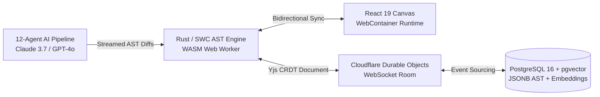

# ENGINEERING BIBLE — MASTER INDEX
## The Complete Technical Architecture, AI System & Engineering Blueprint
**Document 4** | **Classification:** Definitive Technical Specification & Engineering Reference

---

## Document Map

| Part | File | Sections | Key Technical Deliverables |
|:---|:---|:---|:---|
| **Part 1** | [Philosophy & Architecture](file:///home/mohana-fedora/Data/MNVProjects/AIBuilder/docs/ENGINEERING_BIBLE/Engineering_Bible_Part1_Philosophy_Architecture.md) | Parts 1–2 | 7 Engineering Principles (AST source of truth, local-first, zero trust), Architecture/AI/Security/Performance Principles & Budgets, Complete System Architecture Mermaid Diagram, 18-Decision Technology Matrix with alternatives & trade-offs, Service Communication Sequence Diagram, PostgreSQL RLS Multi-Tenancy Architecture |
| **Part 2** | [Frontend & Backend Architecture](file:///home/mohana-fedora/Data/MNVProjects/AIBuilder/docs/ENGINEERING_BIBLE/Engineering_Bible_Part2_Frontend_Backend.md) | Parts 3–4 | Next.js 15 / React 19 Folder Structure, Server vs. Client Component Strategy, State Management Architecture (tRPC Query Cache + Zustand + Immer + Yjs CRDT + Durable Objects), WASM/WebContainer Rendering Engine, NestJS Modular Monolith Architecture Diagram, 6 Core Module Specs (`Auth`, `Project`, `AI`, `Deploy`, `Billing`), Rate Limiting Tiers, Background Job Architecture (NATS JetStream) |
| **Part 3** | [Database & API Design](file:///home/mohana-fedora/Data/MNVProjects/AIBuilder/docs/ENGINEERING_BIBLE/Engineering_Bible_Part3_Database_API.md) | Parts 5–6 | Complete ER Diagram (`workspaces`, `projects`, `pages`, `components`, `tokens`, `versions`, `ai_sessions`, `deployments`, `billing`, `comments`), 20+ Production Table Definitions with columns, types, constraints, indexes & RLS, tRPC Router Structure, Public REST API v1 endpoints, Server-Sent Events (SSE) Streaming Protocol for AI generation |
| **Part 4** | [Multi-Agent AI System & Prompts](file:///home/mohana-fedora/Data/MNVProjects/AIBuilder/docs/ENGINEERING_BIBLE/Engineering_Bible_Part4_AI_System_Prompts.md) | Parts 7–9 | Multi-Agent Orchestration Diagram, 12 Specialized Agent Specs (`Planner`, `Layout`, `UX`, `Copy`, `SEO`, `Frontend Engineer`, `Accessibility`, `Performance`, `Security`, `Reviewer`, `Refinement`, `Learning`), Master System Prompt & Specialized Prompts, Memory Hierarchy (`Short`, `Medium`, `Long-term`), Context Assembly Strategy with 18k token budget, Vector RAG Storage (`pgvector`) |
| **Part 5** | [Plugins, Security & Performance](file:///home/mohana-fedora/Data/MNVProjects/AIBuilder/docs/ENGINEERING_BIBLE/Engineering_Bible_Part5_Plugins_Security_Performance.md) | Parts 10–13 | RAG Knowledge Base Architecture & Reranking Sequence Diagram, Plugin System SDK/Manifest (`@dios/plugin-sdk`) & Web Worker Sandbox, STRIDE Threat Model, Authentication & RBAC Flow Sequence Diagram, AI Safety Defenses, Caching Topology (Browser -> Edge KV -> Redis -> DB), P50/P95/P99 Latency Budgets, Autoscaling Rules |
| **Part 6** | [Observability, Testing, CI/CD & Cloud](file:///home/mohana-fedora/Data/MNVProjects/AIBuilder/docs/ENGINEERING_BIBLE/Engineering_Bible_Part6_Observability_Testing_CICD_Deployment.md) | Parts 14–17 | OpenTelemetry + Grafana LGTM Telemetry Flow, Structured Logging Schema with Trace Correlation, SLIs/SLOs, Specialized AI Monitoring (`context saturation`, `agent retry loops`), Testing Pyramid (Rust `cargo test`, Vitest contract tests, Playwright visual regression), Continuous AI Evaluation Harness (`dios-eval`), Trunk-Based CI/CD Flow with Canary Rollouts & Instant Rollback (< 1s), Hybrid EKS + Cloudflare Edge Topology, Karpenter Autoscaling, Disaster Recovery (RPO < 1s, RTO < 3m) |
| **Part 7** | [Roadmap & Master Index](file:///home/mohana-fedora/Data/MNVProjects/AIBuilder/docs/ENGINEERING_BIBLE/Engineering_Bible_Part7_Roadmap_MasterIndex.md) | Part 18 | 9-Track Implementation Matrix across 5 Horizons (Months 1–24), Engineering Complexity, Risk & Resource Allocation Table (4 -> 24 engineers), Key Technical Bottlenecks & Primary Risk Mitigations, Master Index |

---

## Quick Reference Architecture Highlights

### The Core Engine Architecture

### The 12-Agent AI Ecosystem
- **Orchestration & Routing:** `Planner Agent` (Claude 3.5 Haiku) classifies intent and plans steps within < 200ms.
- **Structural & Visual Generation:** `Layout Agent` creates semantic HTML hierarchy (`<section>`, `<main>`, `<nav>`). `UX Agent` applies visual styling strictly via token references (`color.accent.primary`). `Copy Agent` writes conversion-driven text. `SEO Agent` builds meta tags and JSON-LD.
- **Synthesis:** `Frontend Engineer Agent` compiles all outputs into clean, valid Next.js + Tailwind React components.
- **Quality Gates (Pre-Render):** `Accessibility Agent` enforces WCAG 2.1 AA and auto-remediates contrast failures. `Performance Agent` optimizes images (`next/image`, WebP/AVIF) and lazy loading. `Security Agent` checks for XSS (`dangerouslySetInnerHTML`) and external scripts.
- **Verification & Learning:** `Reviewer Agent` acts as the final gate. If issues exist, `Refinement Agent` executes targeted AST sub-tree patching. `Learning Agent` embeds user corrections into `pgvector` (`ai_memory`) for continuous few-shot prompt injection.

### Infrastructure & Performance Targets
- **Runtime Stack:** Next.js 15 (App Router), React 19, TypeScript strict mode, NestJS modular monolith, Go background workers, Rust/WASM AST compiler.
- **Latency Budgets:** P95 API CRUD < 150ms; Canvas AST update < 16ms (60fps); AI First-Token < 450ms; Edge deployment cutover < 3.8s.
- **Deployment Topology:** Cloudflare Anycast Global Edge (300+ PoPs) with WAF, Edge Workers, KV, and Durable Objects. AWS EKS Kubernetes clusters running on Graviton3 (`arm64`) with Karpenter autoscaling in `us-east-1` (Primary) and `eu-west-1` (Active-Standby DR).
- **Disaster Recovery:** RPO < 1 second via continuous PostgreSQL WAL streaming; RTO < 3 minutes via automated Cloudflare health check failover.

---

## Verification of Complete Venture Blueprint Series (4 Documents)

All 4 foundational master documents governing the **Digital Experience Operating System (DIOS)** are complete and stored in the workspace:

| Document # | Document Title | Primary Purpose & Scope | Total Storage Size |
|:---|:---|:---|:---|
| **Document 1** | [Product Bible V1](file:///home/mohana-fedora/Data/MNVProjects/AIBuilder/docs/Product_Bible_AI_Website_Platform.md) | Strategic market thesis, competitive differentiation, initial 16-pillar feature inventory, and financial modeling | ~59 KB |
| **Document 2** | [Founder Research Bible](file:///home/mohana-fedora/Data/MNVProjects/AIBuilder/docs/FOUNDER_RESEARCH_BIBLE/Founder_Research_Bible_Part1_Industry_Competitors.md) (4 Parts) | Evidence-based industry & competitor deep-dives (13 platforms), Top 200 scored user frustrations, Jobs-To-Be-Done psychology, 11 reverse-engineered design systems, RICE pricing research, 100 white spaces, moat analysis | ~81 KB |
| **Document 3** | [Product Bible V2](file:///home/mohana-fedora/Data/MNVProjects/AIBuilder/docs/PRODUCT_BIBLE_V2/Product_Bible_V2_Part1_Philosophy_Ecosystem_Users.md) (6 Parts) | Definitive product specification: 7 product principles, "Obsidian" design system, W3C token JSON schema, 22 click-level screen specifications, 11 component specs, 11 AI interaction modalities, and RICE-scored MVP roadmap | ~98 KB |
| **Document 4** | [AI + Engineering Bible](file:///home/mohana-fedora/Data/MNVProjects/AIBuilder/docs/ENGINEERING_BIBLE/Engineering_Bible_Part1_Philosophy_Architecture.md) (7 Parts) | Definitive technical architecture: Rust/WASM AST engine, 12-agent AI orchestration pipeline, 20+ database tables with RLS, tRPC/REST/SSE API design, RAG vector memory, OpenTelemetry observability, automated testing harness, EKS cloud topology, and 24-month engineering roadmap | ~100 KB |

**Total Combined Blueprint Size:** ~338 KB of production-grade documentation across 18 dedicated files.
