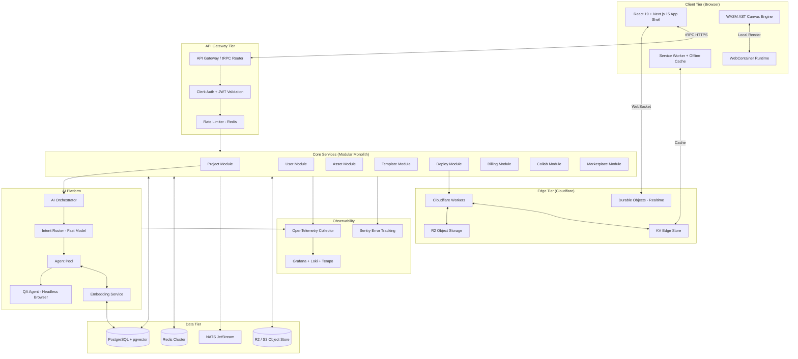
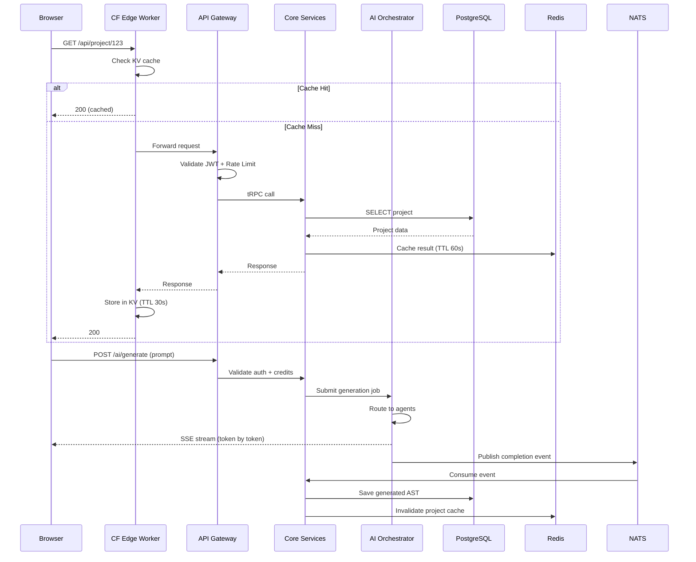

# ENGINEERING BIBLE — PART 1
## Engineering Philosophy & Complete System Architecture
**Document:** 4.1 of 4.7 | **Series:** AI + Engineering Bible

---

# PART 1 — ENGINEERING PHILOSOPHY

## 1.1 Engineering Principles

| # | Principle | Rule | Why It Exists |
|:--|:---|:---|:---|
| 1 | **AST Is the Source of Truth** | All visual, code, and AI operations manipulate the Abstract Syntax Tree. Never parse/emit raw strings. | String manipulation is fragile, lossy, and non-deterministic. AST operations are type-safe, reversible, and composable. Every competitor that uses regex-based code transforms eventually produces corrupt output. |
| 2 | **Local-First, Server-Assisted** | 90%+ of compute runs in the user's browser (WASM/WebContainers). Server handles persistence, AI inference, and Git. | Eliminates server provisioning latency. Users get instant feedback. Reduces infrastructure costs by 10x. Enables offline capability. |
| 3 | **Type Safety at Every Boundary** | TypeScript strict mode everywhere. Zod schemas validate all external data. tRPC for end-to-end type safety. | Runtime type errors in production are unacceptable. Type safety catches 80% of bugs at compile time. tRPC eliminates the API contract drift between frontend and backend. |
| 4 | **Immutable State, Event-Sourced History** | Every state change is an immutable event. Current state is derived by replaying events. | Enables unlimited undo/redo, branching, version comparison, and audit logging from a single mechanism. This is how Figma, Linear, and Notion handle collaborative state. |
| 5 | **Fail Open for Reads, Fail Closed for Writes** | Read operations degrade gracefully (cache, stale data). Write operations require confirmation and validation. | Users should always see something. But data corruption from invalid writes is catastrophic. |
| 6 | **Zero Trust Security Model** | Every request is authenticated and authorized regardless of origin. No implicit trust between services. | Internal services can be compromised. API keys can leak. Defense-in-depth prevents single-point-of-failure breaches. |
| 7 | **Observable by Default** | Every service emits structured logs, metrics, and traces. No "add observability later." | You cannot debug what you cannot see. Production issues in AI systems are especially opaque without structured observability. |

## 1.2 Architecture Principles

| Principle | Implementation | Trade-Off Accepted |
|:---|:---|:---|
| **Modular Monolith → Microservices** | Start as a modular monolith with clear module boundaries. Extract to microservices only when a specific module has different scaling requirements. | Monolith is faster to build and debug. Accept coordination overhead when extracting later. |
| **Event-Driven Communication** | Services communicate via events (Redis Streams / NATS). Synchronous RPCs only for latency-critical paths. | Eventual consistency is acceptable for most operations. Real-time canvas sync uses WebSocket (synchronous). |
| **Edge-First Deployment** | Static assets, generated sites, and read-heavy APIs deployed to Cloudflare edge. Compute-heavy operations (AI, builds) run on central compute. | Edge has limited compute capability. Accept routing complexity for latency reduction. |
| **Stateless Services, Stateful Storage** | Application services are stateless and horizontally scalable. All state lives in PostgreSQL, Redis, or object storage. | Stateless services are simpler to scale but require external state lookups on every request. |

## 1.3 AI Principles (Engineering-Specific)

| Principle | Rule | Why |
|:---|:---|:---|
| **Model-Agnostic Pipeline** | AI pipeline accepts any LLM via adapter interface. Never hard-code to a specific provider. | Anthropic raised prices 2x in 2024. OpenAI deprecated GPT-4-32k. Vendor lock-in is existential. |
| **Structured Output Only** | All LLM outputs are constrained to JSON schemas. No free-form text parsing. | Free-form text is unpredictable. JSON schema enforcement eliminates 90% of parsing failures. |
| **Deterministic Within Context** | Same AST state + same prompt = same output (temperature=0 for edits, 0.3 for generation). | Users expect consistency. A button change should produce the same result if retried. |
| **Cost-Aware Routing** | Use cheapest adequate model per task. Haiku for intent routing. Sonnet for code generation. GPT-4o for complex reasoning. | AI costs are the largest variable expense. A 10x model cost difference for the same output quality is unacceptable. |
| **Graceful Degradation Chain** | Primary model → Secondary model → Open-source fallback → Cached response → Error with explanation. | 100% AI availability is impossible. Users should never see a blank screen due to an API outage. |

## 1.4 Security Principles

| Principle | Implementation |
|:---|:---|
| **Defense in Depth** | WAF (Cloudflare) → API Gateway rate limiting → Authentication (JWT) → Authorization (RBAC check) → Input validation (Zod) → Output sanitization (DOMPurify) → CSP headers |
| **Principle of Least Privilege** | Services access only the databases/queues they need. API keys scoped to specific operations. Users see only their workspace data. |
| **Secrets Management** | All secrets in HashiCorp Vault or Infisical. Never in environment variables in code. Rotation every 90 days. |
| **AI-Specific Security** | Generated code passes through ESLint security rules + AST sanitization before rendering. Prompt injection attempts detected and blocked. |

## 1.5 Performance Principles

| Principle | Budget |
|:---|:---|
| **P95 API Latency** | < 200ms for CRUD operations. < 500ms for AI-assisted operations (excluding generation streaming). |
| **Canvas Frame Rate** | 60fps sustained during drag operations. WASM AST diffs < 5ms. |
| **AI First Token** | < 500ms from prompt submission to first streamed token visible to user. |
| **Build & Deploy** | < 5s from "Publish" click to live URL on edge CDN. |
| **Database Queries** | < 50ms for indexed queries. < 200ms for complex joins. Zero N+1 queries (enforced by DataLoader pattern). |

---

# PART 2 — COMPLETE SYSTEM ARCHITECTURE

## 2.1 High-Level Architecture Diagram

## 2.2 Technology Decisions Matrix

| Layer | Technology | Alternatives Considered | Why Chosen | Trade-Offs |
|:---|:---|:---|:---|:---|
| **Frontend Framework** | Next.js 15 (App Router) | Remix, SvelteKit, Nuxt | Industry standard for React SSR/SSG. Generated sites export as Next.js — dogfooding our own output. Largest ecosystem. | App Router complexity. RSC mental model is challenging for junior devs. |
| **UI Framework** | React 19 | Svelte 5, Vue 3, Solid | Largest talent pool. Best WASM interop story. Generated code targets React — must use React internally. | Bundle size larger than Svelte/Solid. Reconciler overhead for canvas operations. Mitigated by WASM. |
| **AST Engine** | Rust → WASM (SWC-based) | Babel (JS), Tree-sitter | 100x faster than Babel for parse/transform/serialize. Web Worker isolation. No main-thread blocking. | Rust talent is scarce and expensive ($250K+ for senior). Compilation pipeline is complex. |
| **In-Browser Runtime** | WebContainers (StackBlitz) | Sandpack (CodeSandbox), iframe | Full Node.js in browser. Real package.json resolution. True HMR. | Proprietary technology (StackBlitz license required). Fallback to Sandpack for simpler cases. |
| **State Management** | Zustand + Immer | Redux Toolkit, Jotai, MobX | Minimal boilerplate. Immer enables immutable updates with mutable syntax. Excellent devtools. | Less opinionated than Redux — team must enforce patterns manually. |
| **Backend Runtime** | Node.js (NestJS) | Go, Rust (Axum), Python (FastAPI) | TypeScript end-to-end type safety with tRPC. NestJS provides DI and module system. Largest ecosystem for web services. | Single-threaded. CPU-bound operations offloaded to Go workers or WASM. |
| **Performance Workers** | Go (Golang) | Rust, C++ | Excellent concurrency (goroutines). Fast compilation. Strong standard library. Good for Git operations, image processing, AST compilation workers. | Second language in stack. Team must maintain Go + TypeScript expertise. |
| **Database** | PostgreSQL 16 + pgvector | MySQL, CockroachDB, PlanetScale | Best JSONB support for flexible schemas. pgvector for embeddings (no separate vector DB needed). Robust ACID compliance. Row-level security for multi-tenancy. | Single-node write bottleneck. Mitigated by read replicas + Citus for horizontal scaling at enterprise scale. |
| **Cache** | Redis 7 (Cluster) | Memcached, DragonflyDB | Pub/Sub for real-time. Streams for event sourcing. Sorted sets for rate limiting. Lua scripting for atomic operations. | Memory-bound. Costs scale with cache size. Eviction policies require tuning. |
| **Message Queue** | NATS JetStream | RabbitMQ, Kafka, Redis Streams | Lightweight, cloud-native. JetStream provides persistence. Lower operational overhead than Kafka. Excellent for microservice communication. | Smaller ecosystem than Kafka. Less mature for very high-throughput event streaming (>1M events/sec). |
| **Object Storage** | Cloudflare R2 | AWS S3, GCS, MinIO | Zero egress fees (S3 egress costs are significant at scale). S3-compatible API. Global edge distribution built-in. | Cloudflare vendor dependency. Mitigated by S3-compatible API enabling easy migration. |
| **Edge/CDN** | Cloudflare Workers | Vercel Edge, AWS Lambda@Edge, Deno Deploy | Largest edge network (300+ cities). V8 isolates for fast cold starts (<5ms). Durable Objects for real-time state. | V8 isolate constraints (128MB memory, 30s CPU time). Complex operations must proxy to origin. |
| **Auth** | Clerk | Auth0, Supabase Auth, Custom | Fastest integration. Pre-built React components. SSO/SAML on enterprise plan. Webhook events for sync. | Vendor dependency. $0.02/MAU beyond free tier. Migration path: JWT-compatible, can swap to custom auth later. |
| **Payments** | Stripe | Paddle, LemonSqueezy | Industry standard. Best subscription + usage-based billing support. Tax compliance. Invoicing. | 2.9% + 30¢ per transaction. Stripe Tax additional. |
| **Observability** | OpenTelemetry → Grafana Stack | Datadog, New Relic, Honeycomb | Open-source. No per-seat licensing costs. Self-hosted or Grafana Cloud. Full traces + metrics + logs in one stack. | Higher operational overhead than managed Datadog. Grafana Cloud reduces this. |
| **AI Provider (Primary)** | Anthropic (Claude 3.5/3.7) | OpenAI, Google, DeepSeek | Best code generation quality (benchmarks). Longest reliable context window. Best structured output adherence. | Single-provider risk. Mitigated by model-agnostic adapter layer. |
| **AI Provider (Fallback)** | OpenAI (GPT-4o-mini) + DeepSeek-V3 | Mixtral, Llama | GPT-4o-mini: fast, cheap, good for simple edits. DeepSeek: strong code generation, self-hostable for zero-dependency fallback. | Quality variance between providers requires per-model prompt tuning. |
| **Embedding Model** | `text-embedding-3-small` (OpenAI) | Cohere Embed, BGE, Nomic | Best price/performance ratio. 1536 dimensions. Sufficient for design component retrieval. | OpenAI dependency for embeddings. Fallback: BGE-small-en-v1.5 (open-source, self-hosted). |
| **Real-Time** | Cloudflare Durable Objects | Socket.io, Ably, Liveblocks | Co-located with edge deployment. Built-in state persistence. WebSocket + hibernation for cost efficiency. | Cloudflare-specific API. Liveblocks is easier but $$$. Durable Objects require more engineering but zero per-connection cost. |
| **CRDT Library** | Yjs | Automerge, Diamond Types | Most mature JS CRDT. Excellent Y-WebSocket adapter. Used by Notion, BlockNote, Tiptap. | Complex merge semantics for rich document structures. Requires careful schema design. |

## 2.3 Service Communication Patterns

## 2.4 Multi-Tenancy Architecture

| Strategy | Implementation |
|:---|:---|
| **Data Isolation** | PostgreSQL Row-Level Security (RLS). Every table has `workspace_id` column. RLS policies enforce `workspace_id = current_setting('app.workspace_id')`. |
| **Query Enforcement** | Application layer sets `SET LOCAL app.workspace_id = ?` on every connection from pool. Impossible to access other workspace data even with SQL injection. |
| **Asset Isolation** | R2 bucket paths: `/{workspace_id}/{project_id}/{asset_id}`. Signed URLs with workspace-scoped permissions. |
| **AI Isolation** | Each AI generation job includes workspace context only. No cross-workspace data leakage in prompts. |
| **Enterprise Option** | Dedicated PostgreSQL schema per enterprise customer (schema-level isolation). Dedicated AI model instances on request. |

---

*— End of Part 1 (Engineering Bible) —*
