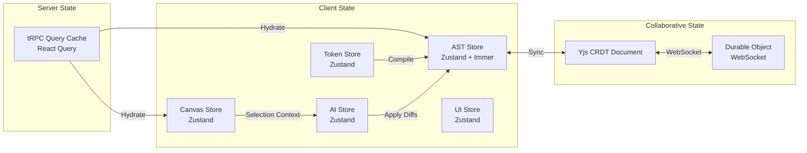

# ENGINEERING BIBLE — PART 2
## Frontend & Backend Architecture
**Document:** 4.2 of 4.7 | **Series:** AI + Engineering Bible

---

# PART 3 — FRONTEND ARCHITECTURE

## 3.1 Project Structure

```
src/
├── app/                          # Next.js App Router
│   ├── (auth)/                   # Auth group (login, signup)
│   ├── (dashboard)/              # Dashboard group
│   │   ├── layout.tsx            # Dashboard shell (sidebar + topbar)
│   │   ├── page.tsx              # Project grid
│   │   └── [workspaceId]/
│   │       └── [projectId]/
│   │           ├── canvas/       # Visual canvas editor
│   │           ├── settings/     # Project settings
│   │           ├── deploy/       # Deployments
│   │           └── analytics/    # Analytics dashboard
│   ├── (marketing)/              # Marketing pages (SSG)
│   ├── api/                      # API routes (tRPC adapter)
│   └── layout.tsx                # Root layout
├── canvas/                       # Canvas engine (isolated module)
│   ├── ast/                      # AST ↔ DOM bridge
│   │   ├── parser.ts             # WASM AST parser interface
│   │   ├── serializer.ts         # AST → JSX code string
│   │   ├── differ.ts             # AST diff computation
│   │   └── wasm/                 # Rust WASM binaries
│   ├── renderer/                 # Canvas rendering engine
│   │   ├── CanvasRoot.tsx        # Root canvas component
│   │   ├── ElementOverlay.tsx    # Selection, hover, drag handles
│   │   ├── BreakpointFrame.tsx   # Responsive preview frames
│   │   └── WebContainerBridge.ts # WebContainer ↔ Canvas sync
│   ├── interactions/             # Mouse/keyboard/touch handlers
│   │   ├── useDragDrop.ts
│   │   ├── useResize.ts
│   │   ├── useSelection.ts
│   │   └── useInlineEdit.ts
│   └── panels/                   # Canvas-specific panels
│       ├── PropertyPanel.tsx
│       ├── CodeInspector.tsx
│       └── PageTree.tsx
├── components/                   # Shared UI components
│   ├── ui/                       # Primitive components (Button, Input, Card, Dialog)
│   ├── layout/                   # Layout components (Sidebar, Topbar, Shell)
│   ├── ai/                       # AI-specific components (PromptBox, AIStudio)
│   └── brand/                    # Brand Studio components
├── lib/                          # Shared utilities
│   ├── trpc/                     # tRPC client + hooks
│   ├── auth/                     # Clerk helpers
│   ├── tokens/                   # Design token engine (client-side)
│   ├── ai/                       # AI client (streaming, history)
│   └── utils/                    # General utilities
├── stores/                       # Zustand stores
│   ├── canvas.store.ts           # Canvas state (selection, zoom, mode)
│   ├── project.store.ts          # Current project state
│   ├── ast.store.ts              # AST tree state (Immer-powered)
│   ├── tokens.store.ts           # Design tokens state
│   ├── ai.store.ts               # AI conversation state
│   └── ui.store.ts               # UI preferences (panel visibility, theme)
├── hooks/                        # Custom React hooks
├── styles/                       # Global CSS + token-generated utilities
│   ├── globals.css
│   ├── tokens.css                # CSS custom properties (auto-generated)
│   └── animations.css
└── types/                        # Shared TypeScript types
    ├── ast.types.ts
    ├── project.types.ts
    ├── tokens.types.ts
    └── api.types.ts
```

## 3.2 Component Strategy

| Category | Pattern | Rendering | Example |
|:---|:---|:---|:---|
| **Server Components** | Data-fetching, layout, static content | RSC (zero client JS) | Dashboard layout, project list, template gallery |
| **Client Components** | Interactive, stateful, browser APIs | `"use client"` directive | Canvas, property panel, AI chat, forms |
| **Shared Components** | Pure UI, no data fetching, no state | Either (default server) | Button, Card, Input, Toast, Dialog |
| **Canvas Components** | Performance-critical, WASM-interop | Client only, Web Worker offload | AST renderer, drag handlers, selection overlay |

**Rule:** Components are server by default. Add `"use client"` only when the component uses hooks, browser APIs, or event handlers.

## 3.3 State Management Architecture



| State Type | Technology | Persistence | Sync |
|:---|:---|:---|:---|
| **Server/Remote State** | tRPC + React Query | PostgreSQL | Stale-while-revalidate, optimistic updates |
| **Canvas UI State** | Zustand | Session only | Local only (selection, zoom, panel visibility) |
| **AST Document State** | Zustand + Immer + Yjs | PostgreSQL + Redis | Real-time via Yjs CRDT → Durable Objects |
| **Design Tokens** | Zustand | PostgreSQL | Workspace-level broadcast on change |
| **AI Conversation** | Zustand | PostgreSQL (history) | Per-user, per-project |

## 3.4 Rendering & Performance Strategy

| Strategy | Implementation |
|:---|:---|
| **Canvas Rendering** | WebContainer renders actual React components in an iframe. Canvas overlay (selection, drag handles) renders in a separate React layer above the iframe. WASM AST parser runs in a Web Worker — never blocks main thread. |
| **Code Splitting** | Route-based splitting via Next.js dynamic imports. Canvas engine (~200KB WASM) loaded only when user enters editor. Marketing pages are fully static. |
| **Streaming** | AI responses streamed via Server-Sent Events. Canvas updates applied incrementally as tokens arrive. React Suspense boundaries for async data loading. |
| **Image Optimization** | `next/image` with automatic WebP/AVIF. Blur placeholder generated at upload time. Lazy loading with Intersection Observer. |
| **Font Loading** | `next/font` with `font-display: swap`. Inter and Geist Mono preloaded. Subset for non-Latin scripts. |
| **Caching** | Service Worker caches app shell + static assets. React Query caches API responses with 60s stale time. Edge KV caches generated site bundles. |

---

# PART 4 — BACKEND ARCHITECTURE

## 4.1 Module Architecture

```mermaid
graph TB
    subgraph API Layer
        TRPC[tRPC Router]
        REST[REST Endpoints<br/>Webhooks, Public API]
        WS[WebSocket Server<br/>Durable Objects]
    end

    subgraph Core Modules
        AuthMod[Auth Module<br/>Clerk + JWT]
        UserMod[User Module<br/>Profiles, Preferences]
        WorkMod[Workspace Module<br/>Orgs, Teams, RBAC]
        ProjMod[Project Module<br/>CRUD, Pages, Components]
        AssetMod[Asset Module<br/>Upload, Optimize, CDN]
        TokenMod[Token Module<br/>Design Tokens, Brands]
        HistMod[History Module<br/>Versions, Checkpoints, Branches]
    end

    subgraph AI Modules
        AIMod[AI Module<br/>Orchestrator, Routing]
        PromptMod[Prompt Module<br/>Templates, Memory]
        EmbedMod[Embedding Module<br/>Vector Search, RAG]
    end

    subgraph Platform Modules
        DeployMod[Deploy Module<br/>Build, Publish, Domains]
        BillMod[Billing Module<br/>Stripe, Credits, Usage]
        CollabMod[Collab Module<br/>Comments, Presence, Reviews]
        AnalyticsMod[Analytics Module<br/>Traffic, CWV, Conversions]
        MktMod[Marketplace Module<br/>Templates, Plugins, Revenue]
        NotifMod[Notification Module<br/>Email, In-App, Webhooks]
    end

    subgraph Infrastructure Modules
        AuditMod[Audit Module<br/>Event Log, Compliance]
        SearchMod[Search Module<br/>Full-Text, Filters]
        JobMod[Job Queue Module<br/>Background Workers]
    end

    TRPC --> AuthMod
    TRPC --> Core Modules
    TRPC --> AI Modules
    TRPC --> Platform Modules
    REST --> Platform Modules
    WS --> CollabMod
```

## 4.2 Module Specifications

### Auth Module
| Property | Detail |
|:---|:---|
| **Responsibility** | User authentication, session management, JWT validation, SSO/SAML |
| **Provider** | Clerk (primary). Custom JWT validation for API keys. |
| **Endpoints** | `auth.getSession`, `auth.getUser`, `auth.createAPIKey`, `auth.revokeAPIKey` |
| **Middleware** | Every tRPC procedure passes through `isAuthenticated` middleware. Protected procedures additionally pass through `hasPermission(resource, action)`. |

### Project Module
| Property | Detail |
|:---|:---|
| **Responsibility** | CRUD for projects, pages, components. AST storage and retrieval. Git sync. |
| **Key Operations** | `project.create`, `project.get`, `project.update`, `project.delete`, `project.clone`, `page.create`, `page.updateAST`, `component.create`, `component.updateAST` |
| **AST Storage** | AST stored as JSONB in PostgreSQL. Compressed with zstd for storage efficiency. Versioned — every update creates a new version row. |
| **Git Sync** | Go worker process. On save: serialize AST → JSX files → Git commit → push to GitHub. On PR merge: pull → parse files → update AST in DB → notify Canvas via WebSocket. |

### AI Module
| Property | Detail |
|:---|:---|
| **Responsibility** | Orchestrate multi-agent AI pipeline. Route prompts. Manage context windows. Stream responses. |
| **Key Operations** | `ai.generate` (full site), `ai.edit` (scoped element), `ai.suggest` (proactive), `ai.explain` (code explanation) |
| **Concurrency** | Max 3 concurrent AI generations per user. Queue additional requests. |
| **Cost Tracking** | Every AI call logged with: model, input tokens, output tokens, latency, cost. Aggregated per user for credit billing. |

### Deploy Module
| Property | Detail |
|:---|:---|
| **Responsibility** | Build Next.js projects, optimize bundles, deploy to Cloudflare edge, manage domains. |
| **Build Pipeline** | 1. Serialize AST → Next.js file system. 2. `next build` (in container). 3. Optimize images (sharp). 4. Purge unused CSS. 5. Run Lighthouse audit. 6. Upload to R2. 7. Update Cloudflare Worker routing. |
| **Domain Management** | Custom domains via Cloudflare API. SSL via Cloudflare automatic certificates. DNS verification via TXT record. |
| **Rollback** | Every deployment creates an immutable bundle in R2. Rollback = point Worker route to previous bundle. Instant (<1s). |

### Billing Module
| Property | Detail |
|:---|:---|
| **Responsibility** | Subscription management, credit tracking, usage metering, invoicing. |
| **Provider** | Stripe Billing (subscriptions) + Stripe Usage Records (AI credits). |
| **Credit System** | Each plan includes N AI credits/month. Credits consumed per AI operation (weighted by model cost). Overage billed at $X per 100 credits. |
| **Webhooks** | Stripe webhooks → update subscription status, handle failed payments, provision/deprovision features. |

## 4.3 API Gateway & Rate Limiting

| Tier | Rate Limit | Burst | Scope |
|:---|:---|:---|:---|
| **Free** | 60 req/min | 10 | Per user |
| **Pro** | 300 req/min | 50 | Per user |
| **Agency** | 600 req/min | 100 | Per workspace |
| **Enterprise** | 3000 req/min | 500 | Per workspace |
| **AI Generation** | 10 req/min (Free), 30 req/min (Pro) | 5 | Per user |
| **Deployment** | 5 req/min | 2 | Per project |

**Implementation:** Redis sliding window counter. Token bucket for burst. Rate limit headers: `X-RateLimit-Limit`, `X-RateLimit-Remaining`, `X-RateLimit-Reset`.

## 4.4 Background Job Architecture

| Queue | Workers | Purpose | Technology |
|:---|:---|:---|:---|
| `ai.generation` | 10 | AI multi-agent pipeline execution | NATS JetStream, Go consumer |
| `deploy.build` | 5 | Next.js build + optimization | NATS JetStream, Go consumer (Docker) |
| `asset.process` | 3 | Image optimization, video transcoding | NATS JetStream, Go consumer (sharp/ffmpeg) |
| `git.sync` | 3 | GitHub push/pull synchronization | NATS JetStream, Go consumer (go-git) |
| `analytics.ingest` | 2 | Aggregate traffic events, compute CWV | NATS JetStream, Go consumer |
| `notification.send` | 2 | Email (Resend), in-app, webhook dispatch | NATS JetStream, Node consumer |
| `audit.log` | 1 | Write audit events to append-only table | NATS JetStream, Node consumer |

**Retry Policy:** 3 retries with exponential backoff (1s, 5s, 30s). Dead letter queue for failed jobs. Alert on DLQ depth > 10.

---

*— End of Part 2 (Engineering Bible) —*
