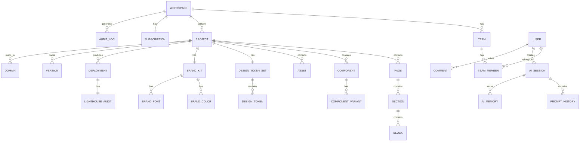

# ENGINEERING BIBLE — PART 3
## Database Design & API Design
**Document:** 4.3 of 4.7 | **Series:** AI + Engineering Bible

---

# PART 5 — DATABASE DESIGN

## 5.1 ER Diagram (Core Entities)



## 5.2 Table Definitions

### Core Tables

#### `workspaces`
| Column | Type | Constraints | Purpose |
|:---|:---|:---|:---|
| `id` | `uuid` | PK, DEFAULT gen_random_uuid() | Unique workspace identifier |
| `name` | `varchar(100)` | NOT NULL | Display name |
| `slug` | `varchar(50)` | UNIQUE, NOT NULL | URL-safe identifier |
| `plan` | `enum('free','pro','agency','enterprise')` | NOT NULL DEFAULT 'free' | Current subscription tier |
| `owner_id` | `uuid` | FK → users.id, NOT NULL | Workspace owner |
| `settings` | `jsonb` | DEFAULT '{}' | Workspace-level settings |
| `created_at` | `timestamptz` | NOT NULL DEFAULT now() | |
| `updated_at` | `timestamptz` | NOT NULL DEFAULT now() | Auto-updated via trigger |

**Indexes:** `idx_workspaces_slug` UNIQUE, `idx_workspaces_owner`  
**RLS:** All queries filtered by `workspace_id = current_setting('app.workspace_id')`

#### `users`
| Column | Type | Constraints | Purpose |
|:---|:---|:---|:---|
| `id` | `uuid` | PK | Maps to Clerk user ID |
| `email` | `varchar(255)` | UNIQUE, NOT NULL | Primary email |
| `name` | `varchar(100)` | | Display name |
| `avatar_url` | `text` | | Profile image URL |
| `preferences` | `jsonb` | DEFAULT '{}' | Theme, keyboard shortcuts, AI preferences |
| `onboarding_completed` | `boolean` | DEFAULT false | |
| `created_at` | `timestamptz` | NOT NULL DEFAULT now() | |

#### `projects`
| Column | Type | Constraints | Purpose |
|:---|:---|:---|:---|
| `id` | `uuid` | PK | |
| `workspace_id` | `uuid` | FK → workspaces.id, NOT NULL | Workspace ownership |
| `name` | `varchar(200)` | NOT NULL | Project name |
| `slug` | `varchar(100)` | NOT NULL | URL identifier |
| `description` | `text` | | |
| `type` | `enum('website','app','landing','docs','blog','dashboard')` | NOT NULL | Project type |
| `status` | `enum('draft','active','archived')` | DEFAULT 'active' | |
| `git_repo_url` | `text` | | Connected GitHub/GitLab repo |
| `git_branch` | `varchar(100)` | DEFAULT 'main' | Active branch |
| `favicon_url` | `text` | | |
| `og_image_url` | `text` | | Default OG image |
| `seo_defaults` | `jsonb` | DEFAULT '{}' | Default meta tags |
| `settings` | `jsonb` | DEFAULT '{}' | |
| `created_at` | `timestamptz` | NOT NULL DEFAULT now() | |
| `updated_at` | `timestamptz` | NOT NULL DEFAULT now() | |

**Indexes:** `idx_projects_workspace` (workspace_id), `idx_projects_slug` (workspace_id, slug) UNIQUE  
**Future:** Add `template_id` FK for template-based creation. Add `forked_from` for project forking.

#### `pages`
| Column | Type | Constraints | Purpose |
|:---|:---|:---|:---|
| `id` | `uuid` | PK | |
| `project_id` | `uuid` | FK → projects.id, NOT NULL | |
| `workspace_id` | `uuid` | FK → workspaces.id, NOT NULL | RLS column |
| `path` | `varchar(500)` | NOT NULL | URL path (e.g., `/pricing`) |
| `title` | `varchar(200)` | NOT NULL | Page title (SEO) |
| `meta_description` | `text` | | SEO meta description |
| `og_title` | `varchar(200)` | | Open Graph title |
| `og_description` | `text` | | |
| `og_image_url` | `text` | | |
| `ast` | `jsonb` | NOT NULL | Page AST (compressed) |
| `ast_hash` | `varchar(64)` | | SHA-256 of AST for change detection |
| `layout_id` | `uuid` | FK → components.id | Shared layout component |
| `sort_order` | `integer` | DEFAULT 0 | Ordering in sitemap |
| `status` | `enum('draft','published','archived')` | DEFAULT 'draft' | |
| `published_at` | `timestamptz` | | Last publish timestamp |
| `created_at` | `timestamptz` | NOT NULL DEFAULT now() | |
| `updated_at` | `timestamptz` | NOT NULL DEFAULT now() | |

**Indexes:** `idx_pages_project` (project_id), `idx_pages_path` (project_id, path) UNIQUE, `idx_pages_status` (project_id, status)

#### `components`
| Column | Type | Constraints | Purpose |
|:---|:---|:---|:---|
| `id` | `uuid` | PK | |
| `project_id` | `uuid` | FK → projects.id | NULL = workspace-level shared component |
| `workspace_id` | `uuid` | FK → workspaces.id, NOT NULL | |
| `name` | `varchar(100)` | NOT NULL | Component name (PascalCase) |
| `type` | `enum('layout','section','primitive','custom')` | NOT NULL | |
| `ast` | `jsonb` | NOT NULL | Component AST |
| `props_schema` | `jsonb` | DEFAULT '{}' | Typed props definition |
| `default_props` | `jsonb` | DEFAULT '{}' | Default prop values |
| `description` | `text` | | Usage documentation |
| `is_shared` | `boolean` | DEFAULT false | Shared across projects? |
| `created_at` | `timestamptz` | NOT NULL DEFAULT now() | |
| `updated_at` | `timestamptz` | NOT NULL DEFAULT now() | |

### Design & Brand Tables

#### `design_token_sets`
| Column | Type | Constraints | Purpose |
|:---|:---|:---|:---|
| `id` | `uuid` | PK | |
| `project_id` | `uuid` | FK → projects.id, NOT NULL | |
| `workspace_id` | `uuid` | FK → workspaces.id, NOT NULL | |
| `name` | `varchar(100)` | DEFAULT 'default' | Token set name |
| `version` | `varchar(20)` | NOT NULL DEFAULT '1.0.0' | SemVer |
| `tokens` | `jsonb` | NOT NULL | Full W3C token JSON |
| `compiled_css` | `text` | | Pre-compiled CSS custom properties |
| `compiled_tailwind` | `jsonb` | | Pre-compiled Tailwind config |
| `created_at` | `timestamptz` | NOT NULL DEFAULT now() | |

#### `brand_kits`
| Column | Type | Constraints | Purpose |
|:---|:---|:---|:---|
| `id` | `uuid` | PK | |
| `project_id` | `uuid` | FK → projects.id, NOT NULL | |
| `workspace_id` | `uuid` | FK → workspaces.id, NOT NULL | |
| `logo_url` | `text` | | Brand logo |
| `logo_dark_url` | `text` | | Dark mode logo variant |
| `tone_of_voice` | `varchar(50)` | | professional/playful/technical/friendly |
| `industry` | `varchar(100)` | | For AI context |
| `target_audience` | `text` | | For AI copy generation |
| `ai_instructions` | `text` | | Permanent AI instructions |

### Versioning & History Tables

#### `versions`
| Column | Type | Constraints | Purpose |
|:---|:---|:---|:---|
| `id` | `uuid` | PK | |
| `project_id` | `uuid` | FK → projects.id, NOT NULL | |
| `workspace_id` | `uuid` | FK → workspaces.id, NOT NULL | |
| `name` | `varchar(200)` | | Human-readable checkpoint name |
| `snapshot` | `jsonb` | NOT NULL | Full project state snapshot (compressed) |
| `created_by` | `uuid` | FK → users.id | |
| `source` | `enum('manual','auto','ai','deploy')` | NOT NULL | How this version was created |
| `parent_version_id` | `uuid` | FK → versions.id | For branching |
| `metadata` | `jsonb` | DEFAULT '{}' | AI edit description, diff summary |
| `created_at` | `timestamptz` | NOT NULL DEFAULT now() | |

### AI Tables

#### `ai_sessions`
| Column | Type | Constraints | Purpose |
|:---|:---|:---|:---|
| `id` | `uuid` | PK | |
| `project_id` | `uuid` | FK → projects.id, NOT NULL | |
| `user_id` | `uuid` | FK → users.id, NOT NULL | |
| `workspace_id` | `uuid` | FK → workspaces.id, NOT NULL | |
| `type` | `enum('generation','edit','conversation')` | NOT NULL | |
| `status` | `enum('active','completed','failed')` | DEFAULT 'active' | |
| `created_at` | `timestamptz` | NOT NULL DEFAULT now() | |

#### `prompt_history`
| Column | Type | Constraints | Purpose |
|:---|:---|:---|:---|
| `id` | `uuid` | PK | |
| `session_id` | `uuid` | FK → ai_sessions.id, NOT NULL | |
| `workspace_id` | `uuid` | NOT NULL | RLS |
| `role` | `enum('user','assistant','system')` | NOT NULL | |
| `content` | `text` | NOT NULL | Prompt or response content |
| `model` | `varchar(50)` | | Model used (claude-3.5-sonnet, etc.) |
| `input_tokens` | `integer` | | Token count |
| `output_tokens` | `integer` | | Token count |
| `cost_cents` | `integer` | | Cost in cents |
| `latency_ms` | `integer` | | Response latency |
| `accepted` | `boolean` | | Did user accept the output? |
| `created_at` | `timestamptz` | NOT NULL DEFAULT now() | |

#### `ai_memory`
| Column | Type | Constraints | Purpose |
|:---|:---|:---|:---|
| `id` | `uuid` | PK | |
| `workspace_id` | `uuid` | NOT NULL | |
| `project_id` | `uuid` | | NULL = workspace-level memory |
| `user_id` | `uuid` | | NULL = project-level memory |
| `type` | `enum('preference','correction','instruction','pattern')` | NOT NULL | |
| `content` | `text` | NOT NULL | Memory content |
| `embedding` | `vector(1536)` | | For semantic retrieval |
| `relevance_score` | `float` | DEFAULT 1.0 | Decay over time |
| `created_at` | `timestamptz` | NOT NULL DEFAULT now() | |

### Deployment & Publishing Tables

#### `deployments`
| Column | Type | Constraints | Purpose |
|:---|:---|:---|:---|
| `id` | `uuid` | PK | |
| `project_id` | `uuid` | FK → projects.id, NOT NULL | |
| `workspace_id` | `uuid` | NOT NULL | |
| `environment` | `enum('staging','production')` | NOT NULL | |
| `status` | `enum('building','deploying','live','failed','rolled_back')` | NOT NULL | |
| `bundle_url` | `text` | | R2 URL to built bundle |
| `commit_hash` | `varchar(40)` | | Git commit SHA |
| `lighthouse_score` | `jsonb` | | {performance, accessibility, seo, best_practices} |
| `bundle_size_bytes` | `integer` | | Total bundle size |
| `deployed_by` | `uuid` | FK → users.id | |
| `deployed_at` | `timestamptz` | | |
| `created_at` | `timestamptz` | NOT NULL DEFAULT now() | |

#### `domains`
| Column | Type | Constraints | Purpose |
|:---|:---|:---|:---|
| `id` | `uuid` | PK | |
| `project_id` | `uuid` | FK → projects.id, NOT NULL | |
| `workspace_id` | `uuid` | NOT NULL | |
| `domain` | `varchar(255)` | UNIQUE, NOT NULL | Custom domain |
| `verified` | `boolean` | DEFAULT false | DNS verification status |
| `ssl_status` | `enum('pending','active','failed')` | DEFAULT 'pending' | |
| `is_primary` | `boolean` | DEFAULT false | Primary domain for project |

### Billing Tables

#### `subscriptions`
| Column | Type | Constraints | Purpose |
|:---|:---|:---|:---|
| `id` | `uuid` | PK | |
| `workspace_id` | `uuid` | FK → workspaces.id, UNIQUE | |
| `stripe_subscription_id` | `varchar(100)` | UNIQUE | |
| `stripe_customer_id` | `varchar(100)` | NOT NULL | |
| `plan` | `enum('free','pro','agency','enterprise')` | NOT NULL | |
| `status` | `enum('active','past_due','canceled','trialing')` | NOT NULL | |
| `credits_included` | `integer` | NOT NULL | Monthly credit allocation |
| `credits_used` | `integer` | DEFAULT 0 | Credits used this period |
| `period_start` | `timestamptz` | | Current billing period start |
| `period_end` | `timestamptz` | | Current billing period end |

#### `credit_transactions`
| Column | Type | Constraints | Purpose |
|:---|:---|:---|:---|
| `id` | `uuid` | PK | |
| `workspace_id` | `uuid` | NOT NULL | |
| `user_id` | `uuid` | NOT NULL | |
| `amount` | `integer` | NOT NULL | Positive = earned, Negative = consumed |
| `type` | `enum('subscription','purchase','consumption','refund')` | | |
| `description` | `text` | | "AI generation: full site (Claude 3.5 Sonnet)" |
| `ai_session_id` | `uuid` | FK → ai_sessions.id | |
| `created_at` | `timestamptz` | NOT NULL DEFAULT now() | |

### Collaboration & Audit Tables

#### `comments`
| Column | Type | Constraints | Purpose |
|:---|:---|:---|:---|
| `id` | `uuid` | PK | |
| `project_id` | `uuid` | FK → projects.id, NOT NULL | |
| `page_id` | `uuid` | FK → pages.id | |
| `workspace_id` | `uuid` | NOT NULL | |
| `author_id` | `uuid` | FK → users.id, NOT NULL | |
| `parent_id` | `uuid` | FK → comments.id | Thread replies |
| `element_selector` | `varchar(500)` | | CSS selector or AST node ID for pinning |
| `content` | `text` | NOT NULL | Comment body (markdown) |
| `resolved` | `boolean` | DEFAULT false | |
| `resolved_by` | `uuid` | FK → users.id | |
| `created_at` | `timestamptz` | NOT NULL DEFAULT now() | |

#### `audit_logs`
| Column | Type | Constraints | Purpose |
|:---|:---|:---|:---|
| `id` | `uuid` | PK | |
| `workspace_id` | `uuid` | NOT NULL | |
| `user_id` | `uuid` | | NULL for system events |
| `action` | `varchar(100)` | NOT NULL | e.g., 'project.create', 'page.update', 'deploy.production' |
| `resource_type` | `varchar(50)` | NOT NULL | e.g., 'project', 'page', 'deployment' |
| `resource_id` | `uuid` | | |
| `metadata` | `jsonb` | DEFAULT '{}' | Action-specific details |
| `ip_address` | `inet` | | |
| `user_agent` | `text` | | |
| `created_at` | `timestamptz` | NOT NULL DEFAULT now() | |

**Indexes:** `idx_audit_workspace_time` (workspace_id, created_at DESC), `idx_audit_action` (action)  
**Partitioning:** Partition by month on `created_at` for efficient querying and retention.

---

# PART 6 — API DESIGN

## 6.1 tRPC Router Structure

```typescript
// Simplified tRPC router structure
const appRouter = router({
  auth: router({
    getSession: publicProcedure.query(...),
    createAPIKey: protectedProcedure.mutation(...),
  }),
  workspace: router({
    get: protectedProcedure.input(z.object({ id: z.string().uuid() })).query(...),
    update: protectedProcedure.input(WorkspaceUpdateSchema).mutation(...),
    members: router({
      list: protectedProcedure.query(...),
      invite: adminProcedure.input(InviteSchema).mutation(...),
      remove: adminProcedure.mutation(...),
    }),
  }),
  project: router({
    list: protectedProcedure.query(...),
    get: protectedProcedure.input(z.object({ id: z.string().uuid() })).query(...),
    create: protectedProcedure.input(ProjectCreateSchema).mutation(...),
    update: protectedProcedure.input(ProjectUpdateSchema).mutation(...),
    delete: protectedProcedure.mutation(...),
    clone: protectedProcedure.mutation(...),
  }),
  page: router({
    list: protectedProcedure.query(...),
    get: protectedProcedure.query(...),
    create: protectedProcedure.input(PageCreateSchema).mutation(...),
    updateAST: protectedProcedure.input(ASTUpdateSchema).mutation(...),
    delete: protectedProcedure.mutation(...),
  }),
  ai: router({
    generate: protectedProcedure.input(GenerateSchema).mutation(...),  // SSE stream
    edit: protectedProcedure.input(EditSchema).mutation(...),           // SSE stream
    suggest: protectedProcedure.query(...),
    history: protectedProcedure.query(...),
    memory: router({
      list: protectedProcedure.query(...),
      create: protectedProcedure.mutation(...),
      delete: protectedProcedure.mutation(...),
    }),
  }),
  deploy: router({
    trigger: protectedProcedure.input(DeploySchema).mutation(...),
    list: protectedProcedure.query(...),
    rollback: adminProcedure.mutation(...),
    domain: router({
      add: protectedProcedure.mutation(...),
      verify: protectedProcedure.mutation(...),
      remove: protectedProcedure.mutation(...),
    }),
  }),
  billing: router({
    getSubscription: protectedProcedure.query(...),
    getUsage: protectedProcedure.query(...),
    createCheckout: protectedProcedure.mutation(...),
    createPortalSession: protectedProcedure.mutation(...),
  }),
});
```

## 6.2 Public REST API (v1)

| Method | Endpoint | Purpose | Auth |
|:---|:---|:---|:---|
| GET | `/api/v1/projects` | List projects | API Key |
| GET | `/api/v1/projects/:id` | Get project | API Key |
| POST | `/api/v1/projects` | Create project | API Key |
| POST | `/api/v1/projects/:id/generate` | AI generate site | API Key + Credits |
| GET | `/api/v1/projects/:id/pages` | List pages | API Key |
| PUT | `/api/v1/projects/:id/pages/:pageId` | Update page AST | API Key |
| POST | `/api/v1/projects/:id/deploy` | Trigger deployment | API Key |
| GET | `/api/v1/projects/:id/deployments` | List deployments | API Key |

**Versioning:** URL-based (`/api/v1/`). Breaking changes increment version. Old versions supported for 12 months.  
**Pagination:** Cursor-based. `?cursor=xxx&limit=20`. Response includes `next_cursor`.  
**Error Format:**
```json
{
  "error": {
    "code": "VALIDATION_ERROR",
    "message": "Invalid project name",
    "details": [{"field": "name", "message": "Must be 1-200 characters"}],
    "request_id": "req_abc123"
  }
}
```

## 6.3 Streaming API (AI Generation)

```
POST /api/v1/ai/generate
Content-Type: application/json
Authorization: Bearer <api_key>

{
  "project_id": "uuid",
  "prompt": "Create a SaaS landing page for an AI legal tech startup",
  "brand_preset": "saas_dark",
  "pages": ["home", "features", "pricing", "about"]
}

Response: text/event-stream

event: progress
data: {"stage": "planning", "message": "Architecting sitemap..."}

event: page_start
data: {"page": "/home", "message": "Generating hero section..."}

event: ast_chunk
data: {"page": "/home", "section": "hero", "ast": {...partial AST...}}

event: page_complete
data: {"page": "/home", "lighthouse": {"performance": 97, "accessibility": 98}}

event: complete
data: {"project_id": "uuid", "pages_generated": 4, "total_tokens": 15420, "credits_used": 12}
```

---

*— End of Part 3 (Engineering Bible) —*
