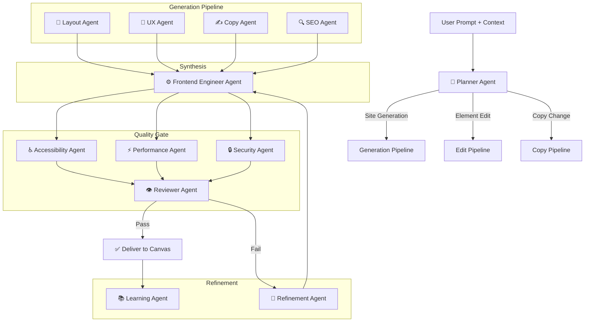
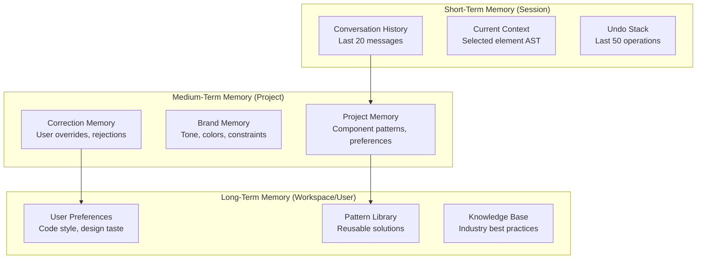

# ENGINEERING BIBLE — PART 4
## Multi-Agent AI System & Prompt Engineering
**Document:** 4.4 of 4.7 | **Series:** AI + Engineering Bible

---

# PART 7 — MULTI-AGENT AI SYSTEM

## 7.1 Agent Orchestration Architecture



## 7.2 Agent Specifications

### Planner Agent
| Property | Detail |
|:---|:---|
| **Model** | Claude 3.5 Haiku (fast, cheap) |
| **Responsibility** | Parse user intent. Classify operation type. Determine which agents to invoke. Build execution plan. |
| **Inputs** | Raw user prompt, current project metadata (page count, component list), user role |
| **Outputs** | Structured plan: `{type: "generation"|"edit"|"copy", scope: "page"|"section"|"element", target: ASTNodeId, agents: [...]}` |
| **Memory** | None (stateless classifier) |
| **Failure Handling** | If confidence < 0.7, ask user for clarification instead of guessing |
| **Latency Budget** | < 200ms |

### Layout Agent
| Property | Detail |
|:---|:---|
| **Model** | Claude 3.7 Sonnet |
| **Responsibility** | Generate page structure: semantic HTML hierarchy, section ordering, grid/flex layouts, responsive structure |
| **Inputs** | Planner output, design token constraints, sitemap context, page type (landing, pricing, blog) |
| **Outputs** | Structural AST (elements, nesting, layout properties) — NO colors, NO copy, NO images |
| **Tools** | `getDesignTokens()`, `getSitemap()`, `getComponentLibrary()` |
| **Constraints** | Max 5 nesting levels. Semantic HTML only (section, article, nav, main, aside). No div-soup. |

### UX Agent
| Property | Detail |
|:---|:---|
| **Model** | Claude 3.7 Sonnet |
| **Responsibility** | Apply visual design: colors, typography, spacing, radii, shadows, hover states — ALL via design tokens |
| **Inputs** | Layout Agent structural AST, design token set, brand kit |
| **Outputs** | Styled AST (token references applied to every visual property) |
| **Hard Rule** | NEVER output a raw hex code, pixel value, or font name. ONLY output token references (`color.accent.primary`, `space.4`, `type.h2`). If no matching token exists, suggest creating one. |
| **Tools** | `getDesignTokens()`, `getBrandKit()`, `getColorContrast(fg, bg)` |

### Copy Agent
| Property | Detail |
|:---|:---|
| **Model** | GPT-4o (best at natural language) |
| **Responsibility** | Generate or edit all text content: headlines, descriptions, CTAs, feature descriptions, testimonials |
| **Inputs** | Styled AST (to understand context), brand kit (tone of voice, industry, audience), existing copy (for edits) |
| **Outputs** | Copy map: `{nodeId: "new text content"}` |
| **Constraints** | Match brand tone. Headlines < 10 words. Descriptions < 30 words. CTAs are action verbs. No filler. |
| **Tools** | `getBrandKit()`, `getIndustryContext()` |

### SEO Agent
| Property | Detail |
|:---|:---|
| **Model** | Claude 3.5 Haiku |
| **Responsibility** | Generate meta tags, structured data, OG tags, heading hierarchy validation, alt text |
| **Inputs** | Final page AST with copy |
| **Outputs** | SEO metadata object: `{title, description, ogTitle, ogDescription, ogImage, structuredData, altTexts}` |
| **Constraints** | Title < 60 chars. Description 120-160 chars. Heading hierarchy valid. All images have alt text. |

### Frontend Engineer Agent
| Property | Detail |
|:---|:---|
| **Model** | Claude 3.7 Sonnet |
| **Responsibility** | Synthesize outputs from Layout + UX + Copy + SEO into final, clean React/Next.js + Tailwind code |
| **Inputs** | Structural AST, style tokens, copy map, SEO metadata |
| **Outputs** | Complete JSX/TSX code + CSS (Tailwind utilities mapped from tokens) |
| **Constraints** | Output MUST be valid JSX. No TypeScript errors. No inline styles. All Tailwind classes from token mappings. Semantic HTML. React component best practices (proper key props, event handlers). |
| **Tools** | `compileTokensToTailwind()`, `validateJSX()`, `formatCode()` |

### Accessibility Agent
| Property | Detail |
|:---|:---|
| **Model** | Rules engine (no LLM needed for most checks) + Claude Haiku for fixes |
| **Responsibility** | Audit generated code for WCAG 2.1 AA compliance. Auto-fix violations. |
| **Checks** | Color contrast (4.5:1), heading hierarchy, alt text, ARIA labels, focus order, button labels, form labels, landmark regions, skip links |
| **Auto-Fix** | If contrast fails → adjust to nearest compliant token. If alt missing → generate from image analysis. If ARIA missing → add role + label. |
| **Output** | `{passed: boolean, violations: [...], fixes_applied: [...]}` |

### Performance Agent
| Property | Detail |
|:---|:---|
| **Model** | Rules engine + build analysis (no LLM) |
| **Responsibility** | Audit generated code for performance. Optimize bundle size. |
| **Checks** | Image formats (WebP/AVIF?), lazy loading, font loading strategy, JS bundle size, unused CSS, render-blocking resources |
| **Auto-Fix** | Add `loading="lazy"` to below-fold images. Add `font-display: swap`. Convert images to WebP. |
| **Output** | `{lighthouse_estimate: number, optimizations_applied: [...]}` |

### Security Agent
| Property | Detail |
|:---|:---|
| **Model** | AST static analysis (ESLint security rules) |
| **Responsibility** | Scan generated code for security vulnerabilities |
| **Checks** | XSS (dangerouslySetInnerHTML), external script injection, insecure links (http://), eval(), open redirects, CSRF-vulnerable forms |
| **Action** | Block generation if critical vulnerability detected. Sanitize medium-risk issues automatically. |

### Reviewer Agent
| Property | Detail |
|:---|:---|
| **Model** | Claude 3.5 Haiku |
| **Responsibility** | Final quality gate. Verify all agents' outputs are coherent. Check for visual consistency. |
| **Inputs** | Final code + accessibility report + performance report + security report |
| **Decision** | PASS (deliver to user), FAIL (send to Refinement Agent with specific issues), PARTIAL (deliver with warnings) |
| **Max Retries** | 3 refinement loops. After 3 failures, deliver best attempt with quality warnings. |

### Refinement Agent
| Property | Detail |
|:---|:---|
| **Model** | Claude 3.7 Sonnet |
| **Responsibility** | Fix specific issues flagged by Reviewer/QA agents |
| **Inputs** | Current code + specific error list from Reviewer |
| **Strategy** | Targeted fixes only. Never regenerate from scratch. Modify only the failing AST subtree. |
| **Output** | Patched code → back to Reviewer Agent |

### Learning Agent
| Property | Detail |
|:---|:---|
| **Model** | Embedding model + PostgreSQL |
| **Responsibility** | Record user feedback (accept/reject/modify) to improve future generations |
| **Inputs** | User action on AI output (accepted, rejected, manually modified) |
| **Storage** | Embed user corrections into `ai_memory` table. Associate with project/workspace/user context. |
| **Effect** | Future generations retrieve relevant memories via vector similarity and include them as few-shot examples in prompts. |

---

# PART 8 — PROMPT ENGINEERING

## 8.1 Master System Prompt

```
You are an expert frontend engineer and designer specializing in React, Next.js 15, 
and Tailwind CSS. You generate production-ready, accessible, performant code.

ABSOLUTE RULES (never violate):
1. ALL visual values MUST reference design tokens. NEVER use raw hex colors, pixel 
   values, or font names. Use token references: `color.accent.primary`, `space.4`, 
   `type.h2`.
2. ALL HTML must be semantic. Use <section>, <article>, <nav>, <main>, <aside>, 
   <header>, <footer>. Minimize <div> usage.
3. ALL images must have descriptive alt text.
4. ALL interactive elements must be keyboard-accessible.
5. Heading hierarchy must be valid (no skipping levels).
6. Maximum 4 levels of DOM nesting from section root.
7. NEVER modify code outside the specified scope.
8. Output valid TypeScript React components only.

DESIGN TOKEN SYSTEM:
{tokens_json}

BRAND CONTEXT:
{brand_kit}

CURRENT PROJECT SITEMAP:
{sitemap}
```

## 8.2 Specialized Prompts (Abbreviated Specifications)

### Layout Generation Prompt
| Field | Content |
|:---|:---|
| **Goal** | Generate semantic HTML structure for a {page_type} page |
| **Context** | Sitemap: {sitemap}. Existing pages: {pages}. Design tokens: {tokens_summary} |
| **Output Schema** | `{ sections: [{ tag: string, role: string, children: [...], layout: "grid"|"flex"|"stack", columns?: number }] }` |
| **Constraints** | Single `<main>`. Sections ordered by conversion priority. Mobile-first structure. Max 8 top-level sections. |

### Component Generation Prompt
| Field | Content |
|:---|:---|
| **Goal** | Generate a reusable React component: {component_description} |
| **Output Schema** | `{ name: string, props: TypeSchema, jsx: string, variants: [...] }` |
| **Constraints** | Use `forwardRef`. Include proper TypeScript types. Support `className` prop for composition. Use design token utilities exclusively. Include all ARIA attributes. |

### Copy Generation Prompt
| Field | Content |
|:---|:---|
| **Goal** | Write conversion-optimized copy for {section_type} |
| **Context** | Industry: {industry}. Audience: {audience}. Tone: {tone}. Product: {description} |
| **Constraints** | Headlines: 4-8 words, action-oriented. Descriptions: 1-2 sentences, benefit-focused. CTAs: imperative verb + outcome ("Start Building Free"). No buzzwords. No filler. |
| **Evaluation** | Score each headline: clarity (1-10), urgency (1-10), specificity (1-10). Return top 3 options. |

### Accessibility Fix Prompt
| Field | Content |
|:---|:---|
| **Goal** | Fix the following WCAG violations in this component |
| **Input** | Component code + violation list `[{rule, element, current, required}]` |
| **Constraints** | Minimal changes. Do not modify visual appearance. Only add/modify accessibility attributes. Preserve all existing functionality. |
| **Output** | Fixed code + explanation of each change |

### Refinement Prompt
| Field | Content |
|:---|:---|
| **Goal** | Fix specific issues without regenerating the entire component |
| **Input** | Current code + issue list from Reviewer Agent |
| **Constraints** | ONLY modify the lines related to the reported issues. Do not refactor. Do not change naming. Do not touch unrelated code. Return a minimal diff. |
| **Fallback** | If unable to fix within 3 attempts, return original code + detailed error report for human review. |

---

# PART 9 — MEMORY ARCHITECTURE

## 9.1 Memory Hierarchy



## 9.2 Context Assembly Strategy

For every AI operation, context is assembled in this order (fitting within model context window):

```
1. System Prompt (fixed)                          ~2,000 tokens
2. Design Tokens (compressed)                     ~1,500 tokens
3. Brand Kit                                      ~500 tokens
4. Sitemap (page list + routes)                   ~300 tokens
5. Current Page AST (selected scope)              ~2,000-8,000 tokens
6. Relevant Memories (vector-retrieved, top 5)    ~1,000 tokens
7. Relevant Components (if editing near them)     ~1,000-3,000 tokens
8. Conversation History (last 10 messages)        ~2,000 tokens
9. User Prompt                                    ~200 tokens
                                          TOTAL: ~10,000-18,000 tokens
```

**Context Compression Strategies:**
- AST sent as simplified schema (remove redundant properties, keep structure + token references)
- Design tokens summarized (only tokens actually used in current page, not full set)
- Conversation history summarized after 10 messages (LLM summarizes prior context into 500-token summary)
- Component library sent as name+props index, not full code (full code retrieved on demand by agent tools)

## 9.3 Vector Storage & Retrieval (RAG)

| Aspect | Implementation |
|:---|:---|
| **Embedding Model** | `text-embedding-3-small` (1536 dimensions) |
| **Storage** | PostgreSQL `pgvector` extension. `ai_memory` table with `vector(1536)` column. |
| **Index** | IVFFlat index with 100 lists (for <1M vectors). Migrate to HNSW at scale. |
| **Retrieval** | Cosine similarity search. Top-K=5 with relevance threshold > 0.7. |
| **What Gets Embedded** | User corrections ("I prefer rounded buttons"), brand instructions, component patterns, design decisions. |
| **Lifecycle** | Relevance score decays 10% per month of non-use. Memories below 0.3 are archived. Users can manually pin memories (no decay). |

---

*— End of Part 4 (Engineering Bible) —*
