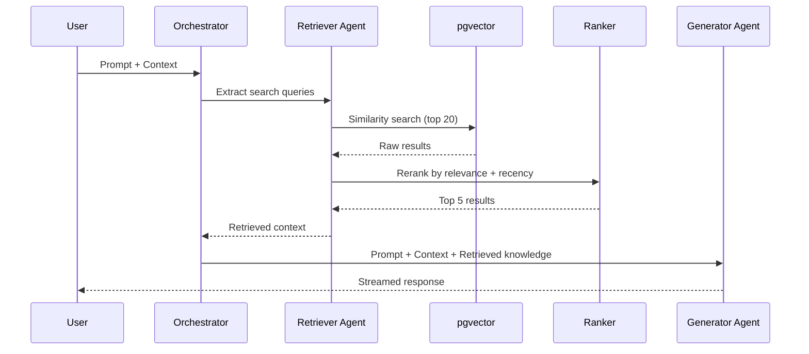
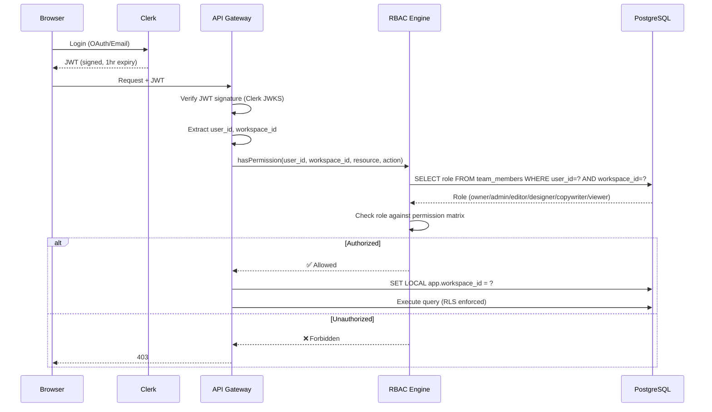
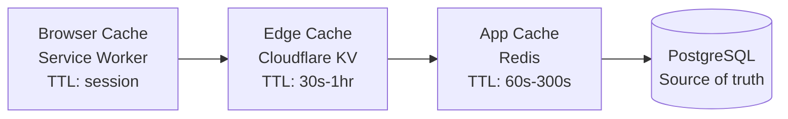

# ENGINEERING BIBLE — PART 5
## Plugin System, Security & Performance
**Document:** 4.5 of 4.7 | **Series:** AI + Engineering Bible

---

# PART 10 — RAG & KNOWLEDGE SYSTEM

## 10.1 Knowledge Base Architecture

| Knowledge Source | Content | Update Frequency | Embedding Strategy |
|:---|:---|:---|:---|
| **Design Patterns** | 500+ curated UI patterns (hero sections, pricing tables, feature grids) with best-practice annotations | Monthly | Embed pattern description + visual category tags |
| **Component Library** | Platform's built-in component docs, props, variants, usage guidelines | On code change (CI/CD hook) | Embed component name + description + props schema |
| **Brand Context** | Per-project brand guidelines, tone, industry, audience | On user edit | Embed brand summary + industry terms |
| **User Corrections** | Historical user modifications to AI output (accepted diffs) | Real-time on user action | Embed correction description + before/after diff |
| **Conversion Data** | A/B test results: which layouts/copy/CTAs convert better for which industries | Daily batch | Embed industry + section type + performance metrics |
| **Documentation** | Platform docs, Tailwind docs, Next.js docs, React docs (for code explanation agent) | Monthly | Chunk + embed documentation sections |

## 10.2 RAG Pipeline



**Evaluation:** Monthly eval on retrieval quality. Metrics: Recall@5 > 0.8, Mean Reciprocal Rank > 0.7. A/B test: generations with RAG vs. without RAG — measure user acceptance rate.

---

# PART 11 — PLUGIN SYSTEM

## 11.1 Plugin Architecture

| Component | Design |
|:---|:---|
| **Plugin SDK** | TypeScript SDK published as `@dios/plugin-sdk` on npm. Provides typed interfaces for all extension points. |
| **Extension Points** | Canvas toolbar items, Property panel sections, AI prompt preprocessors, Post-generation transforms, Custom component types, Deploy hooks, Analytics widgets |
| **Sandbox** | Plugins run in Web Worker (browser) or V8 isolate (server). No direct DOM access. Communicate via structured message passing API. |
| **Permissions** | Plugins declare required permissions in `manifest.json`: `["read:project", "write:ast", "read:tokens", "network:external"]`. Users approve on install. |
| **Lifecycle** | `onInstall` → `onActivate` → `onDeactivate` → `onUninstall`. Plugins can register event listeners for canvas events, AI events, deploy events. |

## 11.2 Plugin Manifest

```json
{
  "id": "plugin-google-analytics",
  "name": "Google Analytics Integration",
  "version": "1.0.0",
  "author": "DIOS Community",
  "description": "Add Google Analytics 4 tracking to published sites",
  "permissions": ["read:project", "write:deploy-hooks", "network:external"],
  "entry": "./dist/index.js",
  "ui": {
    "settings": "./dist/settings.html",
    "propertyPanel": "./dist/panel.html"
  },
  "hooks": {
    "onPreDeploy": "injectAnalyticsScript",
    "onSettings": "configureTrackingId"
  }
}
```

## 11.3 Security Model

| Threat | Mitigation |
|:---|:---|
| **Malicious code execution** | Web Worker sandbox. No DOM access. No `eval`. Content Security Policy restricts network to declared domains. |
| **Data exfiltration** | Network requests only to domains declared in manifest permissions. All requests logged. |
| **Supply chain** | Plugins reviewed before marketplace listing. Automated static analysis for known vulnerability patterns. Dependency scanning. |
| **Privilege escalation** | Permission model enforced at API layer. Plugin API keys scoped to declared permissions only. |

---

# PART 12 — SECURITY

## 12.1 Threat Model (STRIDE)

| Threat | Category | Risk | Mitigation |
|:---|:---|:---|:---|
| **Account takeover** | Spoofing | HIGH | MFA enforcement (enterprise). Rate-limited login. Clerk handles credential security. |
| **Cross-workspace data access** | Tampering | CRITICAL | PostgreSQL RLS. Every query filtered by workspace_id. Penetration-tested quarterly. |
| **Prompt injection via user content** | Tampering | HIGH | User content sanitized before inclusion in AI prompts. System/user prompt separation. Output validation against AST schema. |
| **XSS in generated code** | Elevation | HIGH | Generated code passes through ESLint security rules + DOMPurify. No `dangerouslySetInnerHTML`. CSP headers on all served pages. |
| **API key leakage** | Information Disclosure | MEDIUM | Keys hashed (bcrypt) in DB. Displayed only once on creation. Scoped permissions. Rotation via API. |
| **DDoS on AI endpoints** | Denial of Service | HIGH | Cloudflare WAF. Rate limiting (Redis). Per-user concurrency limits. AI queue with backpressure. |
| **Data breach** | Information Disclosure | CRITICAL | AES-256 encryption at rest (PostgreSQL TDE). TLS 1.3 in transit. Secrets in Vault. SOC2 controls. |
| **Malicious AI output** | Elevation | MEDIUM | Security Agent scans all generated code. No arbitrary script execution. Sandbox rendering. |

## 12.2 Authentication & Authorization Flow



## 12.3 AI Safety

| Attack Vector | Defense |
|:---|:---|
| **Prompt injection** | System prompt immutable. User input wrapped in XML delimiters `<user_input>`. Output validated against JSON schema. |
| **Jailbreak attempts** | Classifier model (Haiku) pre-screens prompts for policy violations. Flagged prompts logged + blocked. |
| **Copyright content generation** | Terms of service: user responsible for content. AI instructed to generate original content only. |
| **Harmful content generation** | Content safety filter on AI output. Blocked categories: violence, illegal activity, harassment. |
| **Data leakage between workspaces** | AI context assembly NEVER includes cross-workspace data. Each generation job scoped to single workspace_id. |

---

# PART 13 — PERFORMANCE ENGINEERING

## 13.1 Caching Architecture



| Cache Layer | Technology | Strategy | Invalidation |
|:---|:---|:---|:---|
| **Browser** | Service Worker + Cache API | App shell cached on install. API responses cached with stale-while-revalidate. | `sw.skipWaiting()` on new deployment. API cache invalidated on mutation. |
| **Edge** | Cloudflare KV | Published site bundles cached at edge. API responses cached for read-heavy endpoints. | Purge on deployment. TTL-based for API. |
| **Application** | Redis | Project data, design tokens, user sessions, rate limit counters. | Event-driven invalidation. Publish event on NATS → subscriber purges relevant Redis keys. |
| **Database** | PostgreSQL (materialized views) | Analytics aggregations, marketplace rankings. | Refreshed on schedule (hourly for analytics, daily for rankings). |

## 13.2 Latency Budgets

| Operation | P50 Target | P95 Target | P99 Target | Strategy |
|:---|:---|:---|:---|:---|
| **Dashboard load** | 200ms | 500ms | 1s | SSR + edge cache + streaming |
| **Canvas open** | 800ms | 1.5s | 3s | WASM loaded from cache. WebContainer hydrates in background. |
| **Element select** | 5ms | 10ms | 20ms | Local Zustand state. No server round-trip. |
| **Property edit** | 16ms | 30ms | 50ms | WASM AST update in Web Worker → main thread render. |
| **AI edit (Cmd+K)** | 500ms (first token) | 1s | 2s | SSE streaming. First token from Haiku router, then Sonnet streams code. |
| **Full site generation** | 15s | 30s | 60s | Multi-agent pipeline with streaming progress. |
| **Deploy to staging** | 2s | 5s | 10s | Pre-built bundle upload to R2. Cloudflare Worker route update. |
| **API CRUD** | 50ms | 150ms | 300ms | Redis cache + indexed PostgreSQL queries. |

## 13.3 Autoscaling Strategy

| Component | Min | Max | Scale Trigger | Scale Down |
|:---|:---|:---|:---|:---|
| **API servers** | 2 | 20 | CPU > 70% for 2 min | CPU < 30% for 5 min |
| **AI workers** | 2 | 50 | Queue depth > 10 | Queue empty for 5 min |
| **Build workers** | 1 | 10 | Queue depth > 5 | Queue empty for 10 min |
| **WebSocket (Durable Objects)** | Auto | Auto | Per-room auto-allocation by Cloudflare | Hibernate after 30s inactivity |
| **PostgreSQL read replicas** | 1 | 4 | Read query latency > 100ms P95 | Latency < 50ms for 30 min |

---

*— End of Part 5 (Engineering Bible) —*
