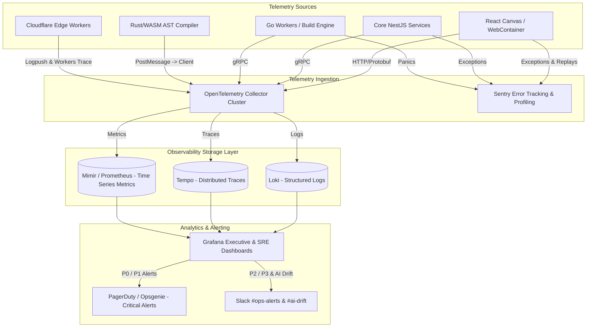
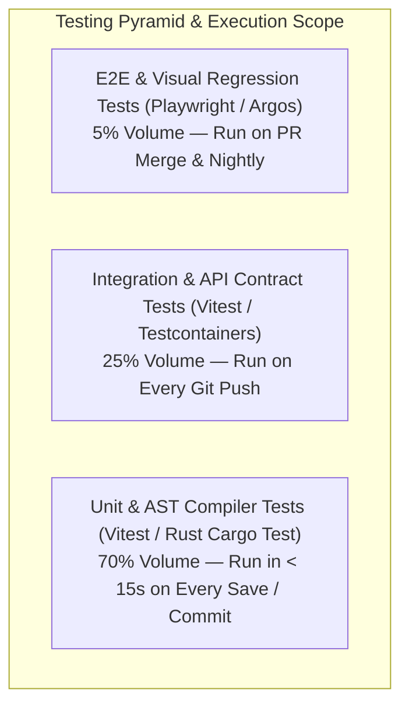
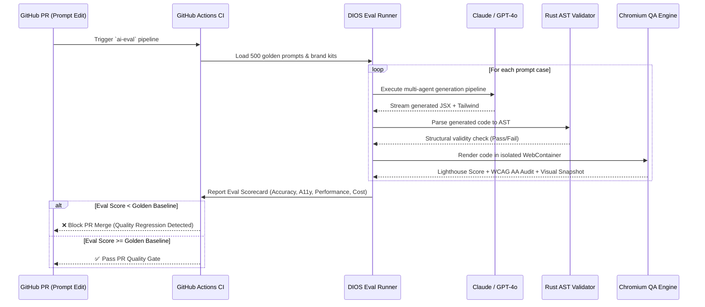
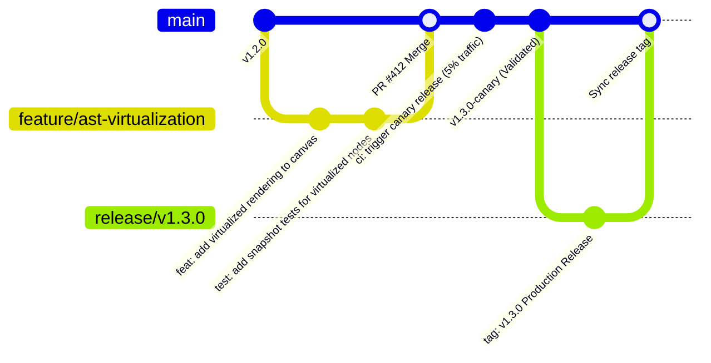

# ENGINEERING BIBLE — PART 6
## Observability, Testing, CI/CD & Cloud Deployment Architecture
**Document:** 4.6 of 4.7 | **Series:** AI + Engineering Bible

---

# PART 14 — OBSERVABILITY & MONITORING

## 14.1 Observability Stack & Telemetry Flow

We utilize the **OpenTelemetry (OTel)** open standard across all microservices, edge workers, and client runtimes to eliminate vendor lock-in. All telemetry is ingested into a unified **Grafana LGTM Stack** (Loki for logs, Grafana for visualization, Tempo for traces, Mimir/Prometheus for metrics).



## 14.2 Structured Logging & Correlation

Every log line emitted across the platform MUST be structured JSON and injected with a `trace_id` and `span_id` by the OTel SDK to ensure 100% trace-to-log correlation.

```json
{
  "timestamp": "2026-07-13T21:30:15.412Z",
  "level": "INFO",
  "service": "project-service",
  "trace_id": "4bf92f3577b34da6a3ce929d0e0e4736",
  "span_id": "00f067aa0ba902b7",
  "workspace_id": "ws_8f9a2b1c3d",
  "user_id": "usr_99a8b7c6",
  "action": "ast.update_element",
  "element_id": "node_btn_cta_home",
  "duration_ms": 4.2,
  "status": "success",
  "message": "AST node updated and committed to Zstd-compressed JSONB column"
}
```

## 14.3 Key SLIs and SLOs (Service Level Objectives)

| Service Domain | Service Level Indicator (SLI) | Target SLO (P95 / P99) | Evaluation Window | Action on Burn Rate Breach |
|:---|:---|:---|:---|:---|
| **API Gateway** | `% of HTTP requests returned without 5xx errors` | **99.95%** availability | 30-day rolling window | PagerDuty trigger; auto-scale read replicas |
| **WASM AST Engine** | `Time to complete parse -> transform -> serialize cycle` | **< 8ms (P95) / < 15ms (P99)** | 7-day rolling window | Rollback WASM binary release; freeze AST schema |
| **Realtime Collab** | `WebSocket event broadcast propagation latency across Yjs peers` | **< 45ms (P95) / < 100ms (P99)** | 24-hour window | Re-balance Cloudflare Durable Objects |
| **AI First-Token** | `Time from prompt submit to first SSE token delivered to browser` | **< 450ms (P95) / < 800ms (P99)** | 7-day rolling window | Switch routing priority from Claude Sonnet to Haiku |
| **Edge Deployment** | `Time from "Publish" click to live global CDN availability` | **< 3.8s (P95) / < 6.0s (P99)** | 30-day rolling window | Allocate additional Go worker containers |

## 14.4 Specialized AI & Multi-Agent Observability

Because LLM pipelines are non-deterministic, standard CPU/memory metrics are insufficient. We track specialized AI health metrics using custom OpenTelemetry spans wrapped around every agent invocation:

1. **Token Consumption Rate & Cost Attribution:** Real-time metrics on `ai_input_tokens_total`, `ai_output_tokens_total`, and `ai_cost_cents_total` tagged by `workspace_id`, `agent_name`, and `model_provider`.
2. **Context Window Saturation Gauge:** Tracks `context_tokens_used / max_context_window`. If saturation > 85%, the `Orchestrator` automatically triggers context summarization via the `Memory Agent`.
3. **Agent Loop Exhaustion Counter:** Measures `agent_retry_attempts`. If an agent (e.g., `Reviewer Agent` rejecting `Frontend Engineer Agent` code) hits 3 loops, an alert fires to `#ai-drift` and the system gracefully degrades to a human-review state.
4. **Prompt & Tool Execution Tracing:** Every agent call records exact tool inputs (`compileTokensToTailwind`, `validateJSX`), latency per tool, and raw LLM response payload inside Tempo trace attributes for post-mortem replay.

---

# PART 15 — COMPREHENSIVE TESTING & QUALITY ENGINEERING

## 15.1 Testing Pyramid & Strategy Matrix



| Test Tier | Tooling & Framework | Scope of Testing | Execution Trigger | Pass Criteria |
|:---|:---|:---|:---|:---|
| **Rust AST Unit Tests** | `cargo test` + `insta` (snapshot testing) | SWC AST parsing, token serialization, round-trip fidelity (`code -> AST -> code == code`) | Pre-commit hook & CI pipeline | 100% pass; 0 memory leaks (tested via `valgrind`/`miri`) |
| **Frontend/Canvas Unit** | `Vitest` + `React Testing Library` | Canvas UI components, property sliders, Zustand store state transitions | Every local save (`npm test --watch`) & CI | Code coverage > 85% on `canvas/` engine |
| **API Contract & Integration** | `Vitest` + `Testcontainers` (PostgreSQL + Redis) | tRPC endpoints, database transactions, RLS enforcement, NATS event dispatch | Every branch push to GitHub | Zero RLS leaks; schema validation passes against Zod |
| **E2E Browser Workflows** | `Playwright` + `MSW` (Mock Service Worker) | Golden Path: Signup -> Prompt -> Canvas Edit -> Publish -> Staging verification | Pull Request creation & merge | Zero flaky tests; all viewports (Desktop/Tablet/Mobile) pass |
| **Visual Regression** | `Playwright` + `Argos CI` | Pixel-perfect canvas snapshot comparison across component library & 6 brand presets | Pull Request targeting `main` | Zero unintended visual drift (< 0.01% pixel diff threshold) |
| **Chaos & Resilience** | `LitmusChaos` inside Kubernetes | Random pod termination, Redis cluster failover, 500ms network latency injection | Weekly scheduled run on Staging cluster | Zero data loss; automatic failover within < 3s |

## 15.2 AI & Prompt Evaluation Harness (Continuous Eval)

To prevent LLM model updates or prompt tweaks from regressing code output quality, we maintain a **Continuous AI Evaluation Harness** (`dios-eval`) powered by 500+ golden test cases stored in `/tests/ai-golden-suite/`.



**Evaluation Grading Criteria:**
1. **Compilation Rate:** % of generated JSX files that parse without syntax errors in the Rust AST compiler (Target: > 99.2%).
2. **Design Token Obedience:** % of CSS/Tailwind properties that strictly map to the provided `tokens.json` (Target: 100% — any hardcoded hex code fails the eval).
3. **Automated WCAG 2.1 AA Pass Rate:** % of generated components passing axe-core accessibility checks (Target: > 96%).

---

# PART 16 — CI/CD, GIT FLOW & RELEASE ENGINEERING

## 16.1 Branching Strategy & Release Flow

We use a modified **Trunk-Based Development** model with short-lived feature branches, strict branch protection, and automated semantic versioning.



## 16.2 CI/CD Pipeline Stages (GitHub Actions + ArgoCD)

1. **Pre-Flight Lint & Type Check (Parallel - 45s):** Runs `eslint`, `prettier`, `tsc --noEmit`, and `cargo clippy`.
2. **Unit & Contract Testing (Parallel - 90s):** Executes Vitest unit tests and Rust WASM compiler tests across 16 CPU runners.
3. **Container Build & SBOM Generation (120s):** Builds multi-arch Docker images (`amd64`/`arm64`) using Docker Buildx, scans for CVE vulnerabilities via `Trivy`, and attaches an SLSA Level 3 Software Bill of Materials (SBOM).
4. **Preview Environment Provisioning (60s):** For every PR, ArgoCD spins up an isolated ephemeral environment (`pr-412.staging.dios.internal`) with isolated PostgreSQL database seeding and full WebContainer runtime access.
5. **Progressive Canary Production Deployment:** When merged to `main`, Argo Rollouts deploys to production Kubernetes clusters:
   - **Phase 1 (Canary 5%):** Traffic split to new pods for 15 minutes. Automatically monitored for 5xx errors or latency spikes via Prometheus metrics.
   - **Phase 2 (Canary 25%):** Held for 30 minutes while AI evaluation metrics settle.
   - **Phase 3 (100% Promotion):** Full cutover. Old pods terminated after 10-minute graceful connection drain.

## 16.3 Feature Flags & Instant Rollback Engine

All user-facing capabilities and AI prompt changes are wrapped in **LaunchDarkly / Unleash** feature flags evaluated at edge/server runtime:

```typescript
// Example: Safe feature rollout for new multi-agent layout engine
const useNewLayoutAgent = await featureFlags.isEnabled('ai-layout-agent-v2', {
  workspaceId: ctx.workspace.id,
  plan: ctx.workspace.plan,
});

if (useNewLayoutAgent) {
  return await runAgentPipelineV2(prompt, ast);
} else {
  return await runAgentPipelineV1(prompt, ast);
}
```

If a critical production bug occurs that cannot be mitigated by turning off a feature flag, the deployment engine executes a **3-second instant rollback** by repointing the Cloudflare Worker routing table directly to the previous immutable container image tag (`v1.2.9`).

---

# PART 17 — CLOUD DEPLOYMENT & KUBERNETES INFRASTRUCTURE

## 17.1 Global Cloud & Edge Topology

The DIOS platform is deployed across a hybrid **Edge + Multi-Region Cloud** topology designed for maximum resilience, low latency, and strict data sovereignty compliance.

```mermaid
graph TB
    subgraph Global Edge ["Cloudflare Anycast Global Edge Network (300+ PoPs)"]
        WAF[WAF + DDoS Protection + SSL Termination]
        Workers[Edge Workers - Routing & SSR Caching]
        KVStore[(Cloudflare KV - Published HTML & Tokens)]
        DO_Collab[Durable Objects - Realtime Yjs WebSocket Rooms]
    end

    subgraph AWS_US ["Core Cloud Region: AWS us-east-1 (N. Virginia)"]
        subgraph K8s_US ["EKS Kubernetes Cluster (us-east-1)"]
            APIGW_US[API Gateway / tRPC Pods]
            Core_US[Core Microservice Pods]
            GoWorkers_US[Go Build & Git Sync Worker Pods]
        end
        PG_US[(PostgreSQL 16 Primary + pgvector)]
        Redis_US[(Redis Cluster Primary)]
    end

    subgraph AWS_EU ["Disaster Recovery & EU Data Region: AWS eu-west-1 (Ireland)"]
        subgraph K8s_EU ["EKS Kubernetes Cluster (eu-west-1)"]
            APIGW_EU[API Gateway / tRPC Pods (EU Data Bound)]
            Core_EU[Core Microservice Pods (EU)]
        end
        PG_EU[(PostgreSQL Read Replica + EU GDPR Schema)]
        Redis_EU[(Redis Cluster Replica)]
    end

    Users_Global[Global Users & Visitors] --> WAF
    WAF --> Workers
    Workers <--> KVStore
    Workers <--> DO_Collab

    Workers -->|API & Write Requests| APIGW_US
    Workers -->|EU GDPR Workspace Requests| APIGW_EU

    APIGW_US --> Core_US
    Core_US <--> PG_US
    Core_US <--> Redis_US
    Core_US --> GoWorkers_US

    APIGW_EU --> Core_EU
    Core_EU <--> PG_EU
    Core_EU <--> Redis_EU

    PG_US -->|Streaming WAL Replication (< 50ms)| PG_EU
```

## 17.2 Kubernetes (EKS) Cluster Architecture & Autoscaling

We run managed **AWS EKS (Kubernetes 1.30+)** clusters using **Karpenter** for high-performance, cost-optimized node provisioning across Graviton3 (`arm64`) and x86 compute instances.

| Pod Workload Type | Instance Family | Target CPU / Memory Request | Horizontal Pod Autoscaler (HPA) Rules | Pod Disruption Budget (PDB) |
|:---|:---|:---|:---|:---|
| **API / tRPC Services** | `c7g.xlarge` (Graviton3 4 vCPU / 8GB) | 500m CPU / 1GB Memory | Min: 4, Max: 64. Scale UP if CPU > 65% OR Concurrent requests > 250/pod | `minAvailable: 75%` |
| **Go Build / Git Workers** | `c6i.2xlarge` (x86 8 vCPU / 16GB) | 2000m CPU / 4GB Memory | Min: 2, Max: 30. Scale UP based on NATS queue depth (`deploy.build` > 5) | `minAvailable: 50%` |
| **WASM / AST Compilers** | `c7g.2xlarge` (Graviton3 8 vCPU / 16GB)| 1000m CPU / 2GB Memory | Min: 2, Max: 20. Scale UP if AST parse latency P95 > 10ms | `minAvailable: 66%` |
| **AI Orchestrator Engine**| `m7g.xlarge` (Graviton3 4 vCPU / 16GB) | 1000m CPU / 2GB Memory | Min: 2, Max: 40. Scale UP if `ai.generation` queue depth > 8 | `minAvailable: 66%` |

## 17.3 Disaster Recovery, Backups & Business Continuity

To guarantee **99.99% infrastructure uptime** and zero data loss for enterprise customers, we enforce strict RPO and RTO parameters:

- **Recovery Point Objective (RPO): < 1 Second.** PostgreSQL primary uses continuous Write-Ahead Log (WAL) streaming replication to the secondary AWS region (`eu-west-1`) and Amazon S3. In the event of total AWS `us-east-1` region failure, data loss is limited to in-flight transactions within the last 1,000 milliseconds.
- **Recovery Time Objective (RTO): < 3 Minutes.** If `us-east-1` goes dark, Cloudflare Health Checks automatically detect the outage within 15 seconds and re-route 100% of global API and web traffic to the hot-standby EKS cluster in `eu-west-1`. Amazon Aurora / RDS promotes the read replica to Primary within 60 seconds.
- **Continuous Backup Testing:** Every Sunday at 02:00 UTC, an automated cron job spins up an isolated sandbox environment from the latest S3 WAL backup, runs automated schema verification and AST integrity tests against 100 random workspaces, and alerts SREs if verification fails.

---

*— End of Part 6 (Engineering Bible) —*
*Continue to Part 7: Engineering Roadmap & Master Index*
