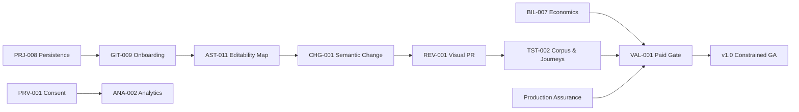
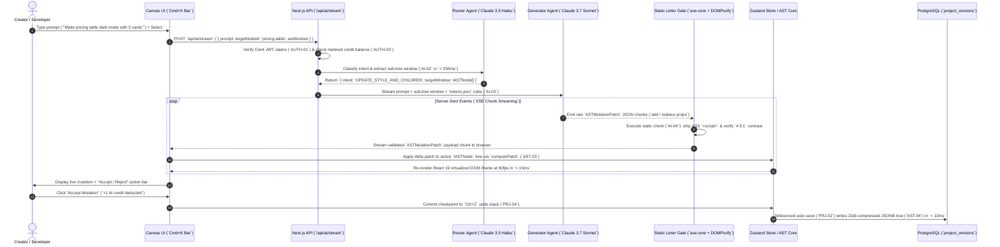

# CANONICAL MASTER DEPENDENCY GRAPH
## Directed Acyclic Graph (`DAG`), Prerequisite Matrix & AI/Git Sequence Workflows
**Document Series:** Master Execution Plan (MEP) — File 3 of 8 | **Status:** Approved DAG Blueprint | **Circular Dependencies:** Zero (0)

---

# ARCHITECTURAL DEPENDENCY PHILOSOPHY (`STRICT DAG ENFORCEMENT`)

In a multi-pod engineering monorepo containing 16 distinct modules and 112 canonical features, circular dependencies and race conditions represent fatal architectural risks. To ensure deterministic execution velocity across Sprints 0 through 12, our platform enforces a strict **Directed Acyclic Graph (`DAG`)**. 

Higher-order capabilities (`AI Generation`, `GitHub Monorepo Sync`, `Creator Marketplace`, `Multiplayer Collaboration`) are strictly downstream of lower-order foundation modules (`Authentication`, `Tenant Workspaces`, `Project Metadata`, `AST Core Engine`, and `Design Tokens`). No feature in a higher tier can ever be initiated until its direct upstream prerequisite features have achieved verifiable definition of done.

```mermaid
graph TD
    subgraph Tier1 [Tier 1: Foundation & Tenancy]
        AUTH["Module 1: Authentication (`@dios/auth`)"]
        WS["Module 2: Workspace (`@dios/workspace`)"]
    end

    subgraph Tier2 [Tier 2: Core Engine & Design Law]
        PRJ["Module 3: Projects (`@dios/project`)"]
        AST["Module 5: AST Engine (`@dios/ast-core`)"]
        TKN["Module 8: Design Tokens (`@dios/tokens`)"]
        CMP["Module 7: Components (`@dios/components`)"]
    end

    subgraph Tier3 [Tier 3: Canvas & Rendering Engine]
        CNV["Module 4: Canvas (`@dios/canvas`)"]
    end

    subgraph Tier4 [Tier 4: Intelligence & Publishing (`v0.5 Alpha Gate`)]
        AI["Module 6: AI Orchestration (`@dios/ai`)"]
        DEP["Module 9: Deployment (`@dios/deploy`)"]
        BIL["Module 12: Billing (`@dios/billing`)"]
        ANA["Module 13: Analytics (`@dios/analytics`)"]
    end

    subgraph Tier5 [Tier 5: Git Monorepo & Growth (`v1.0 Public Gate`)]
        GIT["Module 10: Git Sync (`@dios/git`)"]
        ENT["Module 14: Enterprise (`@dios/enterprise`)"]
    end

    subgraph Tier6 [Tier 6: Ecosystem & Platform (`v2.0 / SDK`)]
        MKT["Module 11: Marketplace (`@dios/marketplace`)"]
        PLG["Module 15: Plugins (`@dios/plugins`)"]
        SDK["Module 16: Developer SDK (`@dios/sdk`)"]
    end

    AUTH --> WS
    WS --> PRJ
    PRJ --> AST
    AST --> TKN
    TKN --> CMP
    AST --> CNV
    TKN --> CNV
    CMP --> CNV
    CNV --> AI
    AST --> DEP
    TKN --> DEP
    WS --> BIL
    AUTH --> ANA
    AST --> GIT
    TKN --> GIT
    WS --> ENT
    BIL --> MKT
    AST --> PLG
    AUTH --> SDK

    style AST fill:#10B981,color:#fff,stroke:#065F46,stroke-width:2px
    style CNV fill:#10B981,color:#fff,stroke:#065F46,stroke-width:2px
    style AI fill:#3B82F6,color:#fff,stroke:#1D4ED8,stroke-width:2px
    style GIT fill:#8B5CF6,color:#fff,stroke:#5B21B6,stroke-width:2px
```

---

# PREREQUISITE UNBLOCKING MATRIX

The following table establishes the exact upstream unblocking prerequisite chain across our core operational features:

| Target Feature ID | Target Feature Name & Module | Upstream Prerequisite Feature IDs | Architectural Justification & Blocker Rationale |
|:---|:---|:---|:---|
| **`WS-01`** | Workspace Root (`@dios/workspace`) | `AUTH-01` (`Clerk JWKS Router`) | You cannot instantiate tenant workspace boundaries or check RLS policies without verified user `sub` JWT claims. |
| **`WS-02`** | Member Invites (`@dios/workspace`) | `WS-01`, `AUTH-02` (`RBAC Engine`) | Invitation tokens must bind to an active workspace ID and verify that the inviting actor possesses `Admin` or `Owner` roles. |
| **`PRJ-01`** | Project Metadata (`@dios/project`) | `WS-01` (`Workspace Root`) | Projects are strictly child entities of workspaces (`workspace_id` foreign key). |
| **`AST-01`** | `IASTNode` Schema (`@dios/ast-core`)| None *(Core Schema Root)* | Absolute structural baseline (`Zod law`) required before any compiler, canvas, or AI model can process tree nodes. |
| **`AST-02`** | SWC TSX Parser (`@dios/ast-core`) | `AST-01` (`IASTNode Schema`) | The visitor parser must target and output validated `IASTNode` JSON structures. |
| **`AST-03`** | Sub-Tree Diff Engine (`@dios/ast-core`)| `AST-02` (`SWC TSX Parser`) | Structural diffing requires two parsed `IASTNode` trees to compute `add / remove / replace` delta mutations. |
| **`AST-04`** | Zstd Compressed DB Store (`@dios/ast-core`)| `AST-01`, `PRJ-01` (`Project Metadata`) | Database storage requires `project_versions` row pointers and valid JSONB AST schemas before compression. |
| **`TKN-01`** | W3C Token Schema (`@dios/tokens`) | None *(Core Schema Root)* | Absolute design law baseline required before component specs or CSS compilers can execute. |
| **`TKN-02`** | Tailwind v4 Compiler (`@dios/tokens`)| `TKN-01` (`W3C Token Schema`) | Real-time CSS compiler consumes `tokens.json` keys to emit `--color-*` variables. |
| **`CMP-01`** | 11 Core Component Specs (`@dios/components`)| `AST-01`, `TKN-01` (`W3C Token Schema`)| Built-in component specifications must conform to `IASTNode` syntax and reference `tokens.json` keys exclusively. |
| **`CNV-01`** | React 19 60fps Canvas (`@dios/canvas`)| `AST-01`, `TKN-02` (`Tailwind Compiler`)| Canvas iframe requires valid virtualized DOM nodes and compiled CSS stylesheets to render UI without unstyled flashes. |
| **`CNV-02`** | Property Inspector Panel (`@dios/canvas`)| `CNV-01`, `AST-03` (`Sub-Tree Diff Engine`)| Selecting an element on canvas populates inspector; editing inputs emits delta patches directly to the AST diffing engine. |
| **`AI-01`** | `Cmd+K` Studio Bar (`@dios/ai`) | `CNV-01` (`React 19 Canvas`) | The natural language prompt bar docks inside the canvas viewport and captures selected element node targeting IDs (`#hero-heading`). |
| **`AI-02`** | Haiku Intent Router (`@dios/ai`) | `AST-05` (`Sub-Tree Pruner`) | Intent classification requires pruned sub-tree windows (`extractSubTree`) to determine target node context accurately. |
| **`AI-03`** | Sonnet Generator (`@dios/ai`) | `AI-02`, `TKN-01` (`W3C Token Schema`) | Prompt generator receives Haiku routing context and must strictly output token-compliant `ASTMutationPatch` payloads. |
| **`AI-04`** | Static Quality Gate (`@dios/ai`) | `AST-03` (`Sub-Tree Diff Engine`) | Static linters (`axe-core / DOMPurify`) intercept `ASTMutationPatch` payloads before they are applied to active project state. |
| **`DEP-01`** | Static `/out` Compiler (`@dios/deploy`)| `AST-02`, `TKN-02` (`Tailwind Compiler`)| Static publishing requires serializing AST to clean TSX (`serializeAST`) and bundling compiled Tailwind CSS chunks. |
| **`DEP-02`** | R2 + Edge KV Publisher (`@dios/deploy`)| `DEP-01` (`Static /out Compiler`) | Cloudflare R2 uploader requires compiled static HTML/JS bundles before executing PUT requests and updating Edge KV. |
| **`GIT-001`** | GitHub App Linker (`@moolox/git`) | `AUTH-007` (`GitHub Credential Authorization Bridge`)| Linking workspace projects to GitHub repositories requires authenticated, least-privilege GitHub App installation credentials. |
| **`GIT-02`** | Clean Next.js Exporter (`@dios/git`) | `AST-02`, `TKN-02` (`Tailwind Compiler`)| Generating buildable Next.js 15 repository files requires clean AST code serialization and CSS file extraction. |
| **`GIT-04`** | Incoming Webhook Puller (`@dios/git`)| `GIT-01`, `AST-02` (`SWC TSX Parser`) | Webhooks receiving push events must parse raw TSX files via SWC visitor before updating active canvas sessions. |
| **`MKT-03`** | Stripe Connect 80/20 (`@dios/marketplace`)| `MKT-02`, `BIL-01` (`Stripe Webhook`) | Split payouts require active Stripe Connect Express onboarding checkouts and verified subscription webhooks. |
| **`PLG-02`** | Web Worker Sandbox (`@dios/plugins`) | `PLG-01` (`Plugin Hook Abstraction`) | Sandboxed third-party workers require defined host interceptor hooks (`IPluginHost`) before dispatching RPC actions. |
| **`COL-01`** | `IASTCollaborative` CRDT (`@dios/ast-core`)| `AST-01` (`IASTNode Schema`) | Conflict-free replicated data structures (`Yjs`) wrap base `IASTNode` JSON properties into durable `Y.Map` trees. |
| **`ENT-03`** | GDPR eu-west-1 Shards (`@dios/enterprise`)| `DEP-02`, `ENT-01` (`Enterprise Schema`) | Data residency enforcement requires enterprise org context and region-aware edge Anycast storage routing. |
| **`SDK-01`** | Headless REST APIs (`@dios/sdk`) | `AUTH-06`, `PRJ-01` (`Project Metadata`) | Public API requests must verify `Authorization: Bearer` API tokens against workspace permissions before accessing project state. |
| **`GIT-007`** | Webhook Delivery Ledger (`@moolox/git`) | `GIT-001`, `GIT-003`, `GIT-004`, `INF-002`, `WS-005` | Reliable replay requires authenticated installations, durable jobs, completed inbound/outbound sync, and append-only audit events. |
| **`GIT-008`** | Drift Reconciliation (`@moolox/git`) | `GIT-004`, `GIT-005`, `GIT-007` | Safe remote-state convergence requires inbound synchronization, structural merge behavior, and an idempotent delivery history. |
| **`MIG-001`** | Database Migration Discipline (`@moolox/db`) | `DB-001`, `DB-002` | Restore, data lifecycle, and future schema activation require deterministic versioned migrations and drift detection. |
| **`BKP-001`** | PITR Backup & Restore (`@moolox/db`) | `DB-001`, `MIG-001`, `ANA-001` | Recovery verification requires the database baseline, reproducible migrations, and observable restore jobs. |
| **`SEC-001`** | Application Edge Security (`@moolox/auth`, `apps/web`) | `AUTH-001`, `AUTH-002`, `INF-001` | Browser, origin, tenant-authorization, and rate controls build on authenticated request context and shared rate-limit infrastructure. |
| **`SEC-002`** | Credential & Key Lifecycle (`@moolox/auth`, `@moolox/git`) | `AUTH-007`, `GIT-001`, `ANA-001` | Rotation and revocation require the GitHub credential boundary, installation lifecycle, and auditable access. |
| **`TST-001`** | Production Assurance CI | `MIG-001`, `SEC-001`, `GIT-007` | Merge protection must exercise migrations, security controls, and webhook replay behavior. |
| **`OPS-001`** | SLOs, Alerting & Incident Response | `ANA-001`, `INF-002`, `DEP-002`, `BKP-001`, `GIT-007` | Operational response requires telemetry, durable jobs, publishing signals, recovery status, and Git delivery status. |
| **`A11Y-001`** | Platform WCAG 2.2 AA | `CNV-001..004`, `TST-001` | Product-interface conformance requires completed core canvas interactions and enforced regression testing. |
| **`DLC-001`** | Retention & Deletion | `AUTH-002`, `DB-001`, `WS-005`, `BKP-001` | Verified erasure requires authorization, the data baseline, backup tombstones, and immutable audit receipts. |
| **`DLC-002`** | Portability & DSAR Export | `DLC-001`, `PRJ-001`, `WS-005` | Complete tenant export depends on lifecycle rules, project data ownership, and audited authorization. |
| **`API-001`** | API Compatibility Contract | `CORE-002`, `AUTH-006`, `SDK-001` | A public compatibility contract depends on the internal router, scoped credentials, and public API surface. |
| **`SEC-003`** | Supply-Chain Integrity & Provenance | `TST-001`, `GIT-006` | Signed, scanned releases require the production CI gate and customer-facing GitHub action packaging pipeline. |
| **`PRJ-008`** | Production Save Transaction | `PRJ-001..004`, `CORE-002`, `AUTH-002`, `DB-001` | A trustworthy repository workflow requires durable, atomic, tenant-safe persistence rather than an injectable client-only save contract. |
| **`GIT-009`** | Brownfield Repository Compatibility Report | `AUTH-007`, `GIT-001..004`, `AST-002`, `TKN-001` | Existing-repository editing cannot start until the linked codebase is analyzed without mutation and its supported envelope is known. |
| **`AST-011`** | Editability & Confidence Map | `GIT-009`, `AST-002..003`, `AIS-003`, `CNV-001..004` | Safe AI/canvas mutation requires explicit enforceable boundaries derived from compatibility analysis. |
| **`CHG-001`** | Semantic Change Object | `AST-003`, `AST-011`, `GIT-002..004`, `PRJ-008`, `WS-005` | Minimal reviewable changes require persisted state, enforced scope, source export/sync, and audit evidence. |
| **`REV-001`** | Visual Pull-Request Review | `CHG-001`, `GIT-003..005`, `CNV-003`, `DEP-002..003` | A review object depends on a semantic change, safe structural merge, responsive rendering, preview, and rollback. |
| **`PRV-001`** | Consent & AI-Memory Controls | `AUTH-002`, `ANA-001`, `WS-005` | Analytics and learning require tenant authority, auditable consent, and redacted telemetry. `PRV-001` blocks `ANA-002` activation. |
| **`BIL-007`** | Billing Lifecycle & Economics | `BIL-001..003`, `AUTH-003`, `ANA-001` | Paid GA requires one canonical model, signed lifecycle events, idempotent entitlements, and measured AI economics. |
| **`TST-002`** | Round-Trip Corpus & Golden Journeys | `TST-001`, `GIT-009`, `AST-011`, `CHG-001`, `REV-001`, `PRJ-008` | GA proof requires production CI plus the complete repository/change/review/persistence chain. |
| **`VAL-001`** | Paid Design-Partner Gate | `GIT-009`, `REV-001`, `BIL-007`, `TST-002` | Public release requires demonstrated real-repository value, trust, and willingness to pay. |

## Final pre-GA critical path



---

# ATOMIC AI GENERATION LOOP SEQUENCE (`SSE STREAMING FLOW`)

When a user submits a natural language prompt inside the floating `Cmd+K` Studio bar (`AI-01`), our platform executes a deterministic **3-Agent Loop** designed to guarantee P95 generation latency `< 3.0 seconds` and zero token hallucination.



---

# BIDIRECTIONAL GITHUB MONOREPO SYNCHRONIZATION SEQUENCE (`CODE IS TRUTH`)

To ensure **Code is Truth** without vendor lock-in (`v1.0 Public Gate`), our platform synchronizes visual canvas mutations and local VS Code developer commits seamlessly via our bidirectional `@dios/git` engine.

```mermaid
sequenceDiagram
    autonumber
    actor Dev as Developer (VS Code)
    participant Git as GitHub Repository (`main` branch)
    participant Webhook as DIOS Webhook (`/api/webhooks/github`)
    participant SWC as SWC Visitor Parser (`AST-02`)
    participant Lock as Node ID Lock Resolver (`AST-06`)
    participant Canvas as Designer Canvas Session (`apps/web`)
    participant Inngest as Inngest Background Worker (`pushCommitJob`)

    Note over Dev,Canvas: PHASE 1: Developer Push from Terminal -> Canvas Auto-Update (`< 3s`)
    Dev->>Git: `git commit -am "feat: update hero heading copy"` && `git push origin main`
    Git->>Webhook: POST `/api/webhooks/github` (`push event payload with file diff list`)
    Webhook->>Webhook: Verify GitHub HMAC SHA-256 signature (`GIT-01`)
    Webhook->>SWC: Fetch modified `/src/app/page.tsx` code & execute `parseJSX(code)` (`AST-02`)
    SWC-->>Lock: Emit mutated `IASTNode` sub-tree (`ASTNodeId: 'hero-heading-1'`)
    Lock->>Lock: Verify exact node lock timestamp (`AST-06 Last-write-wins at node level`)
    Lock->>Canvas: Push WebSocket CRDT sync update (`COL-02`) directly to active browser sessions
    Canvas-->>Canvas: Re-render virtualized DOM iframe; visual heading text updates live without reload!

    Note over Dev,Canvas: PHASE 2: Designer Canvas Edit -> Automated GitHub Pull Request (`< 4s`)
    Canvas->>Canvas: Designer edits button color inside Property Inspector panel (`p-4 bg-accent`)
    Canvas->>Lock: Save delta mutation to `project_versions.ast_tree` (`PRJ-02`)
    Lock->>Inngest: Dispatch async background event (`dios/git.push-commit`) (`GIT-03`)
    Inngest->>Inngest: Run `serializeAST(tree)` -> generates clean Next.js 15 TSX code (`GIT-02`)
    Inngest->>Git: Push atomic commit (`feat(dios): update button token [skip ci]`) via GitHub API
    Git-->>Dev: VS Code git pull syncs designer's token changes directly into local workspace!
```

---

*— End of File 3 (Canonical Master Dependency Graph — Directed Acyclic Graph, Prerequisite Matrix & Sequence Workflows) —*
