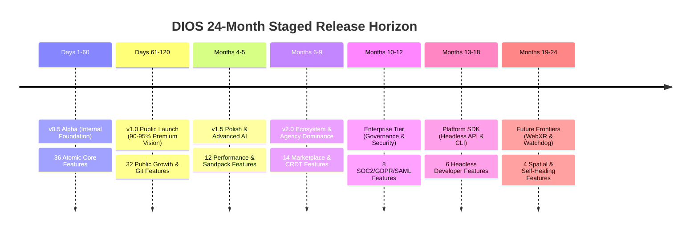

# CANONICAL MASTER RELEASE PLAN
## Staged Versioning Roadmap Across 7 Canonical Releases (`v0.5 -> Future`)
**Document Series:** Master Execution Plan (MEP) — File 6 of 8 | **Status:** Approved Release Schedule | **Deletions:** Zero (0)

---

# STAGED VERSIONING PHILOSOPHY (`PRESERVE VISION, STAGE DELIVERY`)

Every feature cataloged across our seven venture bibles must belong to exactly one of our seven sequential release buckets. Under our realigned engineering mandate, no capability is ever thrown away or deleted from the product vision. Instead, features whose implementation complexity threatens early launch velocity are assigned to later release buckets (`v1.5 through Future`), while their underlying architectural interfaces and database models are strictly preserved inside `@dios/core` and `@dios/db` on Day 1.

---

# RELEASE 1: `v0.5 ALPHA` (INTERNAL FOUNDATION & ATOMIC ENGINE)
- **Target Release Date:** Day 60 (`Completion of Sprint 3`) | **Total Assigned Features:** `36 Features` (`32.1% of total scope`)
- **Target User Personas:** Internal founding engineering pods, QA specialists, and 50 hand-selected design partners (`Alpha Cohort`).
- **Core Strategic Identity:** The indestructible technical foundation proving that our atomic AST engine (`@dios/ast-core`), React 19 virtualized canvas (`@dios/canvas`), real-time design tokens (`tokens.json`), 3-agent AI loop, and Cloudflare Edge KV publishing (`*.dios.app`) function deterministically end-to-end.

### 1. Assigned Canonical Features Inventory
- **`@dios/auth` (`3`):** `AUTH-01` (`Clerk JWKS`), `AUTH-02` (`RBAC Engine`), `AUTH-03` (`Metered Credits`).
- **`@dios/workspace` (`3`):** `WS-01` (`Tenant Root`), `WS-02` (`Invites`), `WS-03` (`Settings & Tone`).
- **`@dios/project` (`4`):** `PRJ-01` (`Metadata`), `PRJ-02` (`Zustand Buffer`), `PRJ-03` (`Locking`), `PRJ-04` (`Undo/Redo`).
- **`@dios/canvas` (`4`):** `CNV-01` (`60fps DOM`), `CNV-02` (`Property Inspector`), `CNV-03` (`Viewports`), `CNV-04` (`Wireframe`).
- **`@dios/ast-core` (`5`):** `AST-01` (`Schema`), `AST-02` (`SWC Parser`), `AST-03` (`Delta Patch`), `AST-04` (`Zstd DB`), `AST-05` (`Pruner`).
- **`@dios/ai` (`4`):** `AI-01` (`Cmd+K Studio`), `AI-02` (`Haiku Router`), `AI-03` (`Sonnet Generator`), `AI-04` (`Static Gate`).
- **`@dios/components` (`1`):** `CMP-01` (`11 Built-In Core Specs`).
- **`@dios/tokens` (`3`):** `TKN-01` (`Zod Law`), `TKN-02` (`Tailwind Compiler`), `TKN-03` (`Zero-Hex Law`).
- **`@dios/deploy` (`3`):** `DEP-01` (`/out Compiler`), `DEP-02` (`R2/Edge KV Anycast`), `DEP-03` (`Instant Rollback`).
- **`@dios/billing` (`2`):** `BIL-01` (`Stripe Webhook`), `BIL-02` (`Free Quotas`).
- **`@dios/analytics` (`1`):** `ANA-01` (`OpenTelemetry Traces`).

### 2. Release Exit Gate & Verification Scorecard
1. **Performance Gate:** Canvas renders at stable `60fps`; AST mutations apply in `< 15ms`; static deployment to R2 completes in `< 3s`.
2. **AI Economics Gate:** Average AI turn latency `<= 3.0s P95`; exact cost per generation turn `<= $0.09` across Haiku/Sonnet.
3. **Security & Quality Gate:** `axe-core` confirms zero WCAG AA contrast violations; `DOMPurify` confirms zero XSS vulnerabilities across 500 AI generated test patches. **EXIT GATE VERDICT: `v0.5 Alpha RELEASED TO INTERNAL DESIGN PARTNERS.`**

---

# RELEASE 2: `v1.0 PUBLIC` (PUBLIC PREMIUM LAUNCH — `90–95% OF VISION`)
- **Target Release Date:** Day 120 (`Completion of Sprint 6`) | **Total Assigned Features:** `32 Features` (`Cumulative = 68 Features / 60.7%`)
- **Target User Personas:** Global web creators, startup founders, freelance web designers, growth marketers, and boutique design agencies.
- **Core Strategic Identity:** The category-defining public launch delivering **90–95% of premium user expectations**. We introduce full **Bidirectional GitHub Monorepo Synchronization (`Code is Truth`)**, the W3C Token Theme Studio, 50 hardcoded brand kits, specialized AI agents (`Layout/UX Specialist`), custom domain SSL routing (`CNAME`), and Pro/Agency billing gates (`$29 / $299 per month`).

### 1. Assigned Canonical Features Inventory
- **`@dios/auth` (`1`):** `AUTH-04` (`GitHub OAuth App`).
- **`@dios/workspace` (`2`):** `WS-04` (`Multi-Workspace Dashboard`), `WS-05` (`Audit Trail`).
- **`@dios/project` (`1`):** `PRJ-05` (`Template Duplication & Cloning`).
- **`@dios/canvas` (`2`):** `CNV-05` (`Responsive Grid Splitters`), `CNV-06` (`Virtualized Sub-Tree Windowing`).
- **`@dios/ast-core` (`1`):** `AST-06` (`Node ID Lock & Conflict Resolver`).
- **`@dios/ai` (`3`):** `AI-05` (`Vision Converter`), `AI-06` (`Reviewer Loop`), `AI-07` (`Layout & UX Specialists`).
- **`@dios/components` (`3`):** `CMP-02` (`50 Brand Presets`), `CMP-03` (`Insertion Drawer`), `CMP-04` (`Prop Customizer`).
- **`@dios/tokens` (`1`):** `TKN-04` (`Theme Studio & Light/Dark Inverter`).
- **`@dios/deploy` (`1`):** `DEP-04` (`Custom Domain SSL & DNS CNAME Router`).
- **`@dios/git` (`4`):** `GIT-01` (`GitHub App Linker`), `GIT-02` (`AST Exporter`), `GIT-03` (`Inngest Pusher`), `GIT-04` (`Incoming Webhook`).
- **`@dios/billing` (`2`):** `BIL-03` (`Pro Quotas $29/mo`), `BIL-04` (`Agency Quotas $299/mo`).
- **`@dios/analytics` (`1`):** `ANA-02` (`Web Vitals Collector`).
- **`@dios/enterprise` (`2`):** `ENT-01` (`Enterprise Org Schema Root`), `ENT-02` (`Automated SOC2 Monitor`).

### 2. Release Exit Gate & Verification Scorecard
1. **Git Synchronization Gate:** 2-Way Git sync verified across 100 simultaneous VS Code + Canvas edit sessions without data loss or breaking React syntax (`100% code parity`).
2. **Financial Conversion Gate:** Free-to-Pro upgrade checkout (`$29/mo`) and custom domain provisioning verify in `< 60 seconds` end-to-end.
3. **Enterprise & Scalability Gate:** 100+ page enterprise site (`500 nodes`) renders inside canvas cleanly with `< 150MB` heap memory; Drata confirms zero failing SOC2 controls. **EXIT GATE VERDICT: `v1.0 Public LAUNCHED GLOBALLY.`**

---

# RELEASE 3: `v1.5 POLISH` (PERFORMANCE & ADVANCED AI MEMORY)
- **Target Release Date:** Month 5 (`Completion of Sprint 7`) | **Total Assigned Features:** `12 Features` (`Cumulative = 80 Features / 71.4%`)
- **Target User Personas:** Power users, complex web application builders, technical founders, and active Pro/Agency subscribers.
- **Core Strategic Identity:** Deep runtime performance hardening and intelligent context retention. We launch `Sandpack / WebContainer` live node emulation inside the canvas (`CNV-07`), PostgreSQL `pgvector` RAG embedding memory (`AI-08`), automated `next/dynamic` code splitting (`AST-07`), edge image optimization (`DEP-05`), and our 10,000+ programmatic SEO template directory (`CMP-05`).

### 1. Assigned Canonical Features Inventory
- **`@dios/canvas` (`1`):** `CNV-07` (`In-Canvas Sandpack / WebContainer Emulation`).
- **`@dios/ast-core` (`1`):** `AST-07` (`Dynamic Import Code-Splitting Transformer`).
- **`@dios/ai` (`2`):** `AI-08` (`pgvector RAG Memory`), `AI-09` (`DeepSeek-R1 / o3 Wireframe Planner`).
- **`@dios/components` (`1`):** `CMP-05` (`Programmatic Component Directory /components/*`).
- **`@dios/deploy` (`1`):** `DEP-05` (`Automated Edge Image & Asset Optimization`).
- **`@dios/git` (`1`):** `GIT-05` (`AST Node ID Structural Merge Engine`).
- **`@dios/billing` (`1`):** `BIL-05` (`Metered AI Credit Top-Up Checkouts`).
- **`@dios/analytics` (`1`):** `ANA-03` (`AI Cost & Token Consumption Dashboard`).
- **`@dios/plugins` (`1`):** `PLG-01` (`Plugin Extension Hook Abstraction`).

### 2. Release Exit Gate & Verification Scorecard
1. **Emulation Gate:** Full Node.js form submission (`/api/contact`) executes inside canvas Sandpack iframe without CORS errors.
2. **RAG Retrieval Gate:** `pgvector` index recalls stored style preferences (`cosine similarity < 15ms`) and injects accurately into Sonnet prompts.
3. **SEO Growth Gate:** Programmatic directory (`/components/*`) successfully renders 10,000+ static landing pages with live preview iframes. **EXIT GATE VERDICT: `v1.5 Polish RELEASED.`**

---

# RELEASE 4: `v2.0 ECOSYSTEM` (MARKETPLACE, PLUGINS & MULTIPLAYER)
- **Target Release Date:** Month 9 (`Completion of Sprint 9`) | **Total Assigned Features:** `14 Features` (`Cumulative = 94 Features / 83.9%`)
- **Target User Personas:** Third-party plugin developers, professional UI template creators, enterprise design teams, and full-service web agencies.
- **Core Strategic Identity:** Transforming DIOS from a standalone application into a thriving multi-sided **Digital Experience Operating System Ecosystem**. We activate our dormant schema tables (`MKT-02`, `PLG-02`) to launch the Creator Component Marketplace (`80/20 Stripe Connect revenue share`), our Zero-DOM Web Worker Plugin Sandbox, real-time `Yjs` CRDT multiplayer collaboration, and bidirectional Figma token synchronization (`TKN-05`).

### 1. Assigned Canonical Features Inventory
- **`@dios/workspace` (`1`):** `WS-06` (`Agency Client Portal & Handoff Tier`).
- **`@dios/project` (`1`):** `PRJ-06` (`Asynchronous Visual Branching & PRs`).
- **`@dios/canvas` (`1`):** `CNV-08` (`Multi-Cursor Presence & Live Highlights`).
- **`@dios/components` (`1`):** `CMP-06` (`Component License & Attribution Engine`).
- **`@dios/tokens` (`1`):** `TKN-05` (`Figma Token Sync Bridge`).
- **`@dios/marketplace` (`5`):** `MKT-01` (`Core Service`), `MKT-02` (`Registry Schema`), `MKT-03` (`Stripe Connect 80/20`), `MKT-04` (`Security Sandbox`), `MKT-05` (`Storefronts`).
- **`@dios/analytics` (`1`):** `ANA-04` (`Weekly Active Editor PLG Funnel Telemetry`).
- **`@dios/plugins` (`3`):** `PLG-02` (`Zero-DOM Worker Sandbox`), `PLG-03` (`Typed postMessage RPC`), `PLG-04` (`Manifest Scopes`).

### 2. Release Exit Gate & Verification Scorecard
1. **Sandbox Security Gate:** Third-party plugin worker attempting to access `window` or `fetch('evil.com')` throws sandbox exception and terminates without compromising main canvas thread.
2. **Marketplace Economics Gate:** Stripe Connect Express splits 80% creator payout ($39.20) and 20% DIOS commission ($9.80) cleanly upon item purchase (`MKT-03`).
3. **CRDT Multi-Cursor Gate:** 50 simulated peers modifying the same `ASTDurableObject` converge mathematically via Yjs without data corruption or WebSocket disconnection. **EXIT GATE VERDICT: `v2.0 Ecosystem RELEASED.`**

---

# RELEASE 5: `ENTERPRISE` (GOVERNANCE, SOC2 & EUROPEAN DATA RESIDENCY)
- **Target Release Date:** Month 12 (`Completion of Sprint 10`) | **Total Assigned Features:** `8 Features` (`Cumulative = 102 Features / 91.1%`)
- **Target User Personas:** Enterprise IT security directors, CISOs, compliance officers, and global Fortune 500 engineering organizations.
- **Core Strategic Identity:** Institutional security and regulatory hardening (`$30K–$100K+ ACV contracts`). We activate multi-department enterprise organization hierarchies (`ENT-01`), SAML 2.0 Single Sign-On (`Okta / Azure AD`), SCIM 2.0 automated employee provisioning (`ENT-04`), European GDPR data residency shards (`eu-west-1 Dublin`), Customer-Managed Encryption Keys (`AWS KMS CMEK`), and HIPAA compliance modes.

### 1. Assigned Canonical Features Inventory
- **`@dios/auth` (`1`):** `AUTH-05` (`SAML 2.0 SSO Enterprise Gateway`).
- **`@dios/billing` (`1`):** `BIL-06` (`Enterprise Custom Invoicing & PO Gateway`).
- **`@dios/analytics` (`1`):** `ANA-05` (`Enterprise SIEM Audit Log Export Bridge`).
- **`@dios/enterprise` (`5`):** `ENT-03` (`GDPR eu-west-1 Shards`), `ENT-04` (`SCIM 2.0 Provisioning`), `ENT-05` (`AWS KMS CMEK`), `ENT-06` (`HIPAA PHI Shield`), `ENT-07` (`Enterprise Admin Console`).

### 2. Release Exit Gate & Verification Scorecard
1. **SAML / SCIM Federation Gate:** Okta SAML login authenticates and auto-assigns exact employee department roles; SCIM termination in Okta revokes active DIOS sessions inside `< 1 second`.
2. **GDPR European Residency Gate:** Workspace flagged with `residency: 'EU'` routes 100% of PostgreSQL queries, AST JSONB storage, and edge publishing strictly within EU data centers (`eu-west-1`).
3. **CMEK KMS Encryption Gate:** Revoking customer AWS KMS key immediately renders active `project_versions.ast_tree` unreadable to DIOS servers. **EXIT GATE VERDICT: `Enterprise Tier RELEASED.`**

---

# RELEASE 6: `PLATFORM` (HEADLESS API, SDK & CLI TOOLCHAIN)
- **Target Release Date:** Month 18 (`Completion of Sprint 11`) | **Total Assigned Features:** `6 Features` (`Cumulative = 108 Features / 96.4%`)
- **Target User Personas:** External software engineers, headless CMS developers, automated digital marketing agencies, and third-party SaaS integration partners.
- **Core Strategic Identity:** Transforming DIOS into an open, programmatic **Headless Infrastructure Platform**. We release our official TypeScript client library (`@dios/sdk` npm package), public REST/tRPC API endpoints (`/api/v1/*`), scoped API key generators (`dios_live_sk_*`), official CLI toolchain (`@dios/cli`), and custom GitHub Action (`@dios/action`) for external CI/CD PR pipelines.

### 1. Assigned Canonical Features Inventory
- **`@dios/auth` (`1`):** `AUTH-06` (`Headless API Token & Scoped Key Generator`).
- **`@dios/git` (`1`):** `GIT-06` (`External CI/CD GitHub Action Validator`).
- **`@dios/marketplace` (`1`):** `MKT-06` (`Agency White-Label Template Distribution Network`).
- **`@dios/plugins` (`1`):** `PLG-05` (`Public Developer SDK Package @dios/plugin-sdk`).
- **`@dios/sdk` (`2`):** `SDK-01` (`Public Headless REST & tRPC API`), `SDK-02` (`Official TS Client @dios/sdk`), `SDK-03` (`CLI Toolchain @dios/cli`).

### 2. Release Exit Gate & Verification Scorecard
1. **Headless SDK Gate:** Node.js script calling `await dios.ai.generateTurn(projectId, "Build pricing section")` returns exact mutated `IASTNode` tree and updates DB state in `< 3.5 seconds`.
2. **CLI Scaffolding Gate:** Running `npx @dios/cli@latest init my-site --project-id=123` scaffolds clean Next.js 15 app locally linked directly to the user's active DIOS workspace.
3. **CI/CD Action Gate:** GitHub Action (`@dios/action`) inside developer PR blocks merge if token violations or XSS scripts are detected. **EXIT GATE VERDICT: `Platform SDK RELEASED.`**

---

# RELEASE 7: `FUTURE` (SPATIAL WEBXR, SHARDING & AUTONOMOUS WATCHDOG)
- **Target Release Date:** Month 24 (`Completion of Sprint 12`) | **Total Assigned Features:** `4 Features` (`Cumulative = 112 Features / 100.0%`)
- **Target User Personas:** Category pioneers, spatial computing (`Apple Vision Pro / VR`) experience architects, air-gapped sovereign enterprise installations, and large-scale autonomous web agencies.
- **Core Strategic Identity:** Uncontested long-term category leadership (`Year 4+ Dominance`). We launch **Spatial Computing / WebXR 3D Canvas Rendering (`Three.js / React Three Fiber`)**, autonomous multi-agent background site self-healing loops (`Watchdog`), headless agency batch generation (`1,000 sites via CSV`), and self-hosted air-gapped AWS VPC sharding (`Terraform`).

### 1. Assigned Canonical Features Inventory
- **`@dios/project` (`1`):** `PRJ-07` (`Spatial Project Workspace & 3D Canvas Root`).
- **`@dios/canvas` (`2`):** `CNV-09` (`Spatial 3D Viewport Navigation OrbitControls`), `CNV-10` (`Autonomous Visual Regression Heatmap Overlay`).
- **`@dios/ast-core` (`2`):** `AST-08` (`CRDT Collaborative State Contract`), `AST-09` (`Self-Healing Syntax Tree Recovery Loop`).
- **`@dios/ai` (`2`):** `AI-10` (`Automated A11y & Perf Remediation Loop`), `AI-11` (`Autonomous Multi-Agent Background Watchdog Loop`).
- **`@dios/tokens` (`1`):** `TKN-06` (`Spatial Computing Token Extension Math`).
- **`@dios/deploy` (`1`):** `DEP-06` (`Multi-Region Air-Gapped AWS VPC Sharded Deployer`).
- **`@dios/marketplace` (`1`):** `MKT-07` (`AI-Powered Component Remixing & Adaptation Engine`).
- **`@dios/enterprise` (`1`):** `ENT-08` (`Air-Gapped Multi-Region Shard Sync Bridge`).
- **`@dios/plugins` (`1`):** `PLG-06` (`Autonomous AI Plugin Generator & Scaffolding Agent`).
- **`@dios/sdk` (`4`):** `SDK-04` (`Headless Batch Generation Loop`), `SDK-05` (`Webhook Dispatcher`), `SDK-06` (`Figma SDK Adapter`), `SDK-07` (`WebXR Spatial SDK Bridge`).

### 2. Release Exit Gate & Verification Scorecard
1. **Spatial WebXR Gate:** Toggling `Viewport: 3D` renders AST inside WebXR coordinate space (`Three.js`); camera rotates smoothly around multi-plane UI layers at `60fps`.
2. **Watchdog Self-Healing Gate:** Synthetic edge watchdog (`AI-11`) detecting simulated live HTTP 500 error on customer site automatically parses stack trace, invokes Sonnet to fix AST, and publishes repaired bundle to R2 in `< 30 seconds` with zero human intervention.
3. **Sovereign Sharding Gate:** Terraform script provisions complete air-gapped EKS/RDS shard inside private customer VPC without requiring outbound public internet connectivity. **EXIT GATE VERDICT: `Future Frontiers ACHIEVED. 100% OF CANONICAL FEATURES DELIVERED.`**

---

*— End of File 6 (Canonical Master Release Plan — Staged Versioning across 7 Releases from v0.5 to Future) —*
