# MASTER FEATURE REGISTRY & PROGRESSIVE ARCHITECTURE BLUEPRINT
## Master Index: Zero Feature Deletion, 100% Architectural Preservation & Staged Delivery
**Document 7** | **Classification:** Definitive Canonical Feature Tracker & Staged Delivery Blueprint

---

## Document Map (`/docs/MASTER_FEATURE_REGISTRY/`)

| Part | File | Sections | Key Canonical Deliverables & Architectural Realignment |
|:---|:---|:---|:---|
| **Part 1** | [Philosophical Realignment & Delivery](file:///home/mohana-fedora/Data/MNVProjects/AIBuilder/docs/MASTER_FEATURE_REGISTRY/Master_Registry_Part1_Philosophical_Realignment_and_Staged_Delivery.md) | Parts 1–3 | Executive philosophical shift from "pruning/deletion" to "progressive activation & 100% architectural preservation", Staged Delivery Model (`v0.5 -> v1.0 -> v1.5 -> v2.0 -> v3.0 -> Enterprise -> Future`), Architectural Foundation Rules (`Marketplace`, `Plugins`, `Collaboration`, and `Enterprise` preserved Day 1 with zero throwaway code) |
| **Part 2** | [Canonical Inventory: Core & Canvas](file:///home/mohana-fedora/Data/MNVProjects/AIBuilder/docs/MASTER_FEATURE_REGISTRY/Master_Registry_Part2_Canonical_Feature_Inventory_Core_and_Canvas.md) | Part 4 | Canonical Feature Inventory across Pillars 1–6 (`AST Engine`, `React Canvas`, `Design Tokens`, `AI Studio & Cmd+K`, `Component Library`, `GitHub Sync`) recording exact Feature IDs (`AST-001` through `GIT-005`), complexity [0-10], dependencies, release buckets, and progress (`100% Spec / 0% Code`) |
| **Part 3** | [Canonical Inventory: AI & Backend](file:///home/mohana-fedora/Data/MNVProjects/AIBuilder/docs/MASTER_FEATURE_REGISTRY/Master_Registry_Part3_Canonical_Feature_Inventory_AI_and_Backend.md) | Part 5 | Canonical Feature Inventory across Pillars 7–12 (`Multi-Agent Orchestration`, `tRPC Monolith`, `Database & RLS`, `Caching & Queues`, `Edge Deploy`, `Identity & RBAC`) recording exact IDs (`ORC-001` through `AUTH-004`), strictly preserving all 12 agent interfaces and extensible DB models |
| **Part 4** | [Canonical Inventory: Ecosystem](file:///home/mohana-fedora/Data/MNVProjects/AIBuilder/docs/MASTER_FEATURE_REGISTRY/Master_Registry_Part4_Canonical_Feature_Inventory_Ecosystem_and_Enterprise.md) | Part 6 | Canonical Feature Inventory across Pillars 13–19 (`Multiplayer Collaboration`, `Creator Marketplace`, `Plugin SDK`, `Agency White-Labeling`, `SEO/Templates`, `Enterprise/Compliance`, `Future Frontiers`) recording IDs (`COL-001` through `FUT-002`) across progressive buckets |
| **Part 5** | [Progressive Architecture & DB](file:///home/mohana-fedora/Data/MNVProjects/AIBuilder/docs/MASTER_FEATURE_REGISTRY/Master_Registry_Part5_Progressive_Architecture_and_Database_Extensibility.md) | Parts 7–8 | Progressive TypeScript extension interfaces (`IASTNode`, `IAgentExecutor`, `IMarketplaceService`), complete 100%-Extensible Drizzle ORM Relational Schema preserving all 20+ tables cleanly (`workspaces`, `users`, `projects`, `project_versions`, `seller_accounts`, `marketplace_items`, `plugins`, `canvas_comments`, `enterprise_orgs`, `audit_logs`) with progressive activation flags (`is_active = false`) |
| **Part 6** | [Traceability Matrix & Master Index](file:///home/mohana-fedora/Data/MNVProjects/AIBuilder/docs/MASTER_FEATURE_REGISTRY/Master_Registry_Part6_Traceability_Matrix_and_MasterIndex.md) | Parts 9–11 | End-to-End Traceability Matrix mapping every feature (`AST-001` to `FUT-002`) backward to its Product Bible origin and forward to its physical code location (`packages/*`, `apps/*`), Success Criteria Verification Scorecard (`65% Alpha / 90-95% v1.0 / 0% Code started`), Master Repository Navigation Matrix spanning all 7 Institutional Bibles (`~688 KB` across 38 files) |

---

## Quick Reference Strategic Highlights

### 1. The New Engineering Principle: Zero Feature Deletion
We assert that **the CTO review exists to simplify engineering execution complexity, NOT to reduce our long-term category-defining product vision**. We preserve 100% of the architectural boundaries, interfaces, and database tables defined across our 6 Institutional Bibles right from Day 1 (`Sprint 1`).

### 2. The Staged Delivery Model (`v0.5 -> v1.0 -> v1.5 -> v2.0 -> v3.0 -> Enterprise -> Future`)

```mermaid
graph TD
    subgraph B1 ["v0.5 Internal Alpha (≈ 65% of Total Vision)"]
        A_Core["AST Core Engine + Design Tokens Law (`tokens.json`)"]
        A_AI["3-Agent Core AI Loop + Haiku Intent Router"]
        A_Canvas["React 19 Canvas + Cmd+K + Property Inspector"]
        A_Deploy["Edge KV 1-Click Publishing (`*.dios.app`) + Auth Gate"]
    end

    subgraph B2 ["v1.0 Public Launch (≈ 90–95% of Premium Product Vision)"]
        P_Git["Full 2-Way GitHub Monorepo Synchronization (`Code is Truth`)"]
        P_Tokens["Complete W3C Token Theme Studio + Local Static Quality Linters"]
        P_Orch["Full 12-Agent Orchestration Abstraction Layer (Core Agents Active)"]
        P_Lib["11 Built-In Component Specs + 50 Hardcoded Brand Kits"]
    end

    subgraph B3 ["v1.5 Polish & Performance"]
        F_Sandpack["In-Canvas Sandpack / WebContainer Live Preview Engine"]
        F_AI["Advanced Vector Memory RAG (`pgvector` + Few-Shot Tuning)"]
        F_Edge["Automated Image Optimization + Advanced Analytics Scripts"]
    end

    subgraph B4 ["v2.0 Ecosystem & Agency Dominance"]
        E_Market["Creator Component Marketplace + Stripe Connect Billing"]
        E_Plugin["Third-Party Web Worker Plugin Sandbox Core"]
        E_Agency["Agency White-Labeling (`build.agency.com`) + Client Handoffs"]
        E_CRDT["Real-Time Multiplayer Collaboration (`Yjs` CRDT + WebSockets)"]
    end

    subgraph B5 ["v3.0 / Enterprise / Platform & Future"]
        Ent_Gov["SOC2 Type II / GDPR DPAs / SAML SSO / SCIM Provisioning"]
        Plat_SDK["Public Headless API & Developer SDK (`@dios/sdk`)"]
        Fut_XR["Spatial Computing / WebXR 3D Canvas Engine"]
    end

    B1 --> B2 --> B3 --> B4 --> B5
```

### 3. Architectural Preservation & 100%-Extensible Database (`@dios/db`)
Instead of deleting advanced tables to simplify MVP, we deploy a **100%-Extensible Drizzle ORM Schema** right on Day 1:
- **Core Tables Active Immediately:** `workspaces`, `users`, `workspace_members`, `projects`, `project_versions` (`compressed JSONB AST + tokens`), `ai_sessions`, `deployments`, `subscriptions`.
- **Ecosystem Tables Preserved with Dormant Flags (`is_active = false`):** `seller_accounts`, `marketplace_items`, `item_reviews`, `plugins`, `canvas_comments`, `enterprise_orgs`, `audit_logs`.
- **Result:** Zero destructive database migrations required when transitioning from `v1.0` to `v2.0+`.

---

## Verification of Complete Institutional Venture Series (All 7 Bibles)

All 7 foundational master documents governing the **Digital Experience Operating System (DIOS)** are complete, formatted, and saved across `38 dedicated files` inside `/home/mohana-fedora/Data/MNVProjects/AIBuilder/docs/`:

| Document # | Document Title | Primary Strategic, Technical & Architectural Scope | Folder / File Location | Storage Size |
|:---|:---|:---|:---|:---:|
| **Document 1** | [Product Bible V1](file:///home/mohana-fedora/Data/MNVProjects/AIBuilder/docs/Product_Bible_AI_Website_Platform.md) | Strategic market thesis, competitive differentiation, initial 16-pillar feature inventory, and financial modeling | `/docs/Product_Bible_AI_Website_Platform.md` *(1 File)* | `~59 KB` |
| **Document 2** | [Founder Research Bible](file:///home/mohana-fedora/Data/MNVProjects/AIBuilder/docs/FOUNDER_RESEARCH_BIBLE/Founder_Research_Bible_Part1_Industry_Competitors.md) *(4 Parts)* | Evidence-based industry & competitor deep-dives (13 platforms), Top 200 scored user frustrations, JTBD psychology, 11 reverse-engineered design systems, RICE pricing research, 100 white spaces, moat analysis | `/docs/FOUNDER_RESEARCH_BIBLE/` *(4 Files)* | `~81 KB` |
| **Document 3** | [Product Bible V2](file:///home/mohana-fedora/Data/MNVProjects/AIBuilder/docs/PRODUCT_BIBLE_V2/Product_Bible_V2_Part1_Philosophy_Ecosystem_Users.md) *(6 Parts)* | Definitive product specification: 7 product principles, "Obsidian" design system, W3C token JSON schema, 22 click-level screen specifications, 11 component specs, 11 AI interaction modalities, and RICE-scored MVP roadmap | `/docs/PRODUCT_BIBLE_V2/` *(6 Files)* | `~98 KB` |
| **Document 4** | [AI + Engineering Bible](file:///home/mohana-fedora/Data/MNVProjects/AIBuilder/docs/ENGINEERING_BIBLE/Engineering_Bible_Part1_Philosophy_Architecture.md) *(7 Parts)* | Definitive technical architecture: Rust/WASM AST engine, 12-agent AI orchestration pipeline, 20+ database tables with RLS, tRPC/REST/SSE API design, RAG vector memory, OpenTelemetry observability, automated testing harness, EKS cloud topology, and 24-month engineering roadmap | `/docs/ENGINEERING_BIBLE/` *(7 Files)* | `~100 KB` |
| **Document 5** | [Company Bible](file:///home/mohana-fedora/Data/MNVProjects/AIBuilder/docs/COMPANY_BIBLE/Company_Bible_Part1_Vision_Strategy_Culture.md) *(7 Parts)* | Executive operating system: Vision, institutional culture, org design (1 -> 1,000+ staff), hiring scorecards, L1–L6 career ladders, MEDDPICC sales, PLG funnel, 5-year pro-forma financials ($145M ARR / +$38M FCF), SOC2/GDPR roadmap, 11-domain risk matrix, and 10 Founder Commandments | `/docs/COMPANY_BIBLE/` *(7 Files)* | `~82 KB` |
| **Document 6** | [CTO Architecture Review](file:///home/mohana-fedora/Data/MNVProjects/AIBuilder/docs/CTO_ARCHITECTURE_REVIEW/CTO_Review_Part1_Executive_and_System_Teardown.md) *(7 Parts)* | Principal engineering teardown: Executive scorecard (`6.5/10 -> CONDITIONAL APPROVAL`), 70% Scope Reduction (`v1.0 Atomic MVP`), Solo Founder stress test (`$85/mo cloud`), pruned 3-Agent AI pipeline (`Haiku -> Sonnet -> Linter`), pruned 8-table ERD, 170 Master Recommendations, and 10 Pre-Conditions | `/docs/CTO_ARCHITECTURE_REVIEW/` *(7 Files)* | `~100 KB` |
| **Document 7** | [Master Feature Registry](file:///home/mohana-fedora/Data/MNVProjects/AIBuilder/docs/MASTER_FEATURE_REGISTRY/Master_Registry_Part1_Philosophical_Realignment_and_Staged_Delivery.md) *(6 Parts)* | Philosophical realignment (`Zero Deletion / 100% Preservation`), Staged Delivery Model (`v0.5 Alpha -> v1.0 Public [90-95%] -> v1.5 -> v2.0 -> v3.0 -> Enterprise -> Future`), Canonical Feature Inventory (`AST-001` through `FUT-002`), progressive TypeScript interfaces, 100%-extensible 20+ table schema, and Traceability Matrix | `/docs/MASTER_FEATURE_REGISTRY/` *(6 Files)* | `~80 KB` |

**Total Combined Venture Blueprint Size:** `~688 KB` across `38 production markdown documents` (supplemented by 5 interactive Master Index artifacts inside `.gemini/antigravity/brain/`).
In strict compliance with your instructions, no physical code implementation has begun. All 7 master institutional bibles are complete, version-controlled, and ready for progressive execution whenever you give the command.
