# DOCUMENT 7 — MASTER FEATURE REGISTRY & PROGRESSIVE ARCHITECTURE BLUEPRINT
## Part 1: Philosophical Realignment, Architectural Preservation & Staged Delivery Model
**Document:** 7.1 of 7.6 | **Series:** Master Feature Registry & Staged Delivery Blueprint

---

# 1. PHILOSOPHICAL REALIGNMENT: FROM DELETION TO PROGRESSIVE ACTIVATION

## 1.1 Re-Interpreting the CTO Review
The **CTO Architecture Review (Document 6)** was authored under the strict mandate of *engineering simplification and velocity risk mitigation*. It successfully identified the execution hazards of attempting to launch 12 non-deterministic AI agents, distributed microservices, and real-time CRDT multiplayer concurrency on Day 1.

However, we hereby establish our **Permanent Implementation Philosophy**:
> **The CTO Architecture Review exists to simplify engineering execution complexity, NOT to reduce our long-term category-defining product vision. The complete 5-Document Venture Blueprint (`Product Bible V1`, `Founder Research Bible`, `Product Bible V2`, `AI + Engineering Bible`, and `Company Bible`) remains our absolute, uncompromised Source of Truth.**

We will build **100% of the planned architecture right from Day 1**. We will deliver **90–95% of our entire product feature inventory by `v1.0` (Public Launch)**. We reserve only ecosystem expansion (`Marketplace`), third-party SDK developer tooling (`Plugins`), and multi-region air-gapped administration (`Enterprise`) for post-`v1.0` staged releases.

## 1.2 The New Engineering Principle: Zero Feature Deletion
No planned feature, UI screen, or database domain shall ever disappear or be "deleted" from our engineering scope simply because it is not active during the internal `v0.5 Alpha` or public `v1.0` release. 

Instead of deletion, we enforce **Progressive Feature Activation**:
1. Every capability defined across our 19 product pillars and 22 click-level screens is formally cataloged inside this **Master Feature Registry**.
2. Every feature is assigned to exactly one of seven non-overlapping **Release Buckets**.
3. All underlying domain boundaries, data models, service interfaces, and API contracts are built cleanly during our foundational `v0.5 / v1.0` engineering phase, allowing advanced features to be activated later via modular toggles without refactoring core abstractions.

---

# 2. THE STAGED DELIVERY MODEL & RELEASE BUCKETS

We classify all 170+ architectural capabilities into seven strict, sequential release buckets:

```mermaid
graph TD
    subgraph B1 ["v0.5 Internal Alpha (≈ 65% of Total Vision)"]
        A_Core["AST Core Engine + Design Tokens Law (`tokens.json`)"]
        A_AI["3-Agent Core AI Loop + Haiku Intent Router"]
        A_Canvas["React 19 Canvas + Cmd+K + Property Inspector"]
        A_Deploy["Edge KV 1-Click Publishing (`*.dios.app`) + Auth Gate"]
    end

    subgraph B2 ["v1.0 Public Launch (≈ 90–95% of Premium Product Vision)"]
        P_Git["Full 2-Way GitHub Monorepo Synchronization (`Code is Truth`)"]
        P_Tokens["Complete W3C Token Theme Studio + Local Static Quality Linters"]
        P_Orch["Full 12-Agent Orchestration Abstraction Layer (Core Agents Active)"]
        P_Lib["11 Built-In Component Specs + 50 Hardcoded Brand Kits"]
    end

    subgraph B3 ["v1.5 Polish & Performance"]
        F_Sandpack["In-Canvas Sandpack / WebContainer Live Preview Engine"]
        F_AI["Advanced Vector Memory RAG (`pgvector` + Few-Shot Tuning)"]
        F_Edge["Automated Image Optimization + Advanced Analytics Scripts"]
    end

    subgraph B4 ["v2.0 Ecosystem & Agency Dominance"]
        E_Market["Creator Component Marketplace + Stripe Connect Billing"]
        E_Plugin["Third-Party Web Worker Plugin Sandbox Core"]
        E_Agency["Agency White-Labeling (`build.agency.com`) + Client Handoffs"]
        E_CRDT["Real-Time Multiplayer Collaboration (`Yjs` CRDT + WebSockets)"]
    end

    subgraph B5 ["v3.0 / Enterprise / Platform & Future"]
        Ent_Gov["SOC2 Type II / GDPR DPAs / SAML SSO / SCIM Provisioning"]
        Plat_SDK["Public Headless API & Developer SDK (`@dios/sdk`)"]
        Fut_XR["Spatial Computing / WebXR 3D Canvas Engine"]
    end

    B1 --> B2 --> B3 --> B4 --> B5

    style B1 fill:#0D9488,color:#fff,stroke:#047857,stroke-width:2px
    style B2 fill:#10B981,color:#fff,stroke:#065F46,stroke-width:2px
    style B3 fill:#3B82F6,color:#fff,stroke:#1D4ED8,stroke-width:2px
    style B4 fill:#6366F1,color:#fff,stroke:#4338CA,stroke-width:2px
    style B5 fill:#8B5CF6,color:#fff,stroke:#6D28D9,stroke-width:2px
```

### Bucket Specifications & Delivery Thresholds:
- **`v0.5 Alpha` (≈ 65% Implementation Scope):** The foundational engine required for internal team testing, alpha design partners, and end-to-end AST validation. Focuses strictly on core canvas rendering, token compilation, basic AI prompt routing, and edge publishing.
- **`v1.0 Public` (≈ 90–95% Implementation Scope):** Everything users expect from a world-class, premium $29–$299/month Digital Experience Operating System. Includes full bidirectional GitHub sync, our complete component/brand template library, our high-craft design system studio, and our fully operational AST compilation engine.
- **`v1.5 Polish` (+3 Months Post-Launch):** Deep performance tuning, in-canvas `Sandpack` live execution for complex backend node previews, advanced vector RAG memory (`pgvector`), and visual regression optimization.
- **`v2.0 Ecosystem` (+6 Months Post-Launch):** Activation of our hidden domain modules: real-time `Yjs` multiplayer WebSockets, the Creator Component Marketplace (`20% take rate`), agency client white-labeling, and the initial plugin execution sandbox.
- **`v3.0 / Enterprise / Platform` (Year 2–3):** Activation of enterprise administration UIs, SCIM 2.0 automated provisioning, air-gapped AWS VPC sharding, and the public `@dios/sdk` developer platform.
- **`Future` (Year 4+ Vision):** Long-term category frontiers including spatial WebXR 3D canvas generation and autonomous multi-agent site self-healing loops.

---

# 3. ARCHITECTURAL PRESERVATION: ZERO-THROWAWAY FOUNDATIONS

To ensure that we never write "throwaway" code or execute painful major rewrites between `v0.5` and `v2.0`, we mandate **100% Structural Architectural Preservation**:

## 3.1 Keep All Domain Modules & Extension Points Active
Even if a feature's UI is hidden in `v1.0`, its **domain module, interfaces, and extension hooks must exist inside our `@dios/core` monorepo right from Sprint 1**:
- **Marketplace Preservation:** Instead of deleting the marketplace, we create the `@dios/marketplace` workspace package containing clean TypeScript service interfaces (`IMarketplaceService`, `IComponentListing`) and our relational database schemas (`marketplace_items`, `seller_accounts`). For `v1.0`, the service simply returns our 50 built-in curated components; in `v2.0`, we activate the external seller query logic without altering the UI canvas imports.
- **Plugin Preservation:** Instead of removing plugins, we build our core `@dios/ast-core` and `@dios/canvas` engines with clean middleware extension interceptors (`onASTMutate(hooks)`, `onTokenChange(hooks)`). For `v1.0`, these hooks are consumed exclusively by our internal design tools; in `v2.0`, we attach our secure Web Worker bridge to these exact same interfaces.
- **Collaboration Preservation:** Instead of ripping out permissions, every API route and server action across `v0.5 / v1.0` strictly verifies multi-tenant RBAC interfaces (`checkWorkspacePermission(userId, workspaceId, 'EDIT_PROJECT')`). We delay only the real-time WebSocket cursor broadcast (`Yjs Durable Objects`), while keeping our data structures 100% CRDT-ready (`version_id` optimistic locking and JSONB node maps).
- **Enterprise Preservation:** We keep our organizational data hierarchy (`workspaces -> enterprise_orgs -> departments -> projects`) intact inside Drizzle ORM from Day 1. For `v1.0`, free and pro users simply belong to a single default organization; when an enterprise contract signs in `v2.0+`, we activate multi-department RBAC without running destructive database schema migrations.

---

*— End of Part 1 (Philosophical Realignment & Staged Delivery Model) —*
