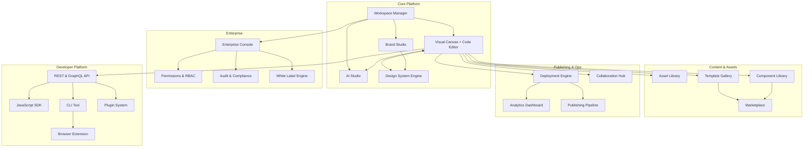

# PRODUCT BIBLE V2 — PART 1
## Product Philosophy, Ecosystem & User Types
**Document:** 3.1 of 3.6 | **Series:** Product Bible V2  
**Classification:** Definitive Product Specification

---

# PART 1 — PRODUCT PHILOSOPHY

## 1.1 Mission
**Enable any team to design, engineer, and autonomously optimize production-grade digital experiences at the speed of thought — with zero lock-in, zero compromise on code quality, and zero accessibility debt.**

*Rationale:* Every word is intentional. "Any team" = designers, developers, marketers. "Production-grade" = not prototypes. "Speed of thought" = AI-native, not AI-bolted-on. "Zero lock-in" = full code export + Git. "Zero accessibility debt" = WCAG compliance is automatic, not optional.

## 1.2 Vision
Build the **Design Intelligence Operating System (DIOS)** — the foundational platform where visual intent, code reality, brand governance, conversion optimization, and AI orchestration converge into a single continuously improving system.

By 2030, every high-performing digital experience on the internet runs through a platform like ours.

## 1.3 Core Principles

| # | Principle | Definition | Anti-Pattern (What We Reject) |
|:--|:---|:---|:---|
| 1 | **Code Is Truth** | The visual canvas is a real-time projection of the underlying AST. Code is never hidden, abstracted away, or proprietary. | Proprietary JSON blobs masquerading as "visual editing" (Framer, Webflow) |
| 2 | **Design Tokens Are Law** | No component, AI generation, or user edit may violate the centralized design token system. Tokens govern colors, typography, spacing, radii, and motion globally. | Hard-coded hex values, magic numbers, inline styles, ad-hoc Tailwind utilities |
| 3 | **AI Is a Teammate, Not a Black Box** | Every AI action is explainable, undoable, scoped, and auditable. Users see exactly what changed and why. | AI that silently modifies 200 lines across 15 files without explanation |
| 4 | **Performance Is a Feature** | Every generated page must score 95+ on Lighthouse. Performance optimization is compile-time automatic, not a post-launch audit. | Shipping bloated JavaScript bundles and hoping someone runs a performance check |
| 5 | **Accessibility Is Not Optional** | WCAG 2.1 AA compliance is enforced automatically before publish. Accessibility issues are compile-time errors, not runtime warnings. | Shipping inaccessible HTML and calling it "good enough" |
| 6 | **Zero Lock-In, Always** | Users own their code. Full Next.js/React export to any Git repository. Self-host anywhere. Leave anytime with zero data loss. | Per-site proprietary hosting that holds your content hostage |
| 7 | **Progressive Complexity** | Beginners see a simple prompt interface. Power users unlock the full AST editor. Complexity scales with the user, never forced. | One-size-fits-all interfaces that overwhelm beginners or bore experts |

## 1.4 Design Principles

| Principle | Implementation | Inspiration |
|:---|:---|:---|
| **Restraint** | Use fewer colors, fewer font sizes, fewer UI elements. Every pixel must justify its existence. | Apple — "Design is not just what it looks like. Design is how it works." |
| **Speed as Aesthetic** | Every interaction completes in <100ms. Perceived speed IS the premium signal. | Linear — Instant transitions, zero loading spinners in core workflows. |
| **Dark-First, Light-Supported** | Primary design mode is dark. Light mode is a full token-mapped alternative, not an afterthought. | Vercel, Raycast, Linear — Professional tools default to dark. |
| **Information Density Without Clutter** | Show maximum useful information per viewport without cognitive overload. Use progressive disclosure. | Figma — Dense but organized. Everything findable but not overwhelming. |
| **Motion With Purpose** | Every animation serves a functional purpose: providing spatial orientation, confirming an action, or guiding attention. Zero decorative motion. | Stripe — Fast, purposeful transitions that enhance understanding. |

## 1.5 Engineering Principles

| Principle | Rule |
|:---|:---|
| **AST-Native Architecture** | All visual operations manipulate the Abstract Syntax Tree directly. No DOM string manipulation. No innerHTML. No regex-based code transforms. |
| **Local-First Compute** | 90%+ of rendering, previewing, and editing happens in the user's browser via WASM/WebContainers. Server round-trips are reserved for persistence, AI inference, and Git operations. |
| **Type Safety Everywhere** | Full TypeScript strict mode. Zod schemas for all API boundaries. tRPC for end-to-end type-safe client-server communication. |
| **Rust for Performance-Critical Paths** | AST parsing, design token compilation, and code transformation run in Rust compiled to WASM for near-native browser performance. |
| **Idempotent AI Operations** | Every AI edit produces the same output given the same input + state. AI operations are deterministic within the AST context window. |

## 1.6 AI Principles

| Principle | Implementation |
|:---|:---|
| **Scoped Mutations Only** | AI never modifies code outside the explicitly selected scope. Editing a button does NOT touch the navbar. |
| **Token-Governed Output** | AI output passes through the Design Token Enforcement Layer before reaching the canvas. Off-brand colors, unauthorized fonts, and inconsistent spacing are rejected at the pipeline level. |
| **Explainable Changes** | Every AI edit generates a human-readable diff summary: *"Changed: Button padding from 12px to 16px. Added: border-radius-lg token. Reason: Consistency with card component radii."* |
| **Graceful Degradation** | If primary LLM (Claude/GPT-4o) is unavailable, the system automatically routes to fallback models (DeepSeek/Llama) with transparent quality indicator. |
| **User Correction Loops** | When a user undoes or modifies an AI suggestion, the correction is stored as preference data to improve future suggestions for that user/project. |

## 1.7 Accessibility Principles

| Principle | Standard |
|:---|:---|
| **Target Standard** | WCAG 2.1 Level AA minimum. AAA for contrast and text sizing where feasible. |
| **Keyboard-First Design** | Every interaction in the platform itself is fully keyboard-accessible. Tab order is logical. Focus indicators are always visible. |
| **Screen Reader Compatibility** | All interactive elements have proper ARIA labels. Live regions announce AI generation progress. |
| **Generated Code Compliance** | All AI-generated HTML includes semantic elements, proper heading hierarchy, ARIA attributes, and sufficient color contrast. Non-compliant output is auto-fixed before rendering. |

## 1.8 Performance Principles

| Metric | Target | Measurement |
|:---|:---|:---|
| **Platform Load Time** | < 2s First Contentful Paint | Core workspace shell cached via service worker |
| **Canvas Interaction Latency** | < 16ms (60fps) | WASM AST operations; no main-thread blocking |
| **AI Response Streaming Start** | < 500ms | First token visible within 500ms of prompt submission |
| **Generated Site Lighthouse** | 95+ Performance, 95+ Accessibility | Automated Lighthouse CI on every publish |
| **Edge Deployment** | < 3s from click to live URL | Pre-built static bundles pushed to Cloudflare edge |

---

# PART 2 — PRODUCT ECOSYSTEM

## 2.1 Ecosystem Map

## 2.2 Product Definitions

### Workspace
- **Purpose:** Top-level organizational container. Contains all projects, team members, billing, and settings.
- **Analogy:** A Figma Organization or GitHub Organization.
- **Key Feature:** One workspace can contain unlimited projects (not per-site pricing).

### Projects
- **Purpose:** Individual website, app, or digital experience. Contains pages, components, assets, design tokens, and deployment configuration.
- **Analogy:** A Git repository.
- **Key Feature:** Every project is backed by a real Git repository (internal or synced to GitHub/GitLab).

### Visual Canvas
- **Purpose:** The core editing surface. Bidirectional WYSIWYG canvas that renders live React components while exposing the underlying AST for code editing.
- **Analogy:** Figma's canvas fidelity + VS Code's code intelligence in a single split-view.
- **Key Feature:** Click any element on canvas → see its React code → edit either visual properties or code → both sync instantly.

### AI Studio
- **Purpose:** Centralized AI interaction hub. Prompt box, generation history, AI memory/preferences, model selection.
- **Analogy:** ChatGPT's interface embedded contextually within a visual editor.
- **Key Feature:** AI is context-aware — it knows the current page structure, design tokens, sitemap, and user's edit history.

### Brand Studio
- **Purpose:** Define and manage brand identity: logo, color palette, typography, tone of voice, imagery style.
- **Analogy:** A digital brand guidelines document that the AI reads and obeys.
- **Key Feature:** Changing the primary brand color here instantly updates every component across every page in the project.

### Design System Engine
- **Purpose:** Centralized design token repository. Stores and enforces colors, typography scales, spacing values, border radii, shadows, motion curves.
- **Analogy:** Style Dictionary or Figma Tokens — but enforced at compile-time.
- **Key Feature:** Tokens are the API between design intent and code output. AI cannot bypass them.

### Asset Library
- **Purpose:** Upload, organize, and optimize images, videos, SVGs, and icons. Automatic WebP/AVIF conversion, responsive srcset generation.
- **Key Feature:** AI can generate brand-consistent images directly into the library.

### Component Library
- **Purpose:** Reusable UI components (buttons, cards, forms, navbars) that respect the design token system. Shared across pages and projects.
- **Key Feature:** Components are real React components with props, variants, and states — not visual-only blocks.

### Template Gallery
- **Purpose:** Pre-built, fully-designed multi-page website templates for specific verticals (SaaS, Agency, E-commerce, Portfolio, Documentation).
- **Key Feature:** Every template is built on the design token system. Swapping a template's brand identity is a 1-click operation.

### Marketplace
- **Purpose:** Third-party ecosystem. Designers sell templates, developers sell components and plugins, agencies sell design systems.
- **Revenue Model:** 20-30% platform take-rate on transactions.
- **Key Feature:** Quality-gated. Every submission is auto-audited for accessibility, performance, and code quality.

### Deployment Engine
- **Purpose:** Build, optimize, and deploy projects to global edge CDN. Custom domains, SSL, staging environments.
- **Key Feature:** 1-click publish. Staging URLs generated automatically. Production deployments require explicit promotion.

### Analytics Dashboard
- **Purpose:** Track visitor traffic, page performance, Core Web Vitals, conversion funnels, and A/B test results.
- **Key Feature:** AI-generated insights: *"Your pricing page has a 62% bounce rate on mobile. The CTA button is below the fold. Recommendation: Move CTA above testimonials."*

### Collaboration Hub
- **Purpose:** Real-time multiplayer editing, comments, review workflows, approval gates, presence indicators.
- **Key Feature:** Comment threads attached to specific DOM elements (like Figma comments on design elements).

### Enterprise Console
- **Purpose:** Organization-level admin panel for managing teams, SSO/SAML, RBAC, audit logs, compliance settings, custom branding.
- **Key Feature:** White-label mode allows agencies/enterprises to rebrand the entire platform for their clients.

### Developer Platform (API, SDK, CLI, Plugins)
- **Purpose:** Enable programmatic access to every platform capability. Headless usage, CI/CD integration, custom plugin development.
- **Key Feature:** CLI tool for local development: `dios dev` runs the visual canvas locally, `dios deploy` pushes to edge, `dios export` generates a clean Next.js project.

---

# PART 3 — USER TYPES

## 3.1 Complete User Profiles

### Startup Founder
| Dimension | Detail |
|:---|:---|
| **Goals** | Launch a professional website in <1 day. Look credible to investors and customers. Iterate fast. |
| **Daily Workflow** | Opens platform → types prompt describing their product → selects brand preset → customizes copy → publishes to custom domain → shares link in pitch deck |
| **Pain Points** | Cannot afford $10K agency. Current AI tools produce generic designs. Doesn't know React/CSS. |
| **Permissions Needed** | Full owner access. All features. |
| **AI Features Used** | Full site generation, copy rewriting, brand color suggestions, competitor URL import |
| **Preferred UI** | Simple prompt-first interface. Hide complexity until needed. |
| **Daily Journey** | 80% AI Studio → 15% Canvas tweaks → 5% Deployment |

### Agency Team
| Dimension | Detail |
|:---|:---|
| **Goals** | Deliver 10+ client websites per month with a small team. Maximize margins. Maintain brand consistency. Professional client handoff. |
| **Daily Workflow** | Client brief → AI sitemap generation → Brand Studio setup → Canvas design → Client review portal → Revisions → Deploy to client domain |
| **Pain Points** | Double-build tax (Figma → Webflow). Clients break layouts. Per-site pricing kills margins. No white-label. |
| **Permissions Needed** | Workspace admin. Client reviewer role (restricted editing). |
| **AI Features Used** | Sitemap architect, bulk page generation, brand enforcement, client-safe editing mode |
| **Preferred UI** | Project management dashboard + Canvas. Need to see all client projects at a glance. |
| **Daily Journey** | 30% Dashboard/Project Management → 40% Canvas → 20% Client Review → 10% Deployment |

### Freelance Designer
| Dimension | Detail |
|:---|:---|
| **Goals** | Deliver premium designs without developer dependency. Build portfolio. Charge $5K+ per project while completing in 1-2 days. |
| **Daily Workflow** | Client brief → Import Figma designs OR start from template → Customize in Canvas → Fine-tune typography and motion → Deploy |
| **Pain Points** | Cannot export code from Framer. Webflow is too complex. AI designs look generic. |
| **Permissions Needed** | Project editor. Export access. |
| **AI Features Used** | Style cloning from URLs, animation builder, Figma import, responsive auto-fix |
| **Preferred UI** | Canvas-dominant with fine-grained visual controls (like Framer). |
| **Daily Journey** | 70% Canvas → 15% Brand Studio → 10% AI Studio → 5% Deploy |

### Frontend Developer
| Dimension | Detail |
|:---|:---|
| **Goals** | Eliminate boilerplate. Get clean, auditable React/Next.js code. Maintain full Git workflow. |
| **Daily Workflow** | `dios dev` locally → Canvas for rapid layout → Code panel for logic → Git commit → PR review → Deploy |
| **Pain Points** | AI generates spaghetti code. Visual builders produce unreadable output. Can't integrate with existing repos. |
| **Permissions Needed** | Full code access. Git admin. CLI access. |
| **AI Features Used** | Component generation, refactoring, accessibility fixes, performance optimization |
| **Preferred UI** | Code editor prominent. Canvas is useful but secondary. Terminal/CLI integration. |
| **Daily Journey** | 40% Code Editor → 30% Canvas → 20% AI prompts → 10% Git/Deploy |

### Marketing Team
| Dimension | Detail |
|:---|:---|
| **Goals** | Launch landing pages in hours, not weeks. A/B test headlines and CTAs. Zero engineering dependency. |
| **Daily Workflow** | Brief from campaign manager → AI generates 3 landing page variants → Review → Publish → Monitor conversion → Iterate |
| **Pain Points** | Engineering backlog delays campaigns. Can't test fast enough. Analytics require separate tools. |
| **Permissions Needed** | Page editor (not site architect). Publish to staging. A/B test creation. |
| **AI Features Used** | Landing page generator, copy variants, A/B testing agent, conversion insights |
| **Preferred UI** | Simplified Canvas with guardrails. Cannot accidentally break site navigation or global styles. |
| **Daily Journey** | 35% AI Studio (generation) → 30% Canvas (editing) → 20% Analytics → 15% A/B Testing |

### Product Manager
| Dimension | Detail |
|:---|:---|
| **Goals** | Ship internal tools, dashboards, and customer portals without competing for engineering resources. |
| **Daily Workflow** | Define data model → AI generates CRUD interface → Customize fields and permissions → Deploy internally |
| **Pain Points** | Engineering team is focused on core product. Internal tools are always deprioritized. |
| **Permissions Needed** | Project creator. Database/CMS editor. Internal deployment. |
| **AI Features Used** | Dashboard generator, form builder, database schema mapper, RBAC configuration |
| **Preferred UI** | Data-centric. Tables, forms, and charts prominently featured. |
| **Daily Journey** | 40% AI Studio → 30% Data/CMS → 20% Canvas → 10% Deploy |

### Enterprise Admin
| Dimension | Detail |
|:---|:---|
| **Goals** | Govern brand consistency across 50+ team members and 200+ projects. Ensure compliance. Control costs. |
| **Daily Workflow** | Review audit logs → Manage team permissions → Update global design tokens → Review compliance reports → Approve deployments |
| **Pain Points** | No centralized brand governance. Rogue teams using off-brand colors. No audit trail. |
| **Permissions Needed** | Organization super-admin. Billing admin. Compliance viewer. |
| **AI Features Used** | Brand compliance scanning, automated accessibility audits, usage reporting |
| **Preferred UI** | Enterprise Console dashboard with organizational overview. |
| **Daily Journey** | 50% Enterprise Console → 30% Brand Studio → 15% Audit Logs → 5% Deployment Approvals |

### Student / Learner
| Dimension | Detail |
|:---|:---|
| **Goals** | Learn web development through building. Create portfolio. Get first freelance clients. |
| **Daily Workflow** | Follow tutorial → Generate site from prompt → Explore generated code to learn → Modify and experiment → Share |
| **Pain Points** | Overwhelmed by complex tools. Can't afford paid plans. Wants to learn, not just generate. |
| **Permissions Needed** | Free tier. Full canvas access. Limited deployments. |
| **AI Features Used** | Code explanation ("explain this component"), learning mode, tutorials |
| **Preferred UI** | Guided onboarding. Tooltips. "Learn" panel explaining generated code. |
| **Daily Journey** | 40% AI Studio (learning) → 35% Canvas → 15% Code Panel → 10% Deploy |

### Content Creator
| Dimension | Detail |
|:---|:---|
| **Goals** | Build a beautiful personal brand presence (portfolio, blog, link-in-bio, course landing page). |
| **Daily Workflow** | Choose template → Customize with personal brand → Write/import content → Publish → Share on social media |
| **Pain Points** | Linktree is too simple. Squarespace is too expensive. Needs blog + portfolio + links in one place. |
| **Permissions Needed** | Basic editor. CMS for blog posts. Custom domain. |
| **AI Features Used** | Content writer, social media preview generator, SEO optimization |
| **Preferred UI** | Template-first. Minimal complexity. Content editing focused. |
| **Daily Journey** | 50% Content/CMS → 30% Canvas → 10% AI Copy → 10% Publishing |

---

*— End of Part 1 (Product Bible V2) —*
*Continue to Part 2: User Journeys & Complete Screen Inventory*
