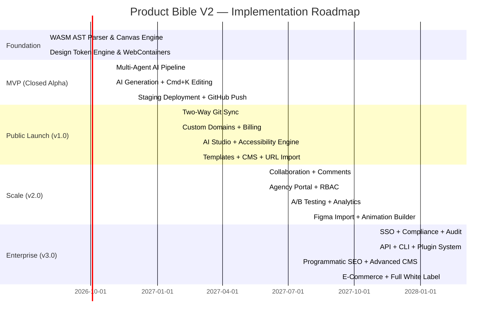

# PRODUCT BIBLE V2 — PART 6
## MVP Definition & Product Roadmap
**Document:** 3.6 of 3.6 | **Series:** Product Bible V2

---

# PART 15 — MVP DEFINITION

## 15.1 Version 0.1 — "Proof of Engine" (Internal Alpha)

**Goal:** Prove the AST-to-Canvas bidirectional compiler works. Internal team only.

| Include | Exclude | Rationale |
|:---|:---|:---|
| ✅ Rust/WASM AST parser (JSX ↔ visual nodes) | ❌ AI generation | Validate core engine before adding AI |
| ✅ Basic visual canvas (render React components) | ❌ Multi-page routing | Single page is sufficient for engine validation |
| ✅ Code panel (Monaco editor, live sync) | ❌ Design tokens | Hard-code styles initially |
| ✅ Basic property panel (edit padding, color, text) | ❌ Responsive breakpoints | Desktop-only for v0.1 |
| ✅ Local Sandpack/WebContainer rendering | ❌ Deployment | No hosting needed yet |
| ✅ Drag-and-drop element reordering | ❌ Collaboration | Single user |

**Engineering Estimate:** 3 engineers × 3 months = 9 person-months  
**Success Criteria:** Engineer edits code → canvas updates in <50ms. Designer drags element on canvas → code updates correctly. Zero data loss between representations.

## 15.2 Version 0.5 — "AI-Powered MVP" (Closed Alpha, 100 users)

**Goal:** First external users generate and edit real sites. Validate AI generation quality and design token enforcement.

| Include | Exclude | Rationale |
|:---|:---|:---|
| ✅ AI site generation from prompt (single + multi-page) | ❌ Figma import | Delay complex integrations |
| ✅ Design token system (colors, typography, spacing) | ❌ Animation builder | Text/layout before motion |
| ✅ Brand preset selector (6 curated systems) | ❌ Custom brand generation | Presets first, AI brand later |
| ✅ Responsive breakpoint preview (4 viewpoints) | ❌ Breakpoint-specific editing | View-only responsive preview |
| ✅ Cmd+K contextual AI editing | ❌ AI Studio full conversation | Localized edits before conversational AI |
| ✅ 1-click staging deployment (*.dios.app) | ❌ Custom domains | Staging URLs only |
| ✅ GitHub push (one-way export) | ❌ Two-way Git sync | Push first, bidirectional later |
| ✅ Authentication (Clerk OAuth) | ❌ SSO/SAML | Basic auth is sufficient |
| ✅ Basic project dashboard | ❌ Analytics | No analytics needed for alpha |
| ✅ Lighthouse auto-audit before publish | ❌ Accessibility auto-fix | Audit and report, don't auto-fix yet |

**Engineering Estimate:** 5 engineers × 3 months = 15 person-months  
**Success Criteria:** 50+ users generate sites without critical failures. Average Lighthouse >90. First-prompt acceptance >50%. Median time-to-live-URL <5 minutes.

## 15.3 Version 1.0 — "Public Launch" (Product Hunt, Open Beta)

**Goal:** Production-ready platform for startups and freelancers. Paid plans launch.

| Include | Rationale |
|:---|:---|
| ✅ Two-way GitHub sync (PR-based) | Core differentiator — ship before competitors |
| ✅ AI Studio (full conversational panel) | Complex multi-step editing needs conversation |
| ✅ Custom domain deployment + SSL | Required for real production sites |
| ✅ Accessibility auto-fix engine | Differentiator — no competitor has this |
| ✅ URL import (clone design language) | High-demand feature from research |
| ✅ Image import & upload | Required for real sites |
| ✅ CMS (basic blog + collection pages) | Needed for content sites |
| ✅ Billing & subscription (Stripe) | Revenue! |
| ✅ Template gallery (20 templates) | Accelerates new user activation |
| ✅ Command palette | Power user efficiency |
| ✅ GDPR compliance (cookie consent, DPA) | Legal requirement for EU users |

**Exclude from v1.0:** Agency white-label, A/B testing, marketplace, enterprise SSO, Figma import, real-time collaboration, analytics dashboard, animation builder, programmatic SEO, e-commerce

**Engineering Estimate:** 8 engineers × 4 months = 32 person-months  
**Success Criteria:** 1,000+ registered users. 200+ published production sites. $10K+ MRR. NPS >40.

## 15.4 Version 2.0 — "Agency & Teams"

**Goal:** Agency workflows, team collaboration, and conversion optimization.

| Include | Rationale |
|:---|:---|
| ✅ Real-time collaboration (presence + cursors) | Agencies need multiplayer editing |
| ✅ Agency white-label client portal | Highest revenue opportunity (agency ARPU $299-$1,499) |
| ✅ RBAC (7 role levels) | Team permission governance |
| ✅ Comment threads (element-pinned) | Review workflow for client feedback |
| ✅ Autonomous A/B testing agent | Conversion data moat begins building |
| ✅ Figma Auto-Layout import plugin | Bridges largest workflow gap (Figma→Code) |
| ✅ Animation/motion builder (visual timeline) | Matches Framer's motion capability |
| ✅ Analytics dashboard (basic) | Needed for A/B testing and client reporting |
| ✅ Template marketplace (buy/sell) | Secondary revenue stream (20-30% take-rate) |
| ✅ SOC2 Type II certification | Enterprise requirement |

**Engineering Estimate:** 12 engineers × 5 months = 60 person-months  
**Revenue Target:** $500K+ MRR. 100+ agency accounts.

## 15.5 Version 3.0 — "Enterprise & Platform"

**Goal:** Enterprise-grade platform with developer ecosystem.

| Include | Rationale |
|:---|:---|
| ✅ Enterprise SSO (SAML, OIDC, SCIM) | Enterprise sales requirement |
| ✅ Programmatic SEO engine (10K+ pages) | High-value growth marketer feature |
| ✅ Plugin/extension system | Developer ecosystem growth |
| ✅ API platform (REST + GraphQL) | Headless usage, integrations |
| ✅ CLI tool (`dios dev`, `dios deploy`, `dios export`) | Developer workflow integration |
| ✅ Advanced CMS (relationships, workflows, localization) | Enterprise content management |
| ✅ E-commerce (Stripe/Shopify integration) | Expand TAM to online retail |
| ✅ HIPAA compliance | Healthcare vertical |
| ✅ White-label (full platform rebrand) | Enterprise/agency premium tier |
| ✅ Audit logging + compliance reporting | Enterprise governance |
| ✅ AI brand voice training | Enterprise brand consistency |
| ✅ Offline support (service worker) | Enterprise reliability requirement |

**Engineering Estimate:** 20 engineers × 6 months = 120 person-months  
**Revenue Target:** $2M+ MRR. 10+ enterprise accounts at $5K+/mo.

## 15.6 What Should NEVER Be Built (Anti-Requirements)

| Anti-Requirement | Rationale |
|:---|:---|
| ❌ Custom LLM / Foundation Model | Cost/complexity is unjustifiable. Use frontier APIs + open-source fallbacks. The moat is in the AST engine and design tokens, not the model. |
| ❌ General-purpose app builder (full-stack backend logic) | Competes with Lovable/Bolt/Replit. Dilutes positioning. Focus on design-forward digital experiences, not CRUD apps. |
| ❌ Email marketing platform | Build integrations with Resend/Mailchimp. Don't build ESP infrastructure. |
| ❌ Project management tool | Integrate with Linear/Jira/Asana. Don't rebuild project management. |
| ❌ Custom payment processing | Integrate Stripe/Paddle. Don't touch money transmission compliance. |
| ❌ Mobile native app builder | Stick to web. React Native / Flutter are separate ecosystems with different constraints. |
| ❌ Desktop app (Electron) | Web-only platform. PWA for offline support. Desktop apps have maintenance overhead. |

---

# PART 16 — PRODUCT ROADMAP (RICE-SCORED)

## 16.1 RICE Scoring Methodology

| Factor | Scale | Definition |
|:---|:---|:---|
| **Reach** | 1-10 | How many users/month will this feature impact? |
| **Impact** | 1-10 | How significantly does this improve user outcomes? (1=minimal, 10=transformative) |
| **Confidence** | 0.5-1.0 | How confident are we in our estimates? (0.5=low, 1.0=high) |
| **Effort** | Person-months | Engineering time required |
| **RICE Score** | (R × I × C) / E | Higher = higher priority |

## 16.2 Foundation Phase (Months 1-3)

| Feature | R | I | C | E (PM) | RICE | Dependencies |
|:---|:--:|:--:|:--:|:--:|:--:|:---|
| WASM AST Parser (JSX ↔ Canvas) | 10 | 10 | 0.8 | 6 | **13.3** | None — foundational |
| WebContainer/Sandpack Integration | 10 | 9 | 0.9 | 4 | **20.3** | None |
| Design Token JSON Schema Engine | 9 | 9 | 0.8 | 3 | **21.6** | AST Parser |
| Basic Canvas Renderer | 10 | 8 | 0.7 | 5 | **11.2** | AST Parser, WebContainer |
| Property Panel (visual editing) | 9 | 7 | 0.8 | 3 | **16.8** | Canvas, Tokens |

## 16.3 MVP Phase (Months 4-6)

| Feature | R | I | C | E (PM) | RICE | Dependencies |
|:---|:--:|:--:|:--:|:--:|:--:|:---|
| Multi-Agent LLM Routing Pipeline | 10 | 10 | 0.7 | 5 | **14.0** | AST Parser, Tokens |
| AI Site Generation (prompt → multi-page) | 10 | 10 | 0.7 | 4 | **17.5** | LLM Pipeline, Canvas |
| Cmd+K Contextual AI Editing | 9 | 9 | 0.8 | 3 | **21.6** | LLM Pipeline, Canvas |
| Responsive Breakpoint Preview | 8 | 8 | 0.9 | 2 | **28.8** | Canvas |
| 1-Click Staging Deployment | 9 | 8 | 0.9 | 3 | **21.6** | WebContainer build |
| GitHub Push (One-Way) | 7 | 7 | 0.9 | 2 | **22.1** | AST → code serializer |
| Brand Preset Selector (6 presets) | 8 | 7 | 0.9 | 1 | **50.4** | Tokens |
| Authentication (Clerk OAuth) | 10 | 5 | 1.0 | 1 | **50.0** | None |
| Lighthouse Auto-Audit | 7 | 7 | 0.8 | 2 | **19.6** | Deployment |

## 16.4 Public Launch Phase (Months 7-10)

| Feature | R | I | C | E (PM) | RICE | Dependencies |
|:---|:--:|:--:|:--:|:--:|:--:|:---|
| Two-Way GitHub Sync | 7 | 9 | 0.7 | 6 | **7.4** | AST Parser, Git engine |
| AI Studio (Full Conversation) | 8 | 8 | 0.8 | 4 | **12.8** | LLM Pipeline |
| Custom Domain + SSL | 8 | 7 | 0.9 | 3 | **16.8** | Deployment engine |
| Accessibility Auto-Fix Engine | 6 | 8 | 0.7 | 4 | **8.4** | AST Parser, Headless browser |
| URL Import (Design Clone) | 7 | 7 | 0.6 | 3 | **9.8** | Headless browser, LLM |
| CMS (Basic Blog + Collections) | 7 | 7 | 0.8 | 5 | **7.8** | Database, API |
| Template Gallery (20 templates) | 8 | 6 | 0.9 | 3 | **14.4** | Tokens, Canvas |
| Billing (Stripe Integration) | 10 | 6 | 1.0 | 2 | **30.0** | Auth |
| Command Palette | 6 | 5 | 0.9 | 1 | **27.0** | None |

## 16.5 Scale Phase (Months 11-15)

| Feature | R | I | C | E (PM) | RICE | Dependencies |
|:---|:--:|:--:|:--:|:--:|:--:|:---|
| Real-Time Collaboration | 6 | 7 | 0.7 | 8 | **3.7** | WebSocket, CRDT |
| Agency White-Label Portal | 4 | 9 | 0.7 | 6 | **4.2** | RBAC, Custom domains |
| RBAC (7 Roles) | 5 | 7 | 0.8 | 3 | **9.3** | Auth |
| Comment Threads (Element-Pinned) | 5 | 6 | 0.8 | 3 | **8.0** | Canvas, Collaboration |
| A/B Testing Agent | 5 | 9 | 0.6 | 6 | **4.5** | Analytics, LLM, Edge |
| Figma Import Plugin | 5 | 8 | 0.5 | 5 | **4.0** | AST, Figma API |
| Animation Builder | 6 | 7 | 0.6 | 5 | **5.0** | Canvas, Framer Motion |
| Analytics Dashboard | 6 | 6 | 0.8 | 4 | **7.2** | Edge analytics |
| Template Marketplace | 5 | 6 | 0.6 | 4 | **4.5** | Templates, Billing |
| SOC2 Type II | 3 | 8 | 0.9 | 4 | **5.4** | Infrastructure audit |

## 16.6 Enterprise Phase (Months 16-22)

| Feature | R | I | C | E (PM) | RICE |
|:---|:--:|:--:|:--:|:--:|:--:|
| Enterprise SSO (SAML/OIDC/SCIM) | 3 | 8 | 0.8 | 4 | **4.8** |
| Programmatic SEO Engine | 4 | 8 | 0.6 | 6 | **3.2** |
| Plugin/Extension System | 4 | 7 | 0.5 | 8 | **1.8** |
| API Platform (REST + GraphQL) | 4 | 7 | 0.7 | 5 | **3.9** |
| CLI Tool | 4 | 6 | 0.8 | 3 | **6.4** |
| Advanced CMS | 4 | 7 | 0.7 | 6 | **3.3** |
| E-Commerce Integration | 3 | 7 | 0.5 | 5 | **2.1** |
| Full White Label | 2 | 8 | 0.7 | 5 | **2.2** |
| Audit Logging | 3 | 6 | 0.9 | 2 | **8.1** |

## 16.7 Roadmap Summary Gantt

## 16.8 Team Scaling Plan

| Phase | Engineers | Designers | PM | Timeline | Key Hires |
|:---|:---:|:---:|:---:|:---|:---|
| **Foundation** | 3 | 0 | 1 | Months 1-3 | Rust/WASM specialist, React canvas engineer, Backend/infra engineer |
| **MVP** | 5 | 1 | 1 | Months 4-6 | +2 LLM/AI engineers |
| **Public Launch** | 8 | 2 | 1 | Months 7-10 | +2 fullstack, +1 designer, +1 DevRel |
| **Scale** | 12 | 3 | 2 | Months 11-15 | +4 engineers (collab, marketplace), +1 PM, +1 designer |
| **Enterprise** | 20 | 4 | 3 | Months 16-22 | +8 engineers (enterprise, API), +1 PM, +1 designer, +2 sales |

---

## DOCUMENT SUMMARY

This Product Bible V2 consists of 6 parts totaling the complete product specification:

| Part | File | Content |
|:---|:---|:---|
| **Part 1** | `Product_Bible_V2_Part1_Philosophy_Ecosystem_Users.md` | Mission, principles, ecosystem map, 10 user types |
| **Part 2** | `Product_Bible_V2_Part2_Journeys_Screens.md` | 5 user journeys, 22 screen specifications |
| **Part 3** | `Product_Bible_V2_Part3_DesignSystem_Components.md` | "Obsidian" design system, 11 core components |
| **Part 4** | `Product_Bible_V2_Part4_AI_Workspace_Tokens.md` | 11 AI interaction modalities, workspace architecture, token JSON schema |
| **Part 5** | `Product_Bible_V2_Part5_Accessibility_Performance_Enterprise.md` | WCAG spec, performance targets, collaboration, enterprise features |
| **Part 6** | `Product_Bible_V2_Part6_MVP_Roadmap.md` | 5 version definitions, RICE-scored features, Gantt roadmap, team plan |

This document is the **single source of truth** for product development. Every feature is specified with purpose, user, value, engineering notes, and dependencies. A new employee joining the company can read these 6 documents and understand exactly what is being built, why, and in what order.

---

*— End of Product Bible V2 —*
