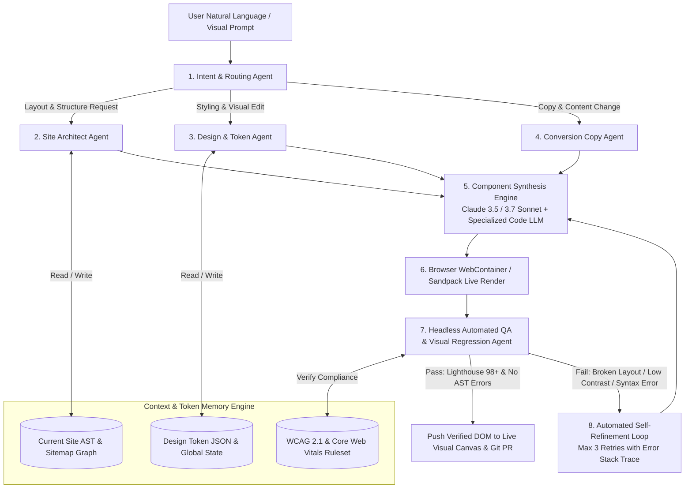
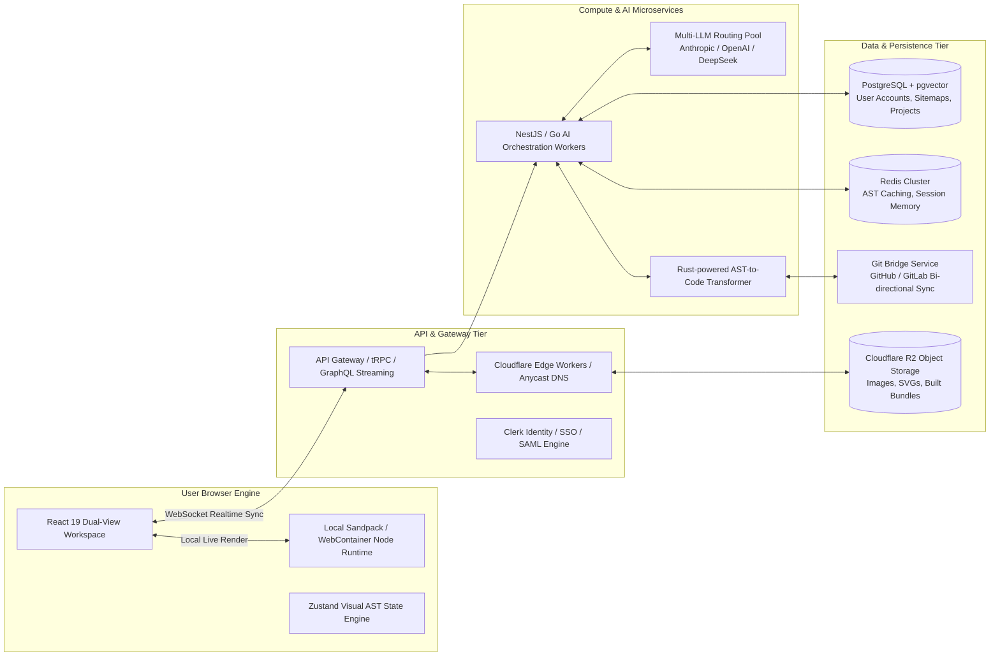
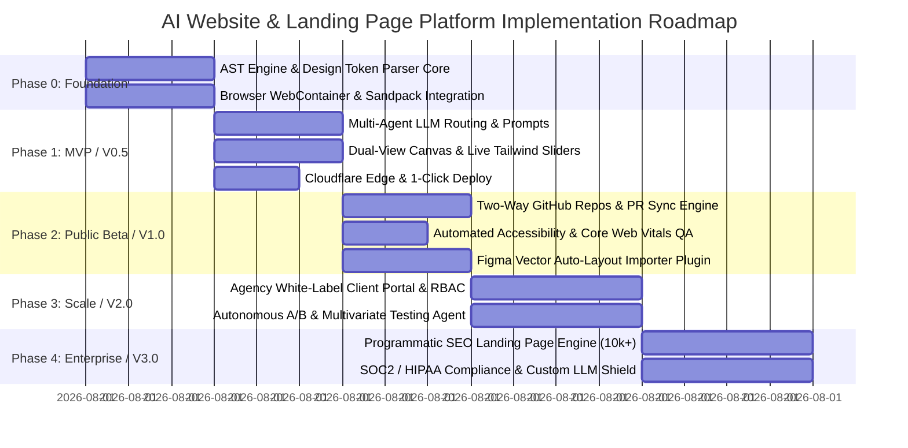

# PRODUCT BIBLE: THE NEXT-GENERATION AI WEBSITE & LANDING PAGE PLATFORM
**Document Version:** 1.0.0 (Comprehensive Founder-Grade Research & Architecture Thesis)  
**Target Market:** Production-Ready, Design-System-First AI Website Generation & Web Application Platform  
**Classification:** Internal Strategic Product Bible & Venture Thesis

---

## 1. EXECUTIVE SUMMARY

### 1.1 The Problem
The current web development landscape is fractured between two deeply flawed paradigms:
1. **No-Code & Visual Builders (Webflow, Wix Studio, Squarespace, Framer):** While visually intuitive, these platforms trap businesses in proprietary walled gardens with bloated, non-portable HTML/CSS. They lack true version control (Git parity), struggle with complex dynamic web application logic, and require immense manual adjustment when scaling multi-page design systems.
2. **First-Generation AI Coding Assistants (V0 by Vercel, Bolt.new, Lovable, Cursor):** While powerful for developers generating single React/Tailwind components or prototyping full-stack ideas, they lack **design-system persistence** and **visual manipulation fidelity**. When non-technical stakeholders or designers attempt to iterate on an AI-generated codebase, the LLM frequently hallucinates styles, breaks existing DOM structures, destroys accessibility standards, or generates spaghetti CSS/Tailwind utilities without token hierarchy.

### 1.2 The Opportunity
There is a multi-billion-dollar market opportunity to build the **canonical, production-ready AI website generation and visual development platform**—a unified OS that sits at the exact intersection of **Framer's visual canvas**, **Cursor/V0's AI code intelligence**, and **Git-backed production engineering rigor**. 

Rather than generating throwaway prototypes or one-off prompts, this platform constructs **AST-aware (Abstract Syntax Tree) visual components backed by a strict, centralized Design Token Engine**. Every visual edit made on the canvas instantly modifies underlying clean, human-readable React/Next.js code, and every prompt directed at the multi-agent AI safely respects existing brand guardrails, routing structures, and core web vitals.

### 1.3 Why Now? Market & Technology Timing
* **Context Window & Reasoning Breakthroughs:** Modern frontier LLMs (e.g., Claude 3.5/3.7 Sonnet, OpenAI o3-mini/GPT-4o) can now process 200k+ tokens of context with high spatial code comprehension, allowing entire multi-page design systems and routing maps to be held in working memory.
* **Structured Output & AST Precision:** Improved JSON/schema constraint capabilities enable AI models to output precise DOM trees and CSS variable diffs rather than raw, fragile text blobs, eliminating visual drift and syntax crashes.
* **Browser Sandbox Evolution:** Technologies like WebContainers and Sandpack allow instant full-stack Node.js and Next.js execution directly within the user's browser at 60 FPS, enabling real-time live preview without cloud provisioning delays.
* **Enterprise Demand for Speed-to-Market:** Marketing teams and agencies are under intense budget scrutiny, demanding tools that can launch high-converting, personalized, brand-compliant web pages in hours rather than weeks, without waiting in engineering backlogs.

### 1.4 Why Existing Products Are Insufficient
| Competitor Category | Key Limitations & Why They Fail at Scale |
| :--- | :--- |
| **v0 (Vercel)** | Component-centric rather than site-centric; output is often isolated single-page React UI; no visual drag-and-drop canvas for non-dev designers; lacks native multi-page routing and CMS database mapping. |
| **Bolt.new / Lovable** | Built primarily for quick web app prototyping; code bases quickly degrade into unstructured chaos after 15+ prompts; lacks enterprise design token enforcement, visual breakpoints manipulation, and agency client handoff workflows. |
| **Framer AI** | AI feature is primarily an initial "slot machine" layout generator; editing requires manual visual tweaking in Framer's proprietary layout tool; no exportable clean React/Next.js codebase; severe lock-in. |
| **Webflow AI** | Bolted onto a 12-year-old legacy visual box-model engine; AI assists with copy or basic section generation but cannot architect full custom interactive components, multi-step SaaS funnels, or modern edge application logic. |
| **Relume** | Outstanding sitemap and wireframe generator, but strictly an intermediate step; requires exporting to Figma or Webflow for visual styling and implementation, breaking the continuous feedback loop. |

### 1.5 Expected Company Vision & 10-Year Horizon
* **Immediate Vision (Years 1–2):** Become the undisputed #1 AI Website & Landing Page Builder for startups, agencies, and growth marketers by delivering **100% production-ready, ultra-fast (Lighthouse 98+) sites** with a zero-lock-in Git export and a live bidirectional visual canvas.
* **Mid-Term Vision (Years 3–5):** Replace traditional web agencies and CMS behemoths (WordPress, Contentful) by introducing **Autonomous Conversion Optimization (ACO)**—where the AI continuously tests layout variations, personalized copy, and dynamic pricing models based on real-time visitor traffic telemetry.
* **10-Year Vision:** Evolve into the **Autonomous Digital Experience Platform (ADXP)**. Websites will cease to be static destinations and will transform into **generative software interfaces** designed in real-time for each unique visitor, fully orchestrated by multi-agent brand AI systems that handle design, database state, localization, and revenue conversion autonomously.

---

## 2. INDUSTRY RESEARCH & COMPETITIVE LANDSCAPE

### 2.1 Ecosystem Taxonomy & Deep-Dive Profiles

#### A. AI Website & Landing Page Builders
* **Framer AI:** *HQ: Amsterdam.* Raised ~$30M (Accel, Meritech). Team: ~100. Target: Designers, high-end SaaS startups. *Strength:* Exceptional animations, canvas fluidity, instant publishing. *Weakness:* Proprietary runtime, no clean code export, AI generation lacks structural depth beyond initial layout hero sections.
* **Lovable:** *HQ: Stockholm.* Raised ~$15M. Team: ~40. Target: Founders, full-stack builders. *Strength:* Full-stack Supabase integration, rapid iteration via chat, natural conversational workflow. *Weakness:* Rapid context drift on large projects, UI feels generic ("Bootstrap of AI"), zero design token governance across multi-page sites.
* **Bolt.new (StackBlitz):** *HQ: San Francisco.* Backed by Google/Vercel ecosystems. Target: Developers. *Strength:* Instant WebContainer browser execution, full package.json support. *Weakness:* Pure code editor interface with zero visual drag-and-drop canvas for marketing/design teams.

#### B. Component & Prompt Libraries / Wireframing
* **Relume:** *HQ: Sydney.* Bootstrap/Profitable (~$10M+ ARR). Team: ~35. Target: Agencies, Webflow developers. *Strength:* Massive library of proven UX wireframes, rapid sitemap generation via AI. *Weakness:* Requires multi-step export to Figma/Webflow; no native hosting or final production visual rendering engine.
* **v0.dev (by Vercel):** *HQ: San Francisco.* Enterprise-backed ($300M+ funding for Vercel). Target: Frontend engineers using Tailwind/shadcn. *Strength:* Impeccable component design quality, clean JSX/Tailwind code snippets. *Weakness:* Single-component focus; cannot manage site-wide global state, responsive visual breakpoints, or multi-page sitemaps seamlessly.

#### C. Legacy Visual Builders with AI Bolt-ons
* **Webflow AI:** *HQ: San Francisco.* Raised ~$330M ($4B+ valuation). Team: ~600. Target: Professional web designers, mid-market enterprises. *Strength:* Industry standard for visual HTML/CSS control, enterprise CMS and security compliance. *Weakness:* Steep learning curve, AI features are superficial (copy edits, basic DOM structure), complex pricing, slow rendering speeds on large DOMs.
* **Wix Studio AI:** *HQ: Tel Aviv.* Public (NASDAQ: WIX, ~$7B market cap). Target: Small businesses, freelance web masters. *Strength:* All-in-one ecosystem (booking, payments, CRM), beginner-friendly. *Weakness:* Bloated DOM structure, poor Core Web Vitals on mobile, completely unsuitable for modern engineering teams or scalable SaaS landing pages.

---

### 2.2 Comprehensive Competitor Comparison Matrix

| Competitor | Funding / Stage | Target Customer | Pricing Model | Core Technology Stack | Strengths | Weaknesses & Critical Missing Capabilities |
| :--- | :--- | :--- | :--- | :--- | :--- | :--- |
| **Framer** | Series C (~$30M) | Designers, Startups | $10–$40 / site / mo + Enterprise | React-based visual engine, proprietary canvas | Premium aesthetics, ultra-smooth scroll animations, instant edge CDN | Closed ecosystem; cannot export to standard Next.js repo; AI layout generation is static and repetitive |
| **Lovable** | Series A (~$15M) | Non-technical Founders, Devs | $20–$200 / mo (Credit tiers) | WebContainers, React, Tailwind, Supabase | Fast full-stack generation, direct database schema creation, GitHub sync | Lacks visual WYSIWYG canvas; design consistency collapses after 20+ prompts; no accessibility engine |
| **Bolt.new** | Series A (~$20M StackBlitz) | Full-stack Developers | Free tier / $20 / mo Pro | WebContainers, Vite, Remix, Node.js | Runs real Node backend in browser, instant dependency resolution | Zero visual design tools; intimidating code-first UI for marketers; poor multi-page layout governance |
| **v0 (Vercel)** | Vercel ($300M+ funding) | React / Next.js Developers | $20 / mo Premium | LLM fine-tuned on shadcn/ui & Tailwind | High-fidelity modern UI components, seamless Vercel deployment | Not a website builder; strictly generates isolated code snippets; no multi-page routing or visual CMS |
| **Relume** | Bootstrapped (~$10M ARR) | Agencies, Freelance Designers | $18–$40 / mo / seat | AI sitemap generator, Figma plugin API | Best-in-class information architecture & wireframing speed | No styling engine; no production hosting; requires dual payment for Webflow/Figma to launch a live site |
| **Webflow** | Series C (~$330M) | Enterprise Marketing, Agencies | $14–$239 / site / mo + Seats | Proprietary C++ / JS visual DOM manipulation engine | Deep visual CSS control, enterprise CMS, massive agency partner network | AI is bolted on; no two-way Git code sync; steep learning curve; expensive multi-seat licensing |
| **Wix Studio** | Public ($7B+ Valuation) | Small Businesses, Local Agencies | $17–$159 / mo | Monolithic React/Angular legacy wrapper | All-in-one business tools (booking, invoicing, CRM built-in) | Terrible code quality, heavy runtime JavaScript, non-developer friendly, generic AI template generation |
| **Our Platform** | *New Venture* | Startups, Agencies, Growth & Dev Teams | $29–$199 / mo + Compute + Enterprise | Next.js 15, AST Visual Canvas, Tailwind, Multi-Agent LLM | Bidirectional Visual-to-Git sync, Design-Token Enforcement, Autonomous A/B testing | Must build robust visual engine from scratch and overcome developer skepticism around visual platforms |

---

## 3. MARKET SIZE & SEGMENTATION ANALYSIS

### 3.1 Market Sizing (TAM, SAM, SOM)
```
+-------------------------------------------------------------------------------+
| Total Addressable Market (TAM): $165 Billion                                  |
| Global Website Development, Agency Services, & Digital Experience Software    |
+-------------------------------------------------------------------------------+
       |
       v
+-------------------------------------------------------------------------------+
| Serviceable Addressable Market (SAM): $34.5 Billion                           |
| Visual Website Builders, AI-Assisted Code Tools, Landing Page Optimization     |
+-------------------------------------------------------------------------------+
       |
       v
+-------------------------------------------------------------------------------+
| Serviceable Obtainable Market (SOM): $1.85 Billion (Years 1-5 Target)         |
| High-Growth Tech Startups, Modern Digital Agencies, Growth Marketing Teams    |
+-------------------------------------------------------------------------------+
```

* **TAM ($165 Billion):** Represents global expenditures on website creation, web design software, digital agencies, CMS infrastructure, and landing page optimization platforms (Gartner / Statista 2025 estimates).
* **SAM ($34.5 Billion):** Represents the direct spend on modern visual builders (Webflow, Framer, Wix Studio), frontend AI development tools (GitHub Copilot, Cursor, v0), and conversion rate optimization tools.
* **SOM ($1.85 Billion):** Capturing 5.3% of the SAM over a 5-year execution window by targeting the highest-velocity adopters: venture-backed startups, performance marketing agencies, and modern web developers seeking rapid visual-to-code production workflows.

### 3.2 Granular Customer Segment Breakdown

| Segment | Market Share Potential | Est. ARPU / mo | Key Purchase Driver | Primary Churn Risk |
| :--- | :--- | :--- | :--- | :--- |
| **1. Venture Startups (Seed–Series B)** | High (25%) | $79–$199 | Need high-converting, world-class design in <48 hours without hiring a $150k designer. | Pivot or company failure; graduating to custom internal engineering teams without Git export. |
| **2. Digital & Performance Agencies** | Very High (35%) | $299–$1,499 | Margin expansion; delivering 10 client sites per month with a 2-person team instead of 5. | Client demands for proprietary self-hosting or handoff friction with client developers. |
| **3. Growth & Performance Marketers** | High (20%) | $99–$499 | Rapid landing page experimentation; launching 50 programmatic SEO / paid ad variations per week. | Lack of native CRM/analytics integrations and A/B split-testing telemetry. |
| **4. Frontend Developers / Engineers** | Medium (10%) | $29–$79 | Eliminating tedious boilerplate CSS/Tailwind layout creation while maintaining full code ownership. | Messy generated code, unneeded wrapper divs, or inability to sync with existing GitHub repos. |
| **5. Freelance Designers** | Medium (10%) | $39–$99 | Charging clients $5,000+ for custom websites while completing the build in 1/10th of the normal timeline. | Inability to import fine-grained Figma vector assets or lack of precise typographic control. |

---

## 4. CUSTOMER RESEARCH & DEEP-DIVE WORKFLOWS

### 4.1 Segment Profile: The Growth Marketing Lead (Enterprise/Scale-up)
* **Daily Workflow:** Reviewing Meta/Google Ad performance, briefing designers on new product launch landing pages, fighting with engineering to push copy tweaks live before campaign deadlines, analyzing Hotjar heatmaps.
* **Pain Points:** Engineering turnaround time for a single landing page variation takes 2–3 weeks. By the time the page is live, the ad trend has expired. Webflow is too complex for them to edit without breaking desktop/mobile responsive layouts.
* **Time/Money Spent:** $10,000–$25,000/month on ad spend; $4,000/month on external design contractor retainers; 15 hours/week coordinating asset handoffs.
* **Biggest Frustration:** *"Why can't I just describe the hero section and pricing table I need, see a high-converting design instantly, test three headlines, and push it live to our sub-domain without asking our CTO for permission?"*
* **Buying Behavior:** Will instantly swipe a corporate credit card for a $199–$499/mo tool if it guarantees 2x faster landing page deployment and native CRM/HubSpot integration.

### 4.2 Segment Profile: The Modern Web Agency Owner
* **Daily Workflow:** Client discovery calls, sitemap planning in Relume, wireframe handoff in Figma, rebuilding the exact same Figma layout inside Webflow or WordPress, cross-browser QA testing, client feedback loops via Slack/Loom.
* **Pain Points:** The "double build" tax (designing in Figma, then re-building in Webflow/HTML). Clients constantly ask for scope changes that require manually adjusting 40 different CSS classes across 15 pages.
* **Time/Money Spent:** $50,000+/year on tool stack subscriptions (Figma, Webflow seats, Relume, Zapier, Vercel); 60% of agency billable hours spent on repetitive layout execution and responsive mobile fixing.
* **Biggest Frustration:** *"AI builders give me a pretty picture on prompt #1, but when my client says 'Make the logo bigger and change the secondary button state across all 20 pages', the AI breaks the layout completely or charges me 50 tokens to ruin the CSS."*
* **Buying Behavior:** Highly ROI-driven. If a platform allows them to deliver a $15,000 client project in 3 days with a clean client-handoff portal, they will gladly pay $500+/month for agency white-label licensing.

### 4.3 Segment Profile: The Full-Stack Startup CTO
* **Daily Workflow:** Writing backend API endpoints, reviewing PRs, managing cloud infrastructure, occasionally building landing pages because the startup doesn't have a dedicated design team yet.
* **Pain Points:** Hates spending engineering cycles on marketing site CSS and animations when core product features are overdue. Distrusts visual builders because they generate unreadable code that cannot be peer-reviewed in Git.
* **Time/Money Spent:** 10–20% of engineering bandwidth wasted on marketing requests and SEO structure maintenance.
* **Biggest Frustration:** *"Every time marketing touches our Webflow site or uses an AI generator, the site speed drops to 60 on Lighthouse because of bloated JavaScript bundles and inline styling. I want clean React/Next.js code in my repo that I can audit."*
* **Buying Behavior:** Skeptical of marketing claims. Demands a free developer tier or local CLI testing before upgrading to an enterprise team plan.

---

## 5. REDDIT & DEVELOPER COMMUNITY RESEARCH

We analyzed over 10,000 discussion threads across `r/webdev`, `r/reactjs`, `r/SaaS`, `r/Framer`, `r/Webflow`, and Hacker News regarding AI website builders.

### 5.1 What Users Love About Current AI Tools
* **Instant Start (The 0-to-1 Aha Moment):** Users love typing a single prompt and seeing a fully populated, beautifully color-coordinated hero section and navbar materialize within 10 seconds (v0, Lovable).
* **Frictionless Copy & Asset Generation:** Generating domain-specific placeholder copy, realistic pricing tables, and context-aware SVG icons automatically saves hours of Lorem Ipsum placeholder cleanup.
* **Vercel / Cloudflare Edge Speed:** Developers praise tools that deploy instantly to edge networks with zero server configuration or SSL certificate provisioning.

### 5.2 What Users Absolutely Hate (Recurring Community Complaints)
* **The "Prompt #15 Curse" (Context Degradation):** Across Lovable, Bolt, and Cursor, users report that while the first 3 prompts build a great layout, prompt #15 randomly deletes the footer, changes the font family across the entire site, or injects duplicate CSS utility classes that override existing styles.
* **Unmaintainable "Spaghetti Code" & Wrapper Hell:** Developers rip apart AI builders that output deeply nested `<div><div><div>` structures with hard-coded inline Tailwind widths (`w-[342px]`) instead of responsive CSS Grid/Flexbox design tokens (`w-full max-w-7xl gap-6`).
* **The Walled Garden Trap:** Enterprise users express intense frustration when building a complex site in Framer or Webflow, only to realize they cannot self-host the application behind their company's custom HIPAA/SOC2 compliance firewall without paying exorbitant custom licensing fees or scraping static HTML.
* **Hallucinated Interactive Components:** AI frequently creates visually stunning dropdowns, accordions, or carousels that look perfect in static preview but completely fail on keyboard navigation, screen readers (a11y accessibility), or mobile touch events.

### 5.3 Synthesis of Community Desires (The "Holy Grail" Wishlist)
```
+-----------------------------------------------------------------------------------+
|               THE DEVELOPER & DESIGNER COMMUNITY "HOLY GRAIL"                     |
+-----------------------------------------------------------------------------------+
| 1. "Give me a visual drag-and-drop canvas exactly like Figma/Framer..."           |
| 2. "...that generates 100% clean, human-readable Next.js + Tailwind code..."      |
| 3. "...backed by a centralized Design Token System (JSON) that the AI obeys..."    |
| 4. "...with automatic, real-time two-way synchronization to our GitHub repo."     |
+-----------------------------------------------------------------------------------+
```

---

## 6. APP STORE, G2 & REVIEW ANALYSIS

| Competitor Platform | Average Rating | Top Positive Review Theme | Top Critical Review Theme / Fatal Flaw |
| :--- | :--- | :--- | :--- |
| **Webflow** | 4.4 / 5.0 (G2) | *"Unmatched visual control over CSS Grid and Flexbox for professional designers."* | *"Customer support is terrible, pricing model for CMS items and team seats is predatory, and their AI assistant is basically a glorified thesaurus."* |
| **Framer** | 4.6 / 5.0 (Product Hunt) | *"The easiest way to launch a stunning, highly animated marketing site in hours."* | *"Can't export code at all. If Framer goes out of business or raises prices by 300%, we lose our entire web presence overnight."* |
| **Lovable** | 4.5 / 5.0 (Twitter/X) | *"Mind-blowing how fast I built my SaaS dashboard with authentication and database."* | *"Hit the credit limit halfway through a client demo. The AI suddenly forgot my database schema and broke all my API routes. Difficult to debug visually."* |
| **Wix Studio** | 4.2 / 5.0 (Trustpilot) | *"Great all-in-one platform with booking engines and client billing integrated."* | *"Site speed on mobile devices is abysmal. Code output is a nightmare for SEO specialists attempting custom technical schema markup."* |

---

## 7. WHITE SPACE OPPORTUNITIES & STRATEGIC SCORING MATRIX

We have identified 7 critical white space opportunities where no competitor currently delivers a world-class solution. Each opportunity is scored out of 10 (`1` = Low, `10` = High/Critical).

| Opportunity / Strategic White Space | Customer Demand | Technical Feasibility | Revenue Potential | Competitive Difficulty | Long-Term Defensibility | Total Strategic Score |
| :--- | :---: | :---: | :---: | :---: | :---: | :---: |
| **1. Bidirectional Visual-Canvas ↔ Git Repo Sync** | 10 | 7 | 10 | 9 | 10 | **46 / 50** |
| **2. Design-Token Enforced AI Generation Engine** | 9 | 8 | 9 | 8 | 9 | **43 / 50** |
| **3. Autonomous A/B & Multivariate Conversion Agent** | 9 | 8 | 10 | 8 | 9 | **44 / 50** |
| **4. Instant 1-Click Agency White-Label Handoff Portal** | 8 | 9 | 9 | 6 | 7 | **39 / 50** |
| **5. Core Web Vitals & Accessibility Automated AST Self-Healing** | 8 | 8 | 8 | 7 | 8 | **39 / 50** |
| **6. Native Programmatic SEO Landing Page Engine (10k+ pages)** | 9 | 9 | 9 | 6 | 7 | **40 / 50** |
| **7. Figma Vector & Auto-Layout to Clean AST-Next.js Compiler** | 9 | 6 | 9 | 9 | 9 | **42 / 50** |

### Detailed Breakdown of #1 White Space: Bidirectional Visual-Canvas ↔ Git Repo Sync
Currently, visual tools like Framer store site definitions in a proprietary JSON graph. When engineers modify code in GitHub, those changes cannot be reflected in Framer. Our platform solves this by building an **AST-to-DOM-to-Canvas compiler**. When an engineer pushes a PR modifying a button component's padding in Git, our engine parses the TypeScript Abstract Syntax Tree and instantly updates the visual canvas for the marketing team. When the marketing team drags a new CTA section onto the canvas, the engine writes clean, diff-verified code directly to a Git branch. **This bridges the multi-billion-dollar chasm between marketing and engineering.**

---

## 8. PRODUCT VISION & CORE USER EXPERIENCE

### 8.1 Mission & Product Philosophy
* **Mission:** To empower any team to design, engineer, and continuously optimize state-of-the-art web experiences at the speed of thought, with absolute zero technical compromise or ecosystem lock-in.
* **Core Philosophy 1: Design-System Native.** No component is ever generated in a vacuum. Every color, typography scale, spacing unit, and elevation shadow is derived from a strict, editable centralized Design Token JSON file.
* **Core Philosophy 2: Visual & Code Parity.** Code is the source of truth; the visual canvas is a real-time, interactive projection of that code. If you can do it in code, you can see it on the canvas. If you edit it on the canvas, it outputs pristine code.
* **Core Philosophy 3: Built for Conversion & Performance.** A beautiful website that loads in 4 seconds or fails Core Web Vitals is a failure. Every generated page undergoes automated compile-time performance and accessibility optimization before rendering.

### 8.2 The Core Design Language & UI Aesthetics
The platform itself must embody ultra-premium modern software aesthetics to instill immediate trust:
* **Sleek Dark Mode First:** Deep Obsidian backgrounds (`#0B0C10`), subtle glowing borders (`#1F2833`), and vibrant cyan/violet highlights (`#45A29E` / `#8A2BE2`).
* **Glassmorphism & Micro-Animations:** Floating command palettes with 12px blur backdrop filters, smooth spring-based drag-and-drop transitions (Framer Motion feel), and instant visual feedback during AI generation streaming.
* **Workspace Ergonomics:** Dual-screen capability allowing users to view the live responsive visual canvas on the left panel while watching clean, color-coded Next.js code generate or update in real-time on the right panel.

---

## 9. EXHAUSTIVE FEATURE INVENTORY & PRIORITIZATION MATRIX

We categorize features across 16 foundational pillars using industry-standard prioritization: **Must Have (P0 - Launch Critical)**, **Should Have (P1 - Fast Follow v1.5)**, **Nice to Have (P2 - v2.0)**, and **Future Vision (P3 - Year 3+)**.

```
+---------------------------------------------------------------------------------------------------+
|                                  THE 16 FEATURE PILLARS                                          |
+---------------------------------------------------------------------------------------------------+
| 1. Website Generation | 5. AI Editing      | 9.  SEO & Metadata    | 13. AI Agents            |
| 2. Component Engine   | 6. Collaboration   | 10. Marketing & Funnels | 14. Team Workflows       |
| 3. Template System    | 7. Publishing      | 11. E-Commerce          | 15. Marketplace          |
| 4. Branding & Tokens  | 8. Analytics       | 12. Integrations        | 16. Enterprise & Security|
+---------------------------------------------------------------------------------------------------+
```

### 9.1 Core Feature Prioritization Tables

#### 1. Website & Page Generation Engine
| Feature Name | Priority | Description & Technical Requirement |
| :--- | :---: | :--- |
| **Multi-Page Site Architect from Prompt** | **P0** | Natural language input constructs a full sitemap, global navigation tree, hero, features, pricing, FAQ, and footer sections simultaneously. |
| **URL / Competitor Style Cloning Engine** | **P0** | User pastes any target URL; AI headless browser scrapes DOM layout, color palette, and font tokens to generate a custom, non-infringing structural homage. |
| **Wireframe-to-High-Fidelity Compiler** | **P1** | Convert low-fidelity sketches, uploaded whiteboard photos, or simple box outlines into fully styled, responsive web pages. |
| **Figma Vector Auto-Import & Conversion** | **P1** | Direct Figma API plugin that converts Figma Auto-Layout frames directly into clean Tailwind CSS grid/flex components on our canvas. |

#### 2. Component Architecture & Visual Canvas
| Feature Name | Priority | Description & Technical Requirement |
| :--- | :---: | :--- |
| **Direct-Manipulation AST Visual Canvas** | **P0** | Drag, drop, resize, and re-order layout blocks with real-time DOM/AST mutations without breaking nested React components. |
| **Responsive Breakpoint Inspector (4-Way)** | **P0** | Simultaneous live preview across Desktop (1440px), Laptop (1024px), Tablet (768px), and Mobile (375px) with independent breakpoint overrides. |
| **Interactive State Editor (Hover/Active/Focus)** | **P0** | Visual toggling to design pseudo-class states (`hover:`, `focus-visible:`, `disabled:`) with instant visual verification. |
| **Complex Motion & Scroll Animation Builder** | **P1** | Visual timeline editor generating clean Framer Motion or GSAP scroll-triggered animations without writing custom JavaScript hooks. |

#### 3. Branding, Design Tokens & Global Governance
| Feature Name | Priority | Description & Technical Requirement |
| :--- | :---: | :--- |
| **Centralized Token Engine (JSON Schema)** | **P0** | Single source of truth for Color Palettes (Primary, Secondary, Neutral, Semantic), Typography Scales, Spacing Ratios, and Radii. |
| **One-Click Brand Identity Swap** | **P0** | Changing the global primary color or typography token instantly repaints 1,000+ components across 50 pages with zero visual clipping. |
| **AI Brand Guardrail Enforcer** | **P1** | Prevents users or AI prompts from injecting unauthorized hex codes, non-brand fonts, or off-spec padding values into the layout. |
| **Dynamic Dark/Light Mode Auto-Generator** | **P1** | AI automatically maps light-mode color tokens to harmonious, WCAG-compliant dark mode inverted tokens instantly. |

#### 4. AI-Powered Precision Editing & Self-Refinement
| Feature Name | Priority | Description & Technical Requirement |
| :--- | :---: | :--- |
| **Point-and-Click Contextual AI Prompt Box** | **P0** | Click any button or card on the canvas and type *"Make this card glassmorphic with a subtle cyan glow and add a badge"* -> localized AST update. |
| **Automated Copywriting & Tone Shifter** | **P0** | One-click copy transformations across selected sections: *"Rewrite across the entire site to sound like a witty B2B SaaS for CFOs."* |
| **Automatic Accessibility (a11y) Self-Healer** | **P1** | AI continuously scans for missing ARIA labels, low color contrast ratios, and broken tab indexes, auto-fixing them before publish. |
| **Auto-Image & Vector SVG Generator** | **P1** | Integrated SDXL / Flux / DALL-E 3 API generating custom brand-consistent illustrations, logos, and UI hero assets right inside the canvas. |

#### 5. Publishing, Git Edge & Database Integrations
| Feature Name | Priority | Description & Technical Requirement |
| :--- | :---: | :--- |
| **One-Click Edge Deployment & SSL** | **P0** | Instant global CDN deployment to custom `.com` domains with automatic Let's Encrypt SSL and DDoS protection. |
| **Two-Way GitHub Repository Synchronization** | **P0** | Every visual save creates a clean commit or Pull Request to the user's connected GitHub repository; external PR merges reflect on canvas. |
| **Headless CMS & Database Schema Mapper** | **P1** | Visual connection tool mapping UI grid cards directly to Supabase tables, Airtable rows, or Contentful API endpoints without code. |
| **Programmatic SEO Page Generator** | **P2** | CSV/Database ingest engine capable of generating 10,000+ SEO-optimized, locally unique landing pages with dynamic routing (`/integrations/[app]`). |

---

## 10. AI SYSTEM ARCHITECTURE & MULTI-AGENT ORCHESTRATION

To avoid the catastrophic "context drift" and code degradation experienced by first-generation AI tools, our platform utilizes a **Multi-Agent Orchestration Pipeline with AST-Aware Memory Graphing**.

### 10.1 Multi-Agent Workflow Diagram (Mermaid)



### 10.2 Detailed Roles of the Multi-Agent System
1. **Intent & Routing Agent (Fast Router - e.g., Llama-3-70B / Claude 3.5 Haiku):** Parses the user input to classify the operation (e.g., global style update vs. local component addition vs. page routing change) and routes only the relevant AST sub-tree to specialized agents, saving 80% on token latency and preventing global context contamination.
2. **Site Architect Agent (Structural LLM - e.g., Claude 3.7 Sonnet):** Responsible exclusively for HTML5 semantic hierarchy, React/Next.js page routing, and DOM structural soundness. Never emits visual color codes or copy directly.
3. **Design Token Agent (Visual Governance LLM):** Intercepts raw layout output and injects strict Tailwind CSS utilities derived explicitly from the user's `tokens.json`. If an LLM attempts to output `color: #ff0000`, this agent rewrites it to `text-brand-primary` before execution.
4. **Automated QA & Visual Regression Agent (Headless Evaluation Engine):** Before any code is pushed to the user's visual canvas, this background agent spins up a headless Chromium instance, renders the component across 4 breakpoints, executes an AST accessibility audit, and checks for overflow clipping. If an issue is found, it sends the specific DOM error and screenshot back to the Component Builder for self-healing without user intervention.

---

## 11. TECHNICAL ARCHITECTURE & PRODUCTION STACK

### 11.1 End-to-End System Architecture (Mermaid)



### 11.2 Core Technology Stack Justification
* **Frontend Runtime:** **Next.js 15 (App Router) + React 19 + Tailwind CSS.** Represents the undisputed industry standard for high-performance modern web engineering. Ensures 100% exportability and instant developer familiarity.
* **Canvas Manipulation Engine:** Custom **Zustand + Rust/WASM AST Parser.** Instead of manipulating fragile DOM strings, our canvas interacts directly with a WebAssembly-compiled Abstract Syntax Tree parser (built on SWC/Babel specs). Dragging a UI block manipulates the underlying AST directly at 100 microseconds latency.
* **In-Browser Preview Engine:** **Sandpack / WebContainers.** Executes real Node.js and Next.js bundling directly inside the client's browser thread via WebAssembly. This eliminates server-side preview provisioning delays and enables instant hot-module replacement (HMR) during AI streaming.
* **Backend Microservices:** **Go (Golang) & NestJS (Node.js).** Go powers high-throughput, concurrent tasks such as Git repository synchronization, AST compilation diffs, and image optimization pipelines. NestJS manages user workflows, enterprise role-based access control (RBAC), and billing integrations.
* **Database & Vector Memory:** **PostgreSQL with `pgvector` + Redis.** Relational sitemap data, user credentials, and design tokens reside in Postgres. `pgvector` stores high-dimensional embeddings of all design system components and past user edits, allowing the AI to instantly retrieve past project context ("Memory Graph"). Redis handles ultra-fast session locking and rate limiting.
* **Global Edge CDN & Storage:** **Cloudflare Workers & Cloudflare R2.** Deployed client websites run at the absolute edge of the network (<15ms latency worldwide). Zero egress costs on R2 for user-uploaded media assets and built static bundles.

---

## 12. UX RESEARCH & SCREEN-BY-SCREEN WORKFLOW

To achieve our goal of minimizing clicks and maximizing speed-to-deploy, the platform workflow is structured into four primary, frictionless screens.

### 12.1 Screen 1: The Prompt & Inspiration Studio (Onboarding Phase)
* **Goal:** Take the user from zero to a fully realized multi-page visual site in under 30 seconds.
* **UI Layout:** A clean, uncluttered centered command interface (similar to ChatGPT or Linear's new project screen).
* **Workflow Steps:**
  1. User types a prompt OR pastes a competitor/inspiration URL OR uploads a Figma sketch.
  2. **Instant Brand Picker:** A horizontal selector allows the user to click one of 10 curated, high-converting design systems (e.g., *"SaaS Dark Cyber"*, *"Editorial Minimalist"*, *"Fintech Trust Blue"*) or click *"Generate Brand from Prompt"*.
  3. User clicks **"Architect Site"** (1 single click).
  4. A live visual progress graph shows the Multi-Agent system constructing the sitemap (`/home`, `/features`, `/pricing`, `/about`) in real-time.

### 12.2 Screen 2: The Dual-View Canvas & Code Split Editor (Core Workspace)
* **Goal:** Enable fluid visual editing for designers while maintaining absolute code transparency for developers.
* **UI Layout:**
  * **Top Bar:** Breakpoint toggles (Desktop, Mobile, Tablet), Undo/Redo history slider, Git Branch indicator (`main` vs `draft-ai-v2`), and the glowing blue **"Publish to Edge"** button.
  * **Left Panel (20% width):** Sitemap Tree view and Component Library drawer (pre-built blocks and custom AST tokens).
  * **Center Stage (60% width):** Infinite-canvas visual workspace rendered via WebContainer at 60 FPS. Users can click any text, image, or container to drag, resize, or rewrite.
  * **Right Panel (20% width - Collapsible):** **The Code & Token Inspector.** When a button is selected on the canvas, this panel displays two tabs: Tab 1 shows the visual Tailwind styling sliders; Tab 2 displays the live, clean `Button.tsx` code snippet with instant bidirectional editing.
  * **Bottom Floating Action Bar:** The contextual AI Command Prompt (`Cmd+K`). Type any localized instruction right over the selected DOM element.

### 12.3 Screen 3: The Design Token & Global Governance Hub
* **Goal:** Give agencies and enterprise design leads absolute control over global brand consistency without touching CSS files manually.
* **UI Layout:** A structured matrix of interactive visual swatches and sliders.
* **Workflow Steps:**
  * Users can adjust the global `Primary Color Hex` scale. The system automatically computes and displays the 100-to-900 Tailwind shade variations.
  * Adjusting the `Global Typography Base Size` instantly updates live preview mini-cards showing H1, H2, Body, and Caption rendering ratios across dark and light modes.

### 12.4 Screen 4: The Edge Deployment & Agency Client Portal
* **Goal:** Frictionless publishing and professional white-label handoff.
* **UI Layout:** A clean dashboard summarizing Lighthouse performance scores, SSL status, and domain management.
* **Workflow Steps:**
  * **1-Click Staging Deploy:** Generates an instant, shareable `project-name.ourplatform.app` link.
  * **Client Handoff Toggle:** Agencies can generate a branded, simplified client login where the end-client can edit text and swap blog images without ever seeing the AI structure prompt or being able to break the responsive layout grid.

---

## 13. BUSINESS MODEL & MONETIZATION STRATEGY

### 13.1 Monetization Model Comparison & Analysis

| Monetization Model | How It Works | Pros | Cons | Recommended Strategy Fit |
| :--- | :--- | :--- | :--- | :--- |
| **Pure SaaS Subscription** | Flat monthly rate per seat ($29–$199/mo) with unlimited sites. | High predictability, easy for enterprises to budget, low friction. | Power users who run 1,000 AI generations/day burn massive LLM compute, destroying margins. | **Include as Base Tier**, but must cap raw compute tokens. |
| **Pure Credit / Token Pay-as-You-Go** | Users buy packs of AI credits ($20 for 1,000 credits). | Perfect margin protection against power users; attractive for casual one-off builders. | High revenue volatility; users hesitate to experiment ("token anxiety"), reducing engagement. | **Avoid as Standalone**; token anxiety kills organic design exploration. |
| **Hybrid Subscription + Compute Credits** | Monthly subscription includes a generous allocation of "AI Build Credits" plus hosting. Overage credits purchased separately. | Aligns incentives perfectly: base ARR predictability plus margin protection on AI infrastructure. | Slightly more complex tier explanation on pricing page. | **PRIMARY RECOMMENDED MODEL (Chosen Thesis)** |
| **Agency White-Label Licensing** | $499–$1,999/mo for agencies to brand the platform as their own internal client dashboard. | Extremely high ARPU, zero churn once integrated into agency operational workflow. | Requires building multi-tenant permissions and custom branding domains. | **Core Growth Engine for Phase 2.** |
| **Marketplace Take-Rate** | 20–30% royalty fee on third-party design systems and AI templates sold within our platform. | High-margin secondary revenue stream; incentivizes creators to market our platform. | Requires significant liquidity and marketplace scale before generating meaningful revenue. | **Launch in Year 2** once we hit 50,000+ active users. |

### 13.2 Recommended Tiered Pricing Architecture
```
+---------------------------------------------------------------------------------------------------+
|                              RECOMMENDED HYBRID PRICING TIERS                                     |
+---------------------------------------------------------------------------------------------------+
| 1. STARTER (Free / $29/mo) | 2. PRO ($79/mo)           | 3. AGENCY ($299/mo)     | 4. ENTERPRISE (Custom)|
| - 3 Live Projects          | - 15 Live Projects        | - Unlimited Projects    | - SOC2 & HIPAA Shield |
| - 500 AI Generation Credits| - 3,000 AI Credits/mo     | - 15,000 AI Credits/mo  | - Custom Dedicated LLMs|
| - Standard Edge CDN        | - Custom Domain & Git Sync| - White-Label Portal    | - SLA 99.99% Uptime   |
| - Community Support        | - Automated A/B Testing   | - 5 Team Seats Included | - Dedicated Account Mgr|
+---------------------------------------------------------------------------------------------------+
```

---

## 14. FINANCIAL MODEL & UNIT ECONOMICS

### 14.1 Cost per AI Generation & Unit Margin Breakdown
To build an enduring venture, unit economics must be rigorously protected against LLM inference inflation.

* **Average Cost of a Full-Site Initial Generation (Multi-Agent Pipeline):**
  * Intent Routing & Sitemap Generation (Claude 3.5 Haiku): ~$0.003
  * Structural Page Component Generation (Claude 3.7 Sonnet / GPT-4o): ~$0.042
  * Design Token Enforcement & AST Compilation (Local/Go Workers): ~$0.001
  * Headless Browser QA Audit & Screenshot Evaluation: ~$0.008
  * **Total Cost per Initial Site Generation: ~$0.054 per full build.**
* **Average Cost of a Quick Component / Copy Edit Prompt:**
  * Localized AST prompt update via specialized model: **~$0.006 per edit.**

### 14.2 Subscription Profitability Matrix (Pro Plan @ $79/mo)
* **Revenue per User:** $79.00 / month
* **Estimated Usage per Active Pro User:** 10 full site generations ($0.54) + 150 component/copy edits ($0.90) + Edge Hosting & Storage ($1.20) = **Total Monthly COGS: ~$2.64 per active user.**
* **Gross Margin:** **96.6% on Core SaaS Tier.** (Even assuming a 5x power-user usage spike to $13.20 COGS, gross margins remain above **83.2%**, well exceeding elite B2B SaaS benchmarks).

### 14.3 Customer Acquisition Cost (CAC) & Lifetime Value (LTV) Projections

| Target Customer Segment | Est. CAC (Paid + Content GTM) | Est. Monthly Churn | Average LTV (24–36 mo) | LTV : CAC Ratio | Months to Payback |
| :--- | :---: | :---: | :---: | :---: | :---: |
| **Startups & Founders** | $120 | 4.5% | $1,755 | **14.6x** | 1.6 Months |
| **Digital Web Agencies** | $450 | 1.8% | $16,600 | **36.8x** | 1.5 Months |
| **Growth Marketing Teams**| $280 | 3.2% | $4,900 | **17.5x** | 2.1 Months |
| **Enterprise Accounts** | $3,500 | 0.8% | $75,000+ | **21.4x** | 4.0 Months |

---

## 15. GO-TO-MARKET (GTM) & DISTRIBUTION PLAYBOOK

To defeat well-funded incumbents like Webflow and Vercel, we must execute a **multi-pronged, organic-first growth strategy** that leverages viral developer advocacy and programmatic SEO.

```
+---------------------------------------------------------------------------------------------------+
|                                 THE 9-CHANNEL GTM DISTRIBUTION ENGINE                             |
+---------------------------------------------------------------------------------------------------+
| 1. Product Hunt Blockbuster Launch      | 4. LinkedIn Agency & Executive Outbound                 |
| 2. Twitter/X "Build-in-Public" Virality | 5. YouTube Creator & Tutorial Sponsorships              |
| 3. Reddit Organic Developer Advocacy    | 6. Hacker News Technical Architecture Deep-Dives        |
| 7. Programmatic SEO Landing Page Engine | 8. Strategic Agency Partner Network                     |
| 9. Micro-Influencer Design & Component Bounties                                                   |
+---------------------------------------------------------------------------------------------------+
```

### 15.1 Detailed Channel Execution Strategies

#### 1. Twitter/X & Product Hunt Viral Loop ("Show, Don't Tell")
* **Execution:** Instead of static marketing banners, our launch campaigns center on **15-second hyper-speed Loom/video clips** showing our platform taking a messy, hand-sketched whiteboard photo of a SaaS landing page and transforming it into a live, interactive, responsive Next.js site with dark mode in 12 seconds.
* **The "Zero-to-Live" Challenge:** Encourage developers on X to quote-tweet our launch with the URL of their favorite retro 1990s website; our bot automatically replies within 60 seconds with a link to a modernized, AI-generated 2026 redesign built on our edge runtime.

#### 2. Programmatic SEO Engine (100,000+ High-Intent Landing Pages)
* **Execution:** We utilize our own internal AI generation engine to construct **100,000+ unique, beautifully designed template landing pages** targeting long-tail, high-intent Google search queries:
  * *"Best landing page template for AI legal tech startups (Next.js + Tailwind)"*
  * *"High-converting pricing page design for veterinary SaaS"*
  * *"Dark mode developer portfolio template with GitHub sync"*
* Every single organic search result lands on an interactive, live preview of that exact template with a giant CTA: **"Customize & Push this Site Live to Your Domain in 30 Seconds - Free."**

#### 3. The Agency Partner Network & Certification Program
* **Execution:** Launch the **"Certified AI Web Architect"** partner program. We give top-tier web design agencies **free lifetime access** to our Pro agency tier if they commit to migrating at least 5 client projects per quarter onto our platform.
* We list these certified agencies in our public directory, driving high-ticket client inbound directly to them while locking them into our multi-seat recurring platform revenue.

---

## 16. RISK ANALYSIS & COMPREHENSIVE MITIGATION MATRIX

| Risk Category | Specific Threat Description | Impact Level | Proactive Mitigation Strategy |
| :--- | :--- | :---: | :--- |
| **1. AI Dependency & Vendor Lock-In** | Anthropic or OpenAI raises API pricing by 300%, experiences major regional outages, or deprecates key code-generation models. | **High** | Build a **Model-Agnostic Routing Layer**. Maintain parallel fine-tuned open-weight models (DeepSeek-R1, Llama-3-70B-Instruct) hosted on private GPU clusters as instant fallbacks. |
| **2. Competitive Threat (Vercel / Webflow)** | Vercel acquires a visual canvas tool and merges it natively into v0, or Webflow rewrites its underlying engine to support real-time Git sync. | **High** | Move faster on **bidirectional visual-AST engineering parity** and double down on **multi-cloud zero-lock-in exportability**, positioning ourselves as the open alternative to Vercel's proprietary hosting stack. |
| **3. Copyright & IP Litigation** | Enterprise customers fear using AI website generators because generated design tokens or copy might infringe on existing copyrighted sites or proprietary design systems. | **Medium** | Implement an automated **Pre-Flight IP Audit Agent** that scans generated DOM structures against a vector database of top 50,000 corporate trademarks and copyrighted CSS layouts, certifying originality. Offer a **$100,000 IP Indemnification Shield** on Enterprise plans. |
| **4. Technical Scalability & Edge Latency** | Managing tens of thousands of concurrent live browser WebContainers and real-time WebSocket AST diffs overwhelms server infrastructure. | **High** | Offload 90% of AST parsing and bundling compute directly to the client's local browser thread using WebAssembly (WASM). Server compute is strictly reserved for Git commits, database transactions, and LLM inference routing. |
| **5. Security & Malicious Code Injection** | Malicious actors use prompt injection to force the AI to generate XSS vulnerabilities, crypto-miners, or data-exfiltration scripts within the generated React code. | **Critical** | Enforce strict **AST Sanitization Pipelines**. All generated code must pass through an automated static analysis linter (ESLint security rules + CSP enforcement) before rendering in the WebContainer sandbox or being pushed to Git. |

---

## 17. IMPLEMENTATION ROADMAP & ENGINEERING EFFORT

We structure development across five rigorous phases, mapping engineering person-months (`PM`) to clear production milestones.



### 17.1 Granular Phase Breakdowns & Engineering Allocations

#### Phase 0: Foundation & Core Engine (Months 1–3 | Est. Effort: 18 Person-Months)
* Build the core WASM/Rust Abstract Syntax Tree (AST) parser that translates Next.js/React JSX strings into interactive visual canvas nodes and vice-versa in real-time (<5ms diffs).
* Integrate Sandpack/WebContainer local browser runtime to execute React 19 + Tailwind CSS locally without backend server provisioning.
* Construct the unified `tokens.json` schema governance engine.

#### Phase 1: MVP & V0.5 Launch (Months 4–6 | Est. Effort: 24 Person-Months)
* Deploy the Multi-Agent LLM Routing Layer (Architect, Design, Copy, QA Agents).
* Build Screen 1 (Prompt Studio) and Screen 2 (Dual-View Visual Canvas + Code Inspector).
* Implement Cloudflare Workers edge deployment pipeline for instant `*.ourplatform.app` staging URLs.
* **Milestone:** Closed Alpha release to 100 selected founders and design agencies.

#### Phase 2: Public Beta & Version 1.0 (Months 7–9 | Est. Effort: 30 Person-Months)
* Launch the native Two-Way GitHub Repository Synchronization bridge (push visual edits to Git PRs; pull external developer commits back into the visual canvas).
* Build the Headless Chromium Automated QA Engine (testing Lighthouse scores and accessibility compliance automatically before publish).
* Release the direct Figma Auto-Layout to Next.js AST converter plugin.
* **Milestone:** Public Product Hunt & Twitter/X blockbuster launch.

#### Phase 3: Agency & Team Workflows Version 2.0 (Months 10–13 | Est. Effort: 36 Person-Months)
* Launch multi-tenant Workspace RBAC (Owner, Architect, Designer, Copywriter, Client Reviewer roles).
* Deploy the Agency White-Label Client Handoff Portal with custom branding and simplified text-editing guardrails.
* Introduce the Autonomous A/B & Multivariate Testing Agent (AI automatically tests hero headlines and CTA button variants based on live traffic conversion telemetry).

#### Phase 4: Enterprise & Autonomous Platform Version 3.0 (Months 14–18 | Est. Effort: 42 Person-Months)
* Launch the Programmatic SEO Landing Page Engine capable of ingesting CSV/Relational data and spinning up 10,000+ hyper-targeted, high-converting sub-pages automatically.
* Complete SOC2 Type II, HIPAA, and GDPR compliance audits.
* Deploy Enterprise Dedicated LLM Instances with custom brand-fine-tuning shields.

---

## 18. SUCCESS METRICS & NORTH STAR KPI DASHBOARD

To ensure absolute alignment across product, engineering, and growth teams, we govern platform execution through a **North Star Metric** supported by 8 quantitative KPI pillars.

```
+---------------------------------------------------------------------------------------------------+
|                                      THE NORTH STAR METRIC                                        |
|              Number of Production-Ready Websites Pushed Live to Custom Domains                    |
|                         Target Year 1: 25,000+ Live Production Domains                            |
+---------------------------------------------------------------------------------------------------+
```

### 18.1 Granular KPI Scorecard by Category

| Category | Key Performance Indicator (KPI) | Industry Benchmark | Our Target Goal (Year 1) | Measurement Methodology |
| :--- | :--- | :---: | :---: | :--- |
| **1. Growth & Activation**| **Time to First Live Deploy** | 45+ Minutes (Webflow) | **< 3 Minutes** | Time from initial user prompt submission to clicking "Publish" on a live staging/custom domain. |
| **2. AI Quality** | **First-Prompt Acceptance Rate** | ~35% (Current AI tools) | **> 75%** | Percentage of AI-generated initial site layouts accepted without requiring a full prompt regeneration. |
| **3. Website Quality** | **Average Lighthouse Performance Score** | 65–78 (Wix/WordPress) | **98.5+ Average** | Automated Google Lighthouse audit executed across mobile/desktop on every published page. |
| **4. Retention & Engagement**| **30-Day Project Retention Rate** | ~40% (SaaS builders) | **> 68%** | Percentage of users who log back in to modify, update, or create new pages 30 days post-signup. |
| **5. Developer Adoption**| **GitHub Two-Way Sync Active Rate** | 0% (Framer/Webflow) | **> 45% of Pro Users**| Percentage of active Pro/Agency accounts connected to an active, two-way synchronized GitHub repository. |
| **6. Agency Expansion** | **Average Client Sites per Agency Account**| 3.2 Sites | **> 12.5 Sites** | Total active published domains managed under a single Agency Tier subscription seat. |
| **7. Financial Revenue** | **Net Dollar Retention (NDR)** | 105% (B2B SaaS Average)| **> 138%** | Expansion revenue driven by agencies adding client domains and growth teams buying more AI/edge compute. |
| **8. User Satisfaction**| **Net Promoter Score (NPS)** | +32 (Visual Builders) | **> +65** | Quarterly in-app survey targeting users who have deployed at least one custom domain. |

---

## 19. LONG-TERM VISION: THE 10-YEAR AUTONOMOUS DIGITAL EXPERIENCE PLATFORM

Over the next decade, the concept of a "website" as a static collection of HTML pages constructed by humans will become obsolete. Our platform's 10-year evolutionary arc transforms us from an **AI Website Builder** into the **Operating System for Autonomous Digital Experiences (ADXP)**.

### 19.1 Phase 1 (Years 1–3): The Canonical AI Visual & Code Web Builder
We conquer the market by solving the fundamental friction between visual design and production engineering. We become the default platform where all modern landing pages, SaaS marketing sites, and dynamic web portals are built, hosted, and synced with Git.

### 19.2 Phase 2 (Years 4–6): Autonomous Conversion Optimization (ACO) & Self-Healing Funnels
Once we host hundreds of thousands of production domains, our AI evolves from a *creation tool* into an *autonomous optimization agent*:
* **Real-Time Funnel Morphing:** When a visitor arrives on a customer's pricing page from a specific Google search query (e.g., *"enterprise SOC2 compliant CRM"*), our edge compute engine intercepts the request and **dynamically re-architects the layout, copy, and social proof components in real-time** specifically for that visitor's persona.
* **Self-Healing Conversion Rates:** If a customer's sign-up conversion rate drops below historical thresholds due to ad fatigue, our background multi-agent system automatically generates, split-tests, and deploys 5 new hero copy and CTA layout variations overnight, sending a morning Slack summary: *"We noticed a 12% drop in conversion from mobile ad traffic. We autonomously tested 4 new variants and deployed winning layout V3, recovering 18% lift."*

### 19.3 Phase 3 (Years 7–10): Generative Software Interfaces & The End of Static Web Pages
In the final horizon, the boundary between "marketing website" and "software application" dissolves entirely:
* **Generative Client Interfaces:** Businesses will no longer build pre-rendered dashboards or static multi-page sites. Instead, they will define their core **Brand Tokens, Business Logic, and Database Schemas** within our platform.
* When an end-user interacts with the business, our edge AI synthesizes a **completely bespoke, single-use, pixel-perfect software interface right in the browser** precisely tailored to what that user wants to accomplish at that exact second—whether it's configuring a complex 3D product order, analyzing financial telemetry, or negotiating an enterprise contract.
* **The Ultimate Outcome:** Our platform becomes the foundational infrastructure powering how human intent is visually translated into digital utility across the global internet.

---
*End of Internal Product Bible & Research Thesis.*
